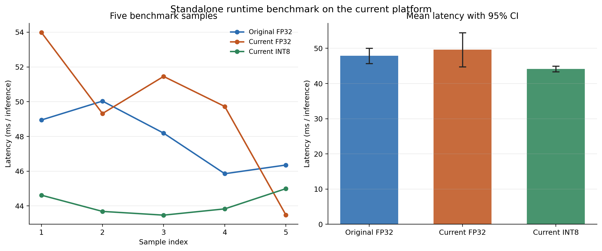

# EEG-Seizure-Prediction

## 1 Data

### 1.1 Source data information

This project currently uses the **SIENA Scalp EEG** dataset as the source data, stored under `data/raw/siena/`. The working subset contains **21 EDF recordings** from **5 subjects** (`PN06`, `PN09`, `PN10`, `PN13`, `PN14`), selected from the SIENA `RECORDS` index and verified by the download audit (`siena_download_audit_summary_2026-05-01.txt`, passed 21/21, failed 0/21). Metadata in `subject_info.csv` indicates the dataset includes multi-subject scalp EEG recordings with seizure annotations listed in per-subject `Seizures-list-*.txt` files and demographic/clinical descriptors (age, gender, seizure type, localization, lateralization, channel count, seizure counts, and recording duration).

During training, it was further observed that the available SIENA subset alone was not sufficient to provide enough data volume for stable model development. For this reason, the dataset was later expanded with an additional seizure-related EEG source obtained from Kaggle, so the overall data origin of the project is no longer limited to a single public corpus. In practice, SIENA serves as the initial well-structured clinical source with explicit seizure timing annotations, while the later Kaggle supplement is used to alleviate the small-sample problem and improve the diversity of training examples.

Data types and content in this repo include: raw EDF signals (`data/raw/siena/**/*.edf`), seizure event text annotations (`Seizures-list-*.txt`), source metadata tables (`subject_info.csv`, `RECORDS`, checksums and audit logs), and processed artifacts under `data/processed/rtms_eeg_preproc/` (e.g., cleaned FIF files, per-record `summary.json`, and preprocessing reports). For example, `PN06-1` has 512 Hz sampling, 9615 s duration, 37 channels in total, and 30 normalized EEG channels after excluding non-EEG channels during preprocessing.

### 1.2 EDA

EDA is implemented in `scripts/single_edf_eda.py` and executed per EDF file with reproducible outputs under `outputs/single_edf_eda/`. The pipeline performs dual-reader loading and consistency checks (`pyedflib` and `mne`), channel metadata extraction (name/type/unit/sampling rate/physical-digital range), channel-level quality statistics (mean, std, peak-to-peak, robust outlier ratio, flatline ratio, saturation ratio), PSD feature extraction via Welch method (delta/theta/alpha/beta/gamma band powers and ratios, low-frequency drift ratio, high-frequency noise ratio, 50/60 Hz line components), within-group channel correlation analysis, seizure-list time parsing and in-range validation, and automatic figure/table export for QA traceability.

The QA results from `outputs/single_edf_eda/` show that files are generally readable and structurally consistent (for example, `PN06-1` has no file-level flags or parsing errors, and metadata from two readers is consistent). At the same time, non-neural or auxiliary channels can contain persistent flatline behavior (e.g., `SPO2`, `HR`, `MK` in `PN06-1`), and some channels show clear line-noise concentration (notably `P9` and `P10`, with very high 50 Hz ratio and near-perfect mutual correlation). These observations match the preprocessing summaries in `data/processed/rtms_eeg_preproc/**/summary.json`, where `P9/P10` are repeatedly identified as line-noise-affected channels. Overall, the dataset is suitable for modeling, but explicit noise-aware handling is necessary to avoid learning artifacts as predictive shortcuts.

### 1.3 Preprocess

Some of the resaerch did not apply preprocessing before segmenting windows and feeding data into the CNN model. At the same time, the EDA results in this project confirm that real noise and interference are present. This design choice is understandable because, in real on-device scenarios, interference is unavoidable and the model should adapt to such conditions. However, one risk is that the model may overfit to noise patterns, which can act as a form of feature leakage. Considering this trade-off, one possible approach is to prepare both preprocessed and raw data: use preprocessed data for longer-epoch training to learn stable physiological features, then perform short-epoch, low-learning-rate fine-tuning on raw data to improve robustness under realistic noise conditions. In this reproduction, a preprocessed dataset was also generated, and models were trained using both the original article's method and the proposed method, so that the practical impact of preprocessing on real predictive performance could be compared.

In related EEG preprocessing studies, bad-channel rejection and interpolation are often decided at the level of the whole recording. However, in long-term epilepsy monitoring, where a single record may last for hours, some artifacts that make a channel temporarily unreliable are more likely to appear only during limited time spans rather than persist throughout the entire session. This intuition is also supported by the timeline-style diagnostics in `outputs/p2p_timeline_20260503_220733/PN06-1_timeline.png` and similar plots, which show that abnormal peak-to-peak behavior can be temporally localized instead of globally stable. Based on this observation, a more reasonable strategy is to divide the long EEG stream into multiple medium-length segments, which is also closer to the scale commonly used in classical preprocessing studies, and then perform bad-channel identification and interpolation separately within each segment.

To examine the effect of different preprocessing strategies, the experiments were organized around three data conditions. The first condition is the raw baseline, which follows the original no-preprocessing idea as closely as possible: EEG is segmented into prediction windows directly from the original recording so that the model is exposed to realistic sensor noise, motion contamination, and line interference. This condition is useful as the deployment-oriented reference because it tests whether the network can still detect preictal structure without any explicit denoising.

The second condition is the rule-based preprocessing pipeline implemented in `scripts/siena_eeg_preprocess.py`, and its outputs are stored as `preprocessed_eeg_v1.fif` plus a per-record mapping file. In this pipeline, non-EEG channels are first removed, then the recording is divided into 60 s segments. For each segment, 50 Hz line-noise power is estimated on the unfiltered signal, after which a 50 Hz notch filter is applied. A channel is then marked as segment-level bad if it shows abnormally strong line noise, low correlation with peer EEG channels, or more than 10 s of local abnormal behavior detected in 1 s sliding windows using flatline and excessive peak-to-peak thresholds. Segments with more than 5 bad channels are discarded entirely; otherwise, bad channels are repaired with spherical-spline interpolation, and remaining short local artifacts are replaced by averaging peer channels only within the affected windows. After valid segments are concatenated, a final 0.5-60 Hz band-pass filter is applied. This version is intended to preserve as much physiological activity as possible while explicitly suppressing artifacts that were repeatedly identified by the EDA stage.

The third condition is the ICA-enhanced preprocessing branch, stored as `preprocessed_eeg_v2_ica.fif`. It inherits the entire V1 pipeline and then applies FastICA to the cleaned signal. If `mne-icalabel` is available, components are classified with ICLabel and components with eye-artifact or muscle-artifact probability >= 0.90 are removed; otherwise, a fallback heuristic based on frontal-channel correlation and high-frequency muscle power is used. In this way, V2 targets residual structured artifacts that may survive channel-level interpolation, especially ocular and myogenic contamination.

After preprocessing, `scripts/build_siena_windows.py` builds the learning dataset for both `v1` and `v2` under `data/processed/siena_slices/SPH5m_PIL30m/`. Windows of 10 s, 20 s, and 30 s are generated, with preictal labels defined by `SPH=5 min` and `PIL=30 min`. Because segment rejection shortens the processed timeline, each preprocessed file is accompanied by a mapping JSON that converts processed window positions back to original recording time; only windows fully contained inside a kept segment are retained. This design ensures that seizure-relative labels remain aligned with the source EDF timeline even after artifact rejection and segment removal.

## 2 Modeling

### 2.1 Model structure

The base CNN used in this project is implemented in `scripts/CNN_base.py`. Its input is an EEG window tensor with shape `(B, C, T)`, where `B` is batch size, `C` is the number of retained EEG channels after preprocessing, and `T` is the number of samples in the 10 s, 20 s, or 30 s analysis window. In the default SIENA setting described earlier, preprocessing keeps 30 EEG channels, so a typical input is `(B, 30, T)`. Before convolution, the tensor is expanded to `(B, 1, C, T)` so that the network can treat the EEG window as a single-channel 2D map whose vertical axis is electrode/channel index and horizontal axis is time.

The key architectural idea is a two-axis convolution design. The network does not mix time and space immediately with square kernels. Instead, it first applies temporal-only convolutions with kernel shape `1 x k`, which slide only along the time axis while preserving the full channel layout. This stage learns within-channel temporal motifs such as rhythmic bursts, preictal trend changes, or transient waveform patterns without prematurely blending information across electrodes. After temporal features are formed, the network switches to spatial-only convolutions with kernel shape `k x 1`, which slide across the channel axis while keeping the time axis fixed. This second stage is used to model cross-electrode structure, such as whether correlated activity emerges across multiple channels or whether a temporal pattern becomes spatially distributed in a seizure-relevant way.

All convolutions use the custom `Conv2dSame` wrapper, which applies dynamic SAME padding before the convolution. As a result, the convolution itself preserves feature-map size, and spatial or temporal downsampling is controlled explicitly by pooling rather than by the convolution stride. Each block follows the order:

`Conv2dSame -> BatchNorm2d (optional) -> activation -> pooling`

An important implementation detail is that these architectural choices are intentionally exposed as an interface rather than hard-coded into one immutable network. In `scripts/CNN_base.py`, the constructor receives the temporal block widths, temporal output channels, temporal pooling widths, spatial block heights, spatial output channels, spatial pooling heights, batch-normalization switch, activation type, pooling type, convolution bias option, and output mode from the training/config side. In other words, the model skeleton is fixed as "temporal stack -> spatial stack -> global average pooling -> linear classifier", but the detailed hyperparameters of each stage are passed in from outside and can be changed without rewriting the model definition.

The description below therefore corresponds to the default instantiation currently returned by `get_default_cnn_kwargs()` in `scripts/train.py`. In that default configuration, batch normalization is enabled, the activation is `ReLU`, pooling is `MaxPool2d`, convolution bias is disabled, and the classifier returns logits rather than probabilities.

The default detailed architecture is:

| Stage   | Type                    | Out channels           | Kernel                  | Pool      | Role                                                               |
| ------- | ----------------------- | ---------------------- | ----------------------- | --------- | ------------------------------------------------------------------ |
| Input   | EEG window              | 1 pseudo-image channel | -                       | -         | reshape `(B, C, T)` to `(B, 1, C, T)`                          |
| Block 1 | Temporal conv           | 4                      | `1 x 8`               | `1 x 8` | extract short temporal motifs independently per EEG channel        |
| Block 2 | Temporal conv           | 16                     | `1 x 16`              | `1 x 4` | expand temporal feature depth and capture longer temporal patterns |
| Block 3 | Temporal conv           | 16                     | `1 x 8`               | `1 x 4` | refine temporal representation before channel mixing               |
| Block 4 | Spatial conv            | 16                     | `16 x 1`              | `4 x 1` | aggregate neighboring-channel structure across electrodes          |
| Block 5 | Spatial conv            | 16                     | `16 x 1`              | `4 x 1` | deepen cross-channel spatial integration                           |
| Head    | Global pooling + linear | 2 classes              | adaptive `1 x 1` + FC | -         | convert feature maps to seizure/non-seizure logits                 |

This means the architecture is anisotropic by construction: temporal abstraction is performed first, and only afterwards does the model learn spatial relations between electrodes. Pooling follows the same separation principle. Temporal blocks downsample only along time with pool sizes `(1, 8)`, `(1, 4)`, and `(1, 4)`, while spatial blocks downsample only along the channel axis with pool sizes `(4, 1)` and `(4, 1)`. This separation keeps the interpretation of each stage clear: early layers answer "what waveform pattern is present over time?", and later layers answer "how is that pattern distributed across EEG channels?". If a NAS-decoded architecture or another custom configuration is supplied, these concrete channel counts, kernel sizes, and pooling sizes can change, but the two-axis design principle remains the same.

After the five convolutional blocks, the model uses `AdaptiveAvgPool2d((1, 1))`, which collapses the remaining channel-axis and time-axis dimensions into one global descriptor per output feature channel. The final linear layer maps that 16-dimensional pooled representation to two output logits. Because of adaptive global average pooling, the network can accept variable-length windows in principle; in practice, the project still trains on fixed-duration windows so that each experiment remains comparable across preprocessing branches and dataset splits.

### 2.2 Training and NAS strategy

The training pipeline in `scripts/train.py` keeps the optimization and evaluation protocol fixed while using an RNN-based NAS controller to refine the detailed CNN instantiation inside the two-axis model family described in Section 2.1. In other words, the overall strategy is to train CNN candidates from scratch under a stable training setup, and to use the controller to search for the most suitable temporal/spatial hyperparameter combination for seizure prediction.

The parameters that are directly specified in `train.py` rather than tuned by the RNN controller are the following. Unless the CLI overrides them, the default values are:

| Category        | Parameter                | Default value                   | Meaning                                                      |
| --------------- | ------------------------ | ------------------------------- | ------------------------------------------------------------ |
| Dataset         | `data_root`            | `data/processed/siena_slices` | root directory of windowed EEG slices                        |
| Dataset         | `dataset_layout`       | `siena`                       | use SIENA split logic by default                             |
| Dataset         | `window`               | `win10s`                      | training windows are 10 s by default                         |
| Dataset         | `version`              | `v1`                          | use preprocessing branch `v1` by default                   |
| Reproducibility | `seed`                 | `42`                          | random seed for split and training                           |
| Loader          | `batch_size`           | `64`                          | mini-batch size                                              |
| Loader          | `num_workers`          | `0`                           | dataloader worker count                                      |
| Optimization    | `epochs`               | `8`                           | each CNN candidate is trained for 8 epochs                   |
| Optimization    | `lr`                   | `1e-4`                        | Adam learning rate for the CNN                               |
| Split           | `test_ratio`           | `0.2`                         | held-out test proportion                                     |
| Split           | `val_ratio`            | `0.2`                         | validation proportion for Kaggle layout                      |
| Sampling        | `train_sampler`        | `balanced-over`               | class balancing strategy in the training loader              |
| Loss            | `class_weight`         | `none`                        | default cross-entropy without explicit class weighting       |
| Selection       | `reward`               | `balanced`                    | validation objective used for model selection and NAS reward |
| Selection       | `far_penalty`          | `1e-3`                        | penalty coefficient in the balanced reward                   |
| NAS loop        | `nas_rounds`           | `15`                          | number of controller update rounds                           |
| NAS loop        | `nas_samples`          | `8`                           | number of sampled CNNs per round                             |
| Controller opt  | `controller_lr`        | `1e-3`                        | Adam learning rate for the RNN controller                    |
| Controller opt  | `controller_grad_clip` | `5.0`                         | gradient clipping threshold for the controller               |
| Controller opt  | `baseline_decay`       | `0.9`                         | exponential moving-average factor for the REINFORCE baseline |

Several training choices are also hard-coded in the implementation even though they are not exposed as CLI arguments. CNN candidates are optimized with Adam, the base loss is cross-entropy, predictions are generated by `argmax` over the two logits, and the validation score used for checkpoint selection is computed at every epoch. In SIENA mode, the validation split is not random: records `PN06-1` and `PN14-4` are kept as a permanent validation set, while the remaining records are split into train and test subsets. The default training sampler is `balanced-over`, which oversamples the minority class so that each training epoch is approximately class-balanced.

The default selection objective deserves special mention because it drives both local model selection and controller learning. With `reward="balanced"`, `train.py` defines the score as:

`balanced score = sensitivity - 1e-3 * FAR`

where FAR is the false-alarm rate measured as false positives per negative hour. During training of each CNN candidate, validation metrics are computed after every epoch, and the epoch with the highest selection score is kept as the representative checkpoint for that candidate. This means the optimization target is not just raw loss minimization; instead, it is explicitly biased toward high sensitivity while discouraging excessive false alarms.

The parameters that are tuned by the RNN controller are not the generic optimizer settings above, but the detailed CNN architecture hyperparameters. The search space is defined in `scripts/arch_decode.py` and contains 19 discrete decisions:

| Group          | Searched parameter | Candidate values                       |
| -------------- | ------------------ | -------------------------------------- |
| Temporal stack | `t_out_1`        | `4, 8, 16`                           |
| Temporal stack | `t_out_2`        | `8, 16, 32`                          |
| Temporal stack | `t_out_3`        | `8, 16, 32`                          |
| Temporal stack | `t_k_1`          | `4, 8, 16`                           |
| Temporal stack | `t_k_2`          | `4, 8, 16`                           |
| Temporal stack | `t_k_3`          | `4, 8, 16`                           |
| Temporal stack | `t_pool_1`       | `1, 2, 4`                            |
| Temporal stack | `t_pool_2`       | `1, 2, 4`                            |
| Temporal stack | `t_pool_3`       | `1, 2, 4`                            |
| Spatial stack  | `s_out_1`        | `8, 16, 32`                          |
| Spatial stack  | `s_out_2`        | `8, 16, 32`                          |
| Spatial stack  | `s_k_1`          | `4, 8, 16`                           |
| Spatial stack  | `s_k_2`          | `4, 8, 16`                           |
| Spatial stack  | `s_pool_1`       | `1, 2, 4`                            |
| Spatial stack  | `s_pool_2`       | `1, 2, 4`                            |
| Block option   | `use_batch_norm` | `0, 1`                               |
| Block option   | `activation`     | `0, 1` mapped to `relu`, `tanh`  |
| Block option   | `pool_type`      | `0, 1` mapped to `max`, `avg`    |
| Block option   | `conv_bias`      | `0, 1` mapped to `False`, `True` |

After sampling, these 19 tokens are decoded into the `EEGCNN` constructor arguments. So what the RNN is really tuning is the detailed instantiation of the temporal stack and spatial stack: channel widths, kernel sizes, pooling sizes, normalization on/off, activation family, pooling family, and whether convolution bias is used. The high-level anisotropic design itself remains fixed; only its discrete hyperparameterization changes.

The RNN controller in `scripts/RNN.py` is a lightweight one-layer LSTM policy network. Its default architecture is:

| Controller component  | Setting                           |
| --------------------- | --------------------------------- |
| Sequence model        | `nn.LSTM`                       |
| Hidden size           | `64`                            |
| Embedding dimension   | `32`                            |
| Number of LSTM layers | `1`                             |
| Entropy coefficient   | `0.01`                          |
| Output heads          | one linear head per decision step |

The controller works autoregressively. It starts from a learned start token, embeds the previous action, feeds that embedding into the LSTM, and at each step uses a step-specific linear head to produce logits over the allowed choices for that hyperparameter. A categorical distribution is formed from those logits, one value is sampled, and the sampled value is fed back as the next token. Repeating this process for all 19 steps produces one complete CNN architecture candidate together with its accumulated log-probability and entropy.

The controller tuning strategy is REINFORCE with entropy regularization. In each NAS round, the controller samples `8` architectures. Each sampled architecture is decoded, validated, checked with a one-batch preflight forward pass, and then trained as an independent CNN for `8` epochs using the fixed optimization settings described above. Its reward is taken from the validation performance of the best epoch, using the same balanced score by default. Invalid architectures are not silently ignored; they receive a fallback reward equal to `min(valid_rewards) - 0.1`, or `-1.0` if the whole round fails. After all rewards in the round are collected, the controller is updated with a policy-gradient loss of the form

`L = -E[log p(a) * (reward - baseline)] - entropy_coeff * E[entropy]`

where the baseline is an exponential moving average of mean round reward with decay `0.9`. Controller gradients are clipped to `5.0` before the Adam update. This setup stabilizes the reward signal, keeps exploration alive through the entropy term, and biases later rounds toward sampling architectures that previously achieved better validation sensitivity/FAR trade-offs.

At the end of the NAS loop, `train.py` retains the top two architectures ranked by validation selection score, saves their decoded JSON architecture files and weights, and evaluates them on the held-out test split. In that sense, the overall training strategy is two-stage: first tune the CNN architecture inside a fixed training protocol using the RNN controller, then report final generalization only for the best validation-ranked CNN candidates.

### 2.3 Quantization strategy

Besides the floating-point CNN described above, the `scripts/` directory also contains two low-precision training branches: an 8-bit quantization-aware CNN in `scripts/CNN_8bit.py` with training entrypoint `scripts/train_8bit.py`, and a binary CNN in `scripts/CNN_bin.py` with training entrypoint `scripts/train_bin.py`. Both branches reuse the same overall NAS-and-training workflow from `train_common.py`, which means the search protocol, split logic, and model-selection strategy remain aligned with the FP32 baseline, while only the numerical representation inside the network is changed.

The 8-bit branch follows a quantization-aware training (QAT) design. Its core quantizer is `quantize_ste(x, bits=8)`, which clips values to a signed fixed-point range and rounds them onto an 8-bit grid during the forward pass, while using a straight-through estimator so that gradients still flow through the clipped floating-point tensor during backpropagation. In practical terms, the trainable master weights remain floating-point parameters, but each forward pass uses a quantized view of those parameters. The same mechanism is also applied to activations through `QuantAct`, so the network is optimized under simulated low-precision conditions rather than being quantized only after training is finished.

Architecturally, the 8-bit CNN preserves the same temporal-stack plus spatial-stack design as the FP32 model, but inserts quantization explicitly at several points. The input is quantized once at the beginning of the forward pass, each convolution block uses quantized convolution weights, and each block applies activation quantization after the nonlinear stage. Batch normalization is retained in FP32, and the final classifier is implemented as a quantized linear layer. The training script exposes the quantization bit-width through `--bits` with a default of `8`, and the exported 8-bit artifact stores integer weights together with FP32 bias and batch-normalization statistics. This design reflects a common QAT compromise: arithmetic-critical weights and activations are pushed toward low precision, while some numerically sensitive parameters are preserved in floating point for stability.

The binary branch pushes this idea further by replacing most internal arithmetic with binarized values. Its `binarize_ste(x)` function maps values to `{-1, +1}` in the forward pass while still allowing clipped gradients to pass during training. However, the entire network is not fully binary. The first convolution block is intentionally kept in FP32 for both inputs and weights, and it still uses the NAS-selected activation function. After that first block, later convolution blocks use binary inputs, binary weights, and a dedicated `BinaryAct` activation. The final classifier is again left as an FP32 linear head, while batch normalization remains in FP32 throughout the network. This mixed-precision layout is consistent with practical binary-network design, where the first and last stages are often kept in higher precision to reduce the accuracy collapse that would occur in a fully binary pipeline.

From a modeling perspective, the repository therefore uses quantization not as a single post-processing step, but as an additional family of trainable model variants. The 8-bit branch targets a compromise between compression and accuracy, while the binary branch explores a more aggressive low-power design point with stronger arithmetic simplification. In both cases, the low-precision behavior is already present during training, so the learned parameters are adapted to the numerical constraints of their intended inference regime rather than being naively compressed only after the optimization process has finished.

Finally, a practical limitation observed after training on the SIENA dataset is that the dataset is relatively small, which makes it difficult for the CNN to learn sufficiently stable and discriminative seizure-related features. For this reason, an additional Kaggle EEG dataset was introduced to expand the training data volume and improve feature learning diversity. The extended training experiments with the Kaggle supplement are still in progress.

## 3 Deployment

The current non-PyTorch deployment path is implemented under `deploy_executorch/`. Instead of using TorchScript, ONNX, or libtorch, this repository adopts an ExecuTorch-based workflow: model training and architecture search are still performed in PyTorch, but the final inference artifact is exported as an ExecuTorch program (`.pte`) and executed through a standalone C++ runtime. In the current first-version scaffold, the deployment ABI is fixed to an input tensor of shape `[1, 31, 5120]` with `float32` elements and an output tensor of shape `[1, 2]`.

### 3.1 Quantization strategy

The repository contains both a training-time 8-bit path and a deployment-time 8-bit path, and these two should not be confused. The 8-bit training implementation in `scripts/CNN_8bit.py` follows a QAT-style idea: weights and activations are quantized during forward propagation with a straight-through estimator so that the network learns parameters that are more tolerant to low-precision inference. In this sense, the 8-bit training stage mainly produces a model that is suitable for later quantization-aware deployment, rather than directly producing the final standalone runtime artifact.

During deployment export, the int8 runtime program is regenerated from the trained checkpoint using the ExecuTorch/XNNPACK quantization stack in `deploy_executorch/tools/export_to_pte.py`. More specifically, the export script first rebuilds the deployment model in floating point, then applies PT2E-style quantization with `XNNPACKQuantizer`, `prepare_pt2e`, and `convert_pt2e`, and finally lowers the quantized graph into an ExecuTorch program. As a result, the original checkpoint file is not overwritten, but the deployed int8 program uses a new quantized representation derived from the trained floating-point weights. Therefore, the training-time 8-bit model should be understood as preparing the network for quantization, while the actual deployed int8 program is generated again during the export stage.

### 3.2 ExecuTorch compilation workflow

The export workflow is centered around `deploy_executorch/tools/export_to_pte.py`. First, the script loads a trained checkpoint and its decoded architecture JSON from `outputs/nas_cnn_8bit_runs/...`. It then reconstructs a deployment-only model using `deploy_executorch/deploy_model.py`. This deployment model is not identical to the training-time `EEGCNN` definition: it rewrites dynamic SAME padding into explicit static padding and constrains the supported kernel/padding combinations to a fixed first-version deployment template. This change is introduced so that the exported graph becomes more predictable and easier to lower into a compact runtime program.

After the deployment model is rebuilt, the export pipeline creates a dummy example input of shape `(1, 31, 5120)` and runs two parallel conversions. The first conversion exports an FP32 ExecuTorch program through `torch.export.export(...)` followed by ExecuTorch edge lowering with `to_edge_transform_and_lower(...)` and `XnnpackPartitioner()`. The second conversion applies PT2E quantization first, then exports and lowers the quantized model in the same way. The script writes both `model_fp32.pte` and `model_int8.pte`, and then copies the int8 version to `model.pte`, which becomes the default runtime artifact used by the standalone inference binary.

Besides the `.pte` files, the export script also writes auxiliary reference artifacts: `golden.pt`, `model_fp32_ref.pt`, `golden_input.bin`, and `golden_output.bin`. These files are used later for numerical validation and for checking that the C++ runtime produces outputs consistent with the original eager PyTorch model.

### 3.3 Standalone runtime

The standalone runtime is implemented in `deploy_executorch/cpp/main.cpp` and built through `deploy_executorch/CMakeLists.txt`. The C++ binary does not depend on the PyTorch runtime. Instead, it links against ExecuTorch runtime components such as `executorch`, `extension_module_static`, `extension_tensor`, and `extension_data_loader`. When available, it also links `portable_ops_lib`, `executorch_backends`, and `xnnpack_backend`, which means the current deployment path relies on the ExecuTorch runtime ecosystem and the XNNPACK backend rather than on Python or libtorch.

At inference time, the executable loads `model.pte`, reads a flat `float32` input buffer from disk, wraps it as an ExecuTorch tensor with shape `{1, 31, 5120}`, and invokes the exported `forward` method. The output tensor is then converted back to a host-side float buffer for printing or validation. In this sense, the actual non-PyTorch inference dependency is the compiled ExecuTorch runtime plus the generated `.pte` model file, not the original training framework.

### 3.4 Validation workflow

The deployment chain includes both Python-side and C++-side validation. In Python, `deploy_executorch/tools/validate_export.py` loads the exported `model.pte` through the ExecuTorch runtime bindings, executes it on the saved golden input, and compares the result against the eager PyTorch model output. The script reports whether the two outputs are `allclose`, whether their `argmax` decisions are the same, and what the maximum absolute error is.

On the C++ side, `main.cpp` can optionally receive `golden_output.bin` as a third argument. If provided, the runtime output is compared against the saved golden output using the same tolerance-based check (`rtol=1e-3`, `atol=1e-4`). This two-level validation design is useful because it checks both the export correctness in Python and the final standalone runtime behavior after compilation.

### 3.5 Current limitations

The current deployment implementation is best understood as a first-version scaffold rather than a fully general deployment framework. It is currently limited to a fixed input ABI `[1, 31, 5120]`, a fixed output ABI `[1, 2]`, and a deployment model whose architecture must match the expected first-version template. Not every NAS-discovered architecture can therefore be exported directly without additional deployment-side support.

Another important limitation is that only the final runtime inference step is free from PyTorch dependency. The export and validation stages still require a Python environment with PyTorch, ExecuTorch Python tooling, and PT2E quantization support from `torchao`. In other words, the repository already contains a working path for generating and executing a non-PyTorch inference artifact, but this path is currently specialized, fixed-shape, and not yet a universal compiler for all training outputs in the project.

## 4 Assessment

### 4.1 Storage consumption and device usability

From a storage perspective, the current standalone non-PyTorch runtime is already much lighter than the original PyTorch-dependent execution path. In the present build, the compiled ExecuTorch inference binary `deploy_executorch/build_et10b/infer.exe` occupies about `4.54 MiB`, while the exported runtime models `model_fp32.pte` and `model_int8.pte` occupy about `0.026 MiB` and `0.023 MiB`, respectively. If both exported model variants are kept together with the standalone executable, the total footprint is about `4.59 MiB`. If only the default runtime pair `infer.exe + model.pte` is kept for inference, the practical runtime footprint is about `4.56 MiB`.

For comparison, the original PyTorch-dependent version has a much smaller checkpoint file by itself (`best_1.pt` is only about `0.023 MiB`), but this number is misleading if considered alone, because the checkpoint cannot run independently. In practice, it still requires a full Python and PyTorch execution environment. On the current machine, the corresponding conda environment used for export and validation occupies about `5.79 GiB`, which is orders of magnitude larger than the standalone ExecuTorch runtime package. Therefore, the main storage advantage of the non-PyTorch version does not come from a dramatically smaller model tensor file, but from removing the heavy framework dependency stack at inference time.

From a device-usability perspective, the current implementation should be regarded as a feasibility validation of framework-independent inference rather than a finished embedded closed-loop system. What has already been achieved is meaningful: the trained model can be converted into an ExecuTorch `.pte` program, the program can be executed through a standalone C++ runtime without depending on the PyTorch runtime, and its numerical behavior can be checked against the eager model through both Python-side and C++-side validation. This demonstrates that the project has moved beyond pure desktop training and reached the stage of independent inference artifact generation.

However, this does not yet satisfy the full requirement of directly running a complete closed-loop neuromodulation pipeline on an embedded device. First, the current deployment target is still a fixed-shape desktop-style runtime scaffold rather than a finalized embedded package. The implementation has not yet demonstrated deployment to a concrete resource-constrained MCU, DSP, FPGA softcore, or edge SoC with board-specific profiling. Second, the current work mainly covers the model inference stage, but a true closed-loop system also requires real-time signal acquisition, online preprocessing, window buffering, scheduling, event triggering, and stimulation/control output integration. Third, system-level constraints such as strict RAM budget, flash budget, latency bound, energy consumption, thermal behavior, fault tolerance, and long-duration runtime stability have not yet been fully characterized in the repository.

In other words, the project has already shown that a non-PyTorch inference path is technically achievable and that the model can be packaged into a comparatively compact standalone runtime artifact. What is still missing for a complete embedded closed-loop demonstration is the last-mile integration work: hardware-target-specific build and validation, end-to-end real-time dataflow support, and device-level proof that sensing, prediction, and actuation can operate together within embedded resource limits.

### 4.2 Static computational complexity and compute-energy proxy

Under static analysis, the currently deployed inference model is structurally very small in parameter count but still nontrivial in arithmetic workload. For the fixed input shape `[1, 31, 5120]`, the model contains `2,922` trainable parameters in total and requires about `133.6 million` multiply-accumulate operations (MACs) for one forward pass. If one MAC is counted as one multiplication plus one addition, this corresponds to about `267.2 million` basic arithmetic operations. When a rough allowance is added for batch normalization, ReLU, and average-pooling operations, the full forward-pass workload is on the order of `280 million` scalar operations. The dominant hotspot is the third temporal block, which alone accounts for about `60.8%` of all MACs, indicating that the temporal feature extraction stage is the main source of compute cost in the present architecture.

The static counts used here follow standard convolutional accounting rules. For a convolution layer with input channels `C_in`, output channels `C_out`, kernel size `K_h x K_w`, and output feature map size `H_out x W_out`, the main quantities are

`Params_conv = C_out * (C_in * K_h * K_w + bias)`

`MACs_conv = H_out * W_out * C_out * (C_in * K_h * K_w)`

`Ops_conv ~= 2 * MACs_conv`

where `bias` is `1` if a learnable bias term is present and `0` otherwise. For the final linear classifier with `N_in` input features and `N_out` output features, the same logic becomes

`Params_fc = N_out * (N_in + bias)`

`MACs_fc = N_in * N_out`

`Ops_fc ~= 2 * MACs_fc`

The total model complexity reported in this section is obtained by summing these quantities over all temporal convolution blocks, spatial convolution blocks, and the final classifier. The additional estimate from `267.2 million` arithmetic operations to roughly `280 million` scalar operations comes from including the elementwise cost of batch normalization, nonlinear activation, and pooling as a secondary correction term rather than treating convolutions alone as the full computation.

From the perspective of static storage and data movement, the same model also shows a clear precision-dependent difference between floating-point and quantized execution. The peak intermediate feature map contains `634,880` elements, which corresponds to about `2.42 MiB` if represented as FP32 and about `620 KiB` if represented as int8. Likewise, the theoretical storage of the trainable parameters alone is about `11.4 KiB` in FP32 and about `2.9 KiB` in int8 if all weights are represented at 8-bit precision. Therefore, even before any hardware-specific benchmarking is performed, quantization already provides a static advantage in both arithmetic bit-width and memory traffic volume.

It is important to note that the FP32 and int8 exported deployment models share the same graph topology, so the total number of MACs is essentially unchanged between the two versions. The advantage of quantization does not come from reducing the number of convolution locations or layer executions, but from making each arithmetic operation and each memory access cheaper. Under a literature-style compute-energy proxy, if FP32 MACs and int8 MACs are assigned representative normalized per-operation energies, the int8 model yields a much lower arithmetic energy lower bound than the FP32 model. Using this type of static proxy, the current model gives a rough compute-only lower bound on the order of `614.6 uJ` per inference for FP32 arithmetic versus about `30.7 uJ` per inference for int8 arithmetic, which suggests an approximately `20x` advantage in pure arithmetic energy for the quantized version.

The compute-energy proxy is estimated with a simple operation-count model:

`E_proxy ~= N_MAC * e_MAC`

where `N_MAC` is the total number of MACs and `e_MAC` is a representative per-MAC energy taken from literature-scale back-of-the-envelope estimates. Using Horowitz-style normalized values for arithmetic energy, one may approximate

`e_MAC(FP32) ~= e_mult(FP32) + e_add(FP32) ~= 3.7 pJ + 0.9 pJ = 4.6 pJ`

`e_MAC(INT8) ~= e_mult(INT8) + e_add(INT8) ~= 0.2 pJ + 0.03 pJ = 0.23 pJ`

which leads to

`E_proxy(FP32) ~= 133,611,536 * 4.6 pJ ~= 614.6 uJ`

`E_proxy(INT8) ~= 133,611,536 * 0.23 pJ ~= 30.7 uJ`

This proxy is intentionally simple: it captures the arithmetic advantage of lower precision, but it does not model backend-specific kernel fusion, cache locality, thread scheduling, or off-chip memory traffic. Its purpose is therefore not to replace real power measurement, but to provide a transparent first-order estimate of why the quantized model should be computationally cheaper than the non-quantized one even when their layer topology is identical.

This comparison should be interpreted carefully. These numbers are not board-level power measurements and do not yet include runtime overheads such as kernel launch cost, thread scheduling, cache behavior, off-chip memory access, or I/O handling. Nevertheless, as a static assessment, they are still useful: they show that the quantized model already has a clear theoretical advantage over the non-quantized model in terms of compute-energy proxy, even when the network structure itself is unchanged. In other words, the current repository is already able to support a defensible static argument that quantization improves computational energy efficiency, while future hardware measurements can be used to determine how much of this theoretical advantage is realized on the actual target platform. If later hardware-side evaluation is needed, a more standardized energy-per-inference measurement protocol can follow embedded benchmarking practices such as MLPerf Tiny.

References for this subsection:

1. Mark Horowitz, "Computing's Energy Problem (and what we can do about it)," ISSCC 2014. https://gwern.net/doc/cs/hardware/2014-horowitz-2.pdf
2. Benoit Jacob et al., "Quantization and Training of Neural Networks for Efficient Integer-Arithmetic-Only Inference," CVPR 2018. https://openaccess.thecvf.com/content_cvpr_2018/papers/Jacob_Quantization_and_Training_CVPR_2018_paper.pdf
3. Colby Banbury et al., "MLPerf Tiny Benchmark," NeurIPS Datasets and Benchmarks 2021 / OpenReview version. https://openreview.net/pdf?id=8RxxwAut1BI

### 4.3 Runtime benchmark on the current platform

To complement the static analysis above, the repository now also includes a small runtime benchmark on the current desktop standalone deployment path. Three ExecuTorch artifacts were compared under the same C++ runtime and the same fixed input binary: `orig_fp32`, which is the original non-quantized baseline from `outputs/nas_cnn_runs` exported to `deploy_executorch/dist/model_orig_fp32.pte`; `curr_fp32`, which is the floating-point standalone export from the current 8-bit-training branch; and `curr_int8`, which is the corresponding int8 standalone export from the same branch. The benchmark evidence is stored in [deploy_executorch/dist/benchmark_runtime/benchmark_summary.json](</e:/BaiduSyncdisk/nuro_work/deploy_executorch/dist/benchmark_runtime/benchmark_summary.json>), [benchmark_samples.csv](</e:/BaiduSyncdisk/nuro_work/deploy_executorch/dist/benchmark_runtime/benchmark_samples.csv>), [benchmark_summary.csv](</e:/BaiduSyncdisk/nuro_work/deploy_executorch/dist/benchmark_runtime/benchmark_summary.csv>), [benchmark_pairwise_tests.csv](</e:/BaiduSyncdisk/nuro_work/deploy_executorch/dist/benchmark_runtime/benchmark_pairwise_tests.csv>), and the raw CLI logs in [deploy_executorch/dist/benchmark_runtime/raw_logs](</e:/BaiduSyncdisk/nuro_work/deploy_executorch/dist/benchmark_runtime/raw_logs>).

The protocol was intentionally simple and fully local. All three models were executed on the same machine, through the same `infer.exe` standalone runtime, and with the same fixed `golden_input.bin` input. For each model, `5` independent samples were collected. Each sample launched a fresh process, ran `10` warmup inferences that were not timed, and then measured `100` forward passes. The primary metric was mean wall-clock latency per inference in milliseconds. Confidence intervals were computed as `95%` Student-`t` intervals over the five sample means, and pairwise significance tests used paired `t`-tests with Holm correction across the three model pairs.

| Model | Mean latency (ms/inf) | SD (ms) | 95% CI (ms) | Mean throughput (inf/s) |
| ----- | ---------------------: | ------: | ----------- | ----------------------: |
| `orig_fp32` | `47.88` | `1.75` | `[45.70, 50.05]` | `20.89` |
| `curr_fp32` | `49.59` | `3.88` | `[44.78, 54.41]` | `20.16` |
| `curr_int8` | `44.12` | `0.65` | `[43.31, 44.93]` | `22.67` |

The runtime data show that `curr_int8` is the fastest of the three standalone artifacts on the current platform. Relative to the original non-quantized standalone baseline, the int8 deployment reduced mean latency by about `3.76 ms` per inference, corresponding to a speedup of about `7.84%`. Relative to the current floating-point export from the same 8-bit-training branch, the int8 deployment reduced mean latency by about `5.47 ms`, corresponding to a speedup of about `11.04%`. The original baseline was also slightly faster than the current floating-point export, with a mean advantage of about `1.72 ms` or `3.47%`.

| Pair | Mean latency difference (ms) | Faster model | Speedup (%) | Raw `p` | Holm-corrected `p` |
| ---- | ---------------------------: | ------------ | ----------: | ------: | -----------------: |
| `curr_fp32` vs `curr_int8` | `5.47` | `curr_int8` | `11.04` | `0.0434` | `0.0868` |
| `curr_fp32` vs `orig_fp32` | `1.72` | `orig_fp32` | `3.47` | `0.3160` | `0.3160` |
| `curr_int8` vs `orig_fp32` | `-3.76` | `curr_int8` | `7.84` | `0.0148` | `0.0443` |

Under this small-sample protocol, the strongest result is the comparison between `curr_int8` and `orig_fp32`: after Holm correction, the int8 standalone artifact still shows a statistically significant latency advantage on the current platform. The comparison between `curr_int8` and `curr_fp32` points in the same direction and has a favorable raw `p`-value, but with only `n=5` samples it does not remain significant after multiple-comparison correction. Therefore, the runtime evidence is consistent with the static compute-energy analysis: quantization already produces a measurable practical speed advantage in the standalone deployment path, even though the present experiment is still a desktop runtime proxy rather than a board-level embedded power study.

This section should still be read with the same caveats as the rest of the current deployment assessment. The measurements were collected on the present desktop-style standalone runtime, not on a target embedded board with direct power instrumentation. The benchmark therefore supports claims about runtime latency and statistical runtime advantage on the current platform, but not yet claims about final device energy per inference in a closed-loop embedded deployment.

Finally, one practical limitation of the current assessment is that a fully usable end-task model has not yet been trained to the point where a realistic closed-loop application evaluation can be carried out directly. As a result, the present runtime benchmark can only compare the standalone behavior of each exported model independently, rather than evaluating a mature deployment pipeline under true task conditions. This means the current results should be interpreted as evidence about deployability and relative runtime behavior, not yet as proof of application-level readiness.

More importantly, the most meaningful future evaluation is not the isolated runtime of a single model variant, but the behavior of a joint inference ecosystem in real use. In particular, one plausible deployment workflow is to let a very low-cost binary or near-binary model perform coarse early screening, and then let a higher-precision 32-bit or 8-bit model perform the later refined decision. Under such a cascaded setup, the critical quantities to measure are the actual end-to-end runtime power consumption, energy per decision, latency budget, false-alarm rate, missed-event rate, and the overall sensitivity-specificity trade-off of the combined system. Therefore, although the current repository already supports independent standalone benchmarking of several model forms, the more important next step is system-level evaluation of this cooperative multi-stage workflow under realistic operating conditions.

Finally, a practical limitation observed after training on the SIENA dataset is that the dataset is relatively small, which makes it difficult for the CNN to learn sufficiently stable and discriminative seizure-related features. For this reason, an additional Kaggle EEG dataset was introduced to expand the training data volume and improve feature learning diversity. The extended training experiments with the Kaggle supplement are still in progress.
