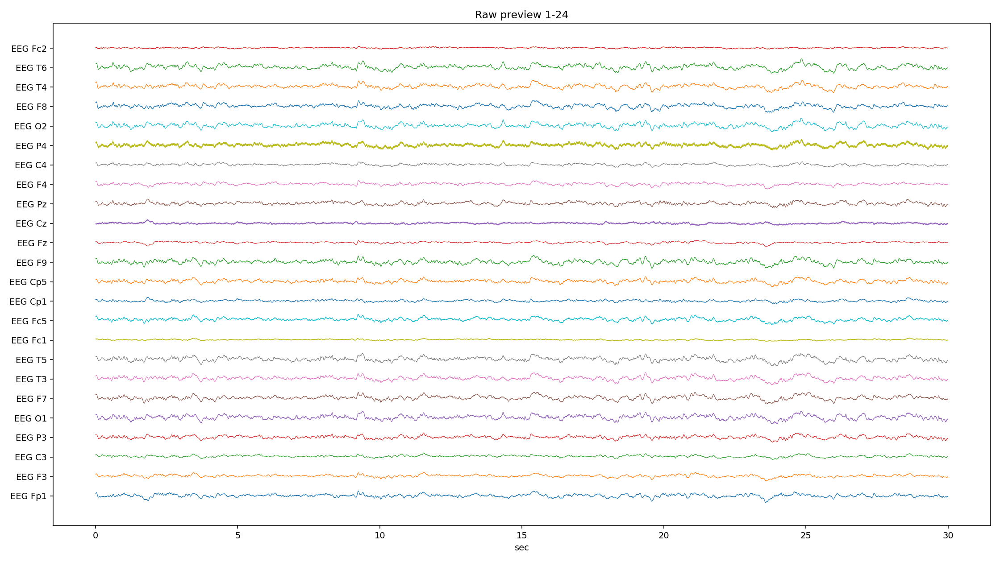
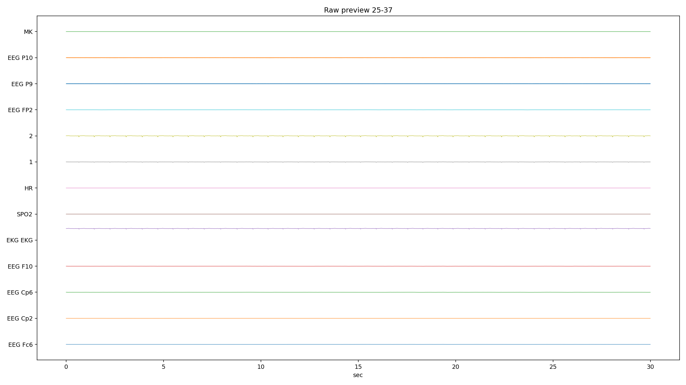
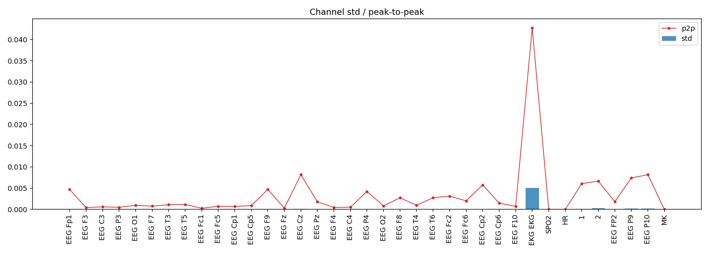
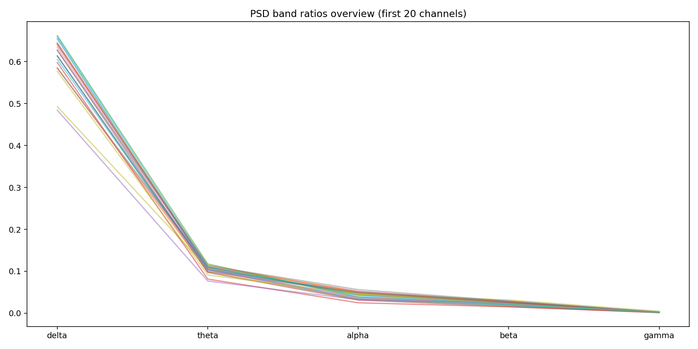
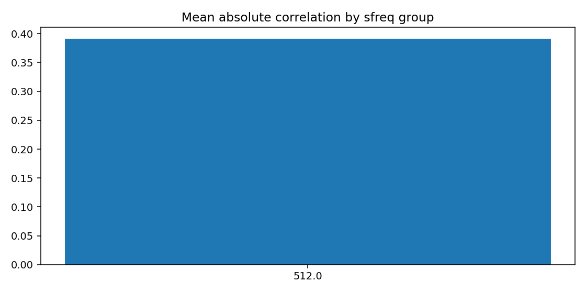
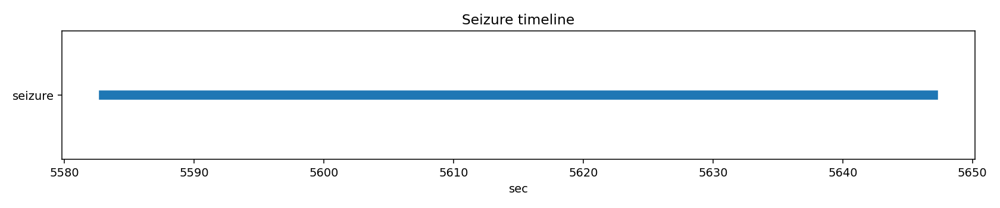

# PN06-1.edf EDA/QC 人工深度报告

## 1. 文件概览

| 项 | 值 |
|---|---|
| EDF | `E:\BaiduSyncdisk\nuro_work\data\raw\siena\PN06\PN06-1.edf` |
| 文件大小 | 364,302,848 bytes |
| 记录时长 | 9615.0 s (160.25 min) |
| 通道数 | 37 |
| 采样率结构 | 单采样率（512 Hz） |
| 文件级 flags | 无 |

补充：`errors.jsonl` 为空，读取与分析流程无中断错误。

## 2. 元数据检查

| 项 | 结果 |
|---|---|
| 起始时间（pyedflib） | 2016-01-01T04:21:22 |
| 起始时间（mne） | 2016-01-01 04:21:22+00:00 |
| recording_type | EDF |
| line_freq | None |
| 重名/空名通道 | 未见 |
| physical/digital 范围 | 均合法 |

人工解读：
- 文件头信息一致性好，没有 reader_discrepancy。
- `line_freq` 缺失意味着工频结论主要依赖 PSD 结果而非设备元数据。

## 3. 通道质量统计（关键表）

### 3.1 自动风险通道

| 通道 | 风险标记 |
|---|---|
| EKG EKG | high_variance, extreme_p2p |
| SPO2 | low_variance, high_flatline_ratio |
| HR | low_variance, high_flatline_ratio |
| 2 | high_variance |
| MK | high_flatline_ratio |

### 3.2 平线与振幅关键值

| 指标 | 观察 |
|---|---|
| 全程平线 | `SPO2`, `HR`, `MK`（flatline_ratio=1.0） |
| 高 std | `EKG EKG`（0.00503），`2`（2.85e-4），`P10/P9` 也偏高 |
| 极端 p2p | `EKG EKG`（0.0427）最显著 |
| robust z 异常比最高 | 通道 `1`（0.045）和 `2`（0.033）相对更高 |

人工解读：
- `SPO2/HR/MK` 在本段记录中没有有效动态，不适合作为连续时序特征。
- `EKG EKG` 高振幅符合生理差异，不应按 EEG 噪声直接剔除。
- `2` 通道既高方差又有短平线，建议单独复核通道语义。

## 4. PSD 与噪声（关键表）

### 4.1 频带均值（按通道平均）

| delta | theta | alpha | beta | gamma |
|---:|---:|---:|---:|---:|
| 0.548 | 0.085 | 0.038 | 0.027 | 0.003 |

### 4.2 50Hz 占比最高通道（Top 5）

| 通道 | 50Hz比值 |
|---|---:|
| EEG P10 | 0.852 |
| EEG P9 | 0.844 |
| EEG Cz | 0.154 |
| EEG P4 | 0.093 |
| EEG Fc1 | 0.084 |

人工解读：
- 大多数 EEG 通道符合“delta 主导、随频率升高逐步下降”的形态。
- `P9/P10` 存在非常明显的工频污染，属于建模前必须处理项。

## 5. 通道间相关性

| 指标 | 值 |
|---|---:|
| mean_abs_corr | 0.391 |
| max_corr | 0.997 |
| min_corr | -0.559 |

高相关对（示例）：`P9-P10(0.997)`, `O1-O2(0.970)`, `T5-Cp5(0.945)`。

人工解读：
- 中等偏高的空间相关性，适合保留多导联联合特征。
- `P9/P10` 的极高相关可能同时受到邻近位置和工频共噪影响。

## 6. Annotation 与 Seizure

| 项 | 结果 |
|---|---|
| EDF annotations | 0 |
| seizure list 命中 | 1 |
| seizure 时间窗 | 5583.0s ~ 5647.0s（64s，in_range=True） |

人工解读：
- 该文件事件标注主要来自 seizure list。
- 时间窗在记录范围内，可直接用于监督切片标注。

## 7. 图像逐张解读

### raw_preview_page_01.png
- 图像：
- 观察：主体 EEG 波形连续，未见大面积平线或饱和，局部有轻度慢漂移与短暂尖波。

### raw_preview_page_02.png
- 图像：
- 观察：`SPO2/HR/MK` 为水平线，`EKG` 有规律波动；与通道统计完全一致。

### channel_std_p2p.png
- 图像：
- 观察：`EKG EKG` 振幅显著高；`2/P9/P10` 明显高于多数 EEG 通道。

### flatline_saturation.png
- 图像：
- 观察：平线问题集中在 `SPO2/HR/MK`；饱和比例整体接近 0，说明主要矛盾不是削顶。

### psd_overview.png
- 图像：
- 观察：前 20 通道频带曲线形态一致性较好，delta 主导明确。

### corr_group.png
- 图像：
- 观察：相关性柱值约 0.39，与表格一致，不是空图。

### annotation_distribution.png
- 图像：
- 观察：明确显示“无 annotation”，属于数据现状提示图。

### seizure_timeline.png
- 图像：
- 观察：可视化地标出 64 秒发作区间，位置合理。

## 8. 总结与建模建议
1. 主体 EEG 信号质量可用，文件级完整性良好。  
2. `SPO2/HR/MK` 建议从 EEG 建模特征中剔除或缺失编码。  
3. `P9/P10` 工频污染重，需先做 50Hz 陷波并复算 PSD/QC。  
4. 保留跨导联特征建模（相关性中等偏高），但对高共噪通道做降权。  
5. seizure list 时间窗可直接用于正样本切片。  

