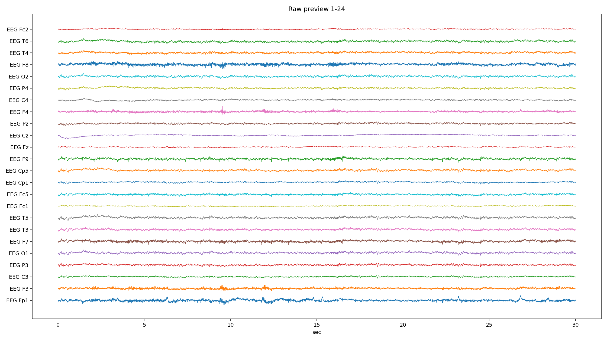
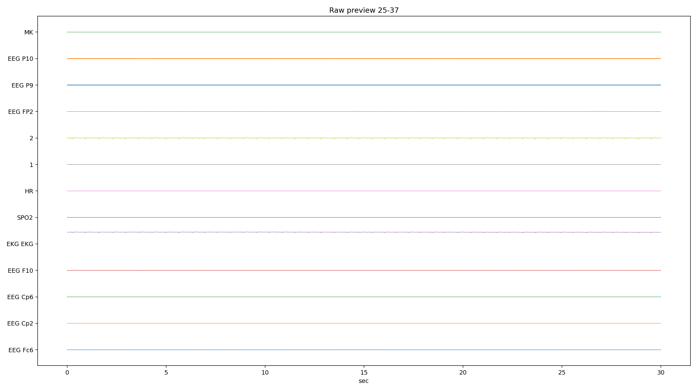
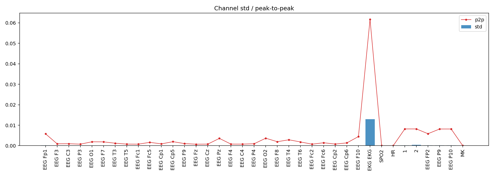
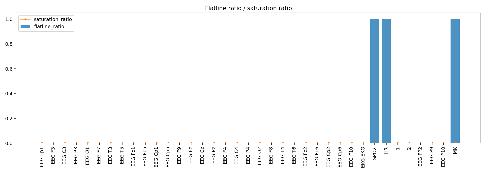
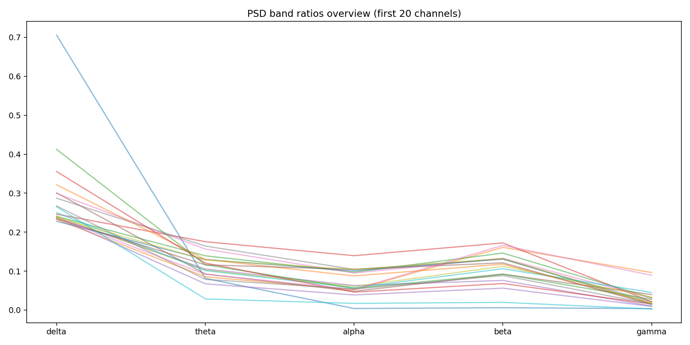
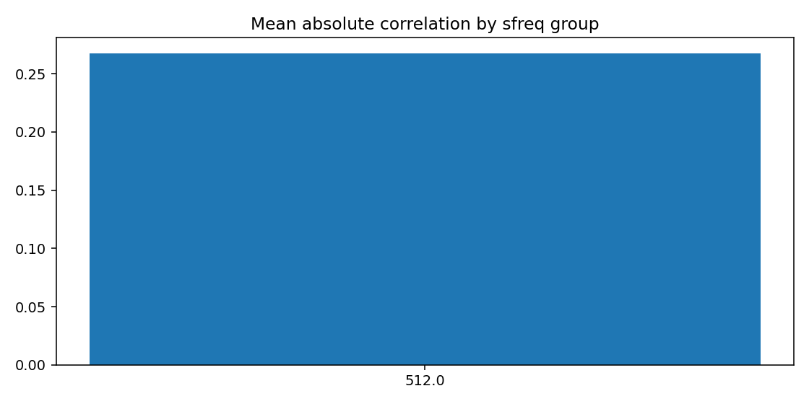
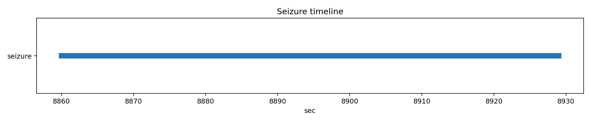

# PN06-2.edf EDA/QC 人工深度报告

## 1. 文件概览

| 项 | 值 |
|---|---|
| EDF | `E:\BaiduSyncdisk\nuro_work\data\raw\siena\PN06\PN06-2.edf` |
| 文件大小 | 478,156,288 bytes |
| 记录时长 | 12620.0 s (210.33 min) |
| 通道数 | 37 |
| 采样率结构 | 单采样率（512 Hz） |
| 文件级 flags | 无 |

补充：`errors.jsonl` 未见致命错误记录。

## 2. 元数据检查

| 项 | 结果 |
|---|---|
| 起始时间（pyedflib） | 2016-01-01T21:11:29 |
| 起始时间（mne） | 2016-01-01 21:11:29+00:00 |
| recording_type | EDF |
| line_freq | None |
| 通道命名完整性 | 无空名、无重名 |
| physical/digital 范围 | 均合法 |

人工解读：
- 本文件头信息完整，读取链路可靠。
- 与 PN06-1 一样，工频信息需依赖频谱估计。

## 3. 通道质量统计（关键表）

### 3.1 自动风险通道

| 通道 | 风险标记 |
|---|---|
| EKG EKG | high_variance, extreme_p2p |
| SPO2 | low_variance, high_flatline_ratio |
| HR | low_variance, high_flatline_ratio |
| 2 | high_variance |
| MK | high_flatline_ratio |

### 3.2 平线与振幅关键值

| 指标 | 观察 |
|---|---|
| 全程平线 | `SPO2`, `HR`, `MK`（flatline_ratio=1.0） |
| 高 std | `EKG EKG`（0.01295）显著；其次 `2`（4.06e-4）、`1`（2.26e-4） |
| 极端 p2p | `EKG EKG`（0.0617）最高；`1/2/P9/P10` 次高 |
| robust z 异常比最高 | `1`（0.0396）、`2`（0.0366）、`Fp1/CP6/FP2` 约 0.03 |

人工解读：
- 与 PN06-1 类似，`SPO2/HR/MK` 仍是常值/平线通道。
- `1/2` 通道异常比例上升，建议在建模中独立处理，不直接混入 EEG 主特征。

## 4. PSD 与噪声（关键表）

### 4.1 频带均值（按通道平均）

| delta | theta | alpha | beta | gamma |
|---:|---:|---:|---:|---:|
| 0.283 | 0.098 | 0.073 | 0.109 | 0.031 |

### 4.2 50Hz 占比最高通道（Top 5）

| 通道 | 50Hz比值 |
|---|---:|
| EEG P10 | 0.753 |
| EEG P9 | 0.748 |
| EEG Fc2 | 0.166 |
| EEG Cz | 0.144 |
| EEG Fc1 | 0.133 |

人工解读：
- 相比 PN06-1，本文件 beta/gamma 比例更高，提示更强高频成分或噪声成分。
- `P9/P10` 仍然是最显著工频污染点（>0.74），处理优先级高。

## 5. 通道间相关性

| 指标 | 值 |
|---|---:|
| mean_abs_corr | 0.267 |
| max_corr | 0.997 |
| min_corr | -0.260 |

高相关对中几乎只突出 `P9-P10(0.997)`。

人工解读：
- 整体相关性显著低于 PN06-1，跨导联同步性更弱。
- 高相关主要集中在 `P9/P10`，结合 PSD 判断，可能受共噪驱动。

## 6. Annotation 与 Seizure

| 项 | 结果 |
|---|---|
| EDF annotations | 0 |
| seizure list 命中 | 1 |
| seizure 时间窗 | 8860.0s ~ 8929.0s（69s，in_range=True） |

人工解读：
- 事件标注仍主要依赖 seizure list。
- 时间窗位置合理，可用于监督切片。

## 7. 图像逐张解读

### raw_preview_page_01.png
- 图像：
- 观察：前 24 通道中可见轻度漂移与突发波动，部分导联较 PN06-1 更“粗糙”。

### raw_preview_page_02.png
- 图像：
- 观察：`SPO2/HR/MK` 直线；`EKG` 波动显著；`1/2` 通道活动明显高于背景。

### channel_std_p2p.png
- 图像：
- 观察：`EKG EKG` 峰值最突出，`1/2/P9/P10` 的 p2p 也相对高。

### flatline_saturation.png
- 图像：
- 观察：平线集中在 `SPO2/HR/MK`；饱和比例依然近零。

### psd_overview.png
- 图像：
- 观察：前 20 通道曲线分散度比 PN06-1 更大，频带差异更明显。

### corr_group.png
- 图像：
- 观察：相关性柱值约 0.267，验证“整体耦合偏弱”结论。

### annotation_distribution.png
- 图像：
- 观察：显示无 annotation，占位图正常。

### seizure_timeline.png
- 图像：
- 观察：69 秒发作窗显示清晰，范围与表格一致。

## 8. 总结与建模建议
1. 文件整体可读，但跨导联一致性较 PN06-1 降低（mean_abs_corr 下降）。  
2. `SPO2/HR/MK` 仍应从 EEG 主特征中剔除或缺失编码。  
3. `P9/P10` 工频污染持续显著，建议通道级陷波并做复评。  
4. 对 `1/2` 通道建议单独质量策略（可保留但降权，或作为辅助通道）。  
5. seizure 时间窗可直接用于监督任务的阳性样本构建。  

