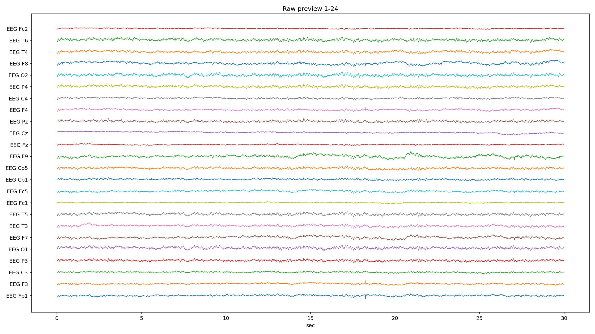
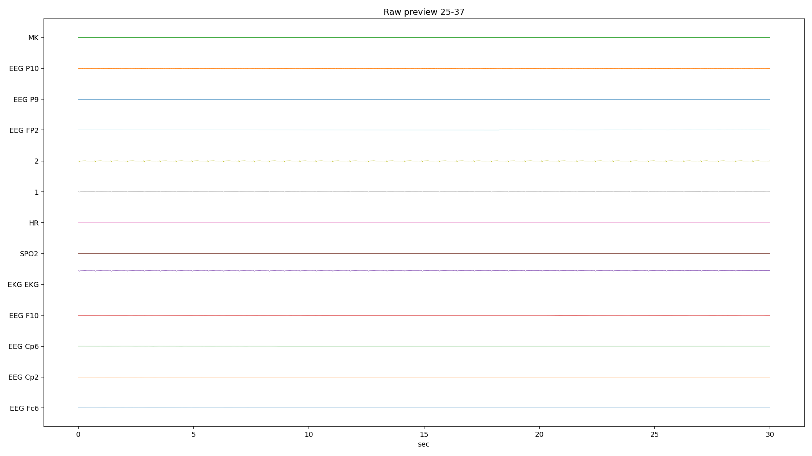
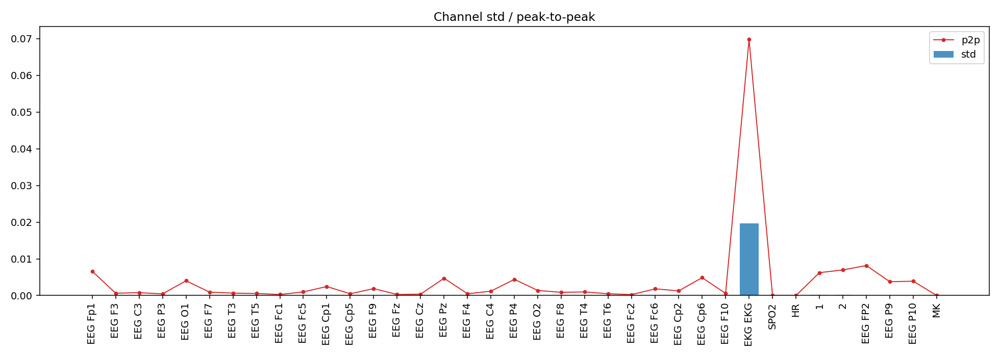
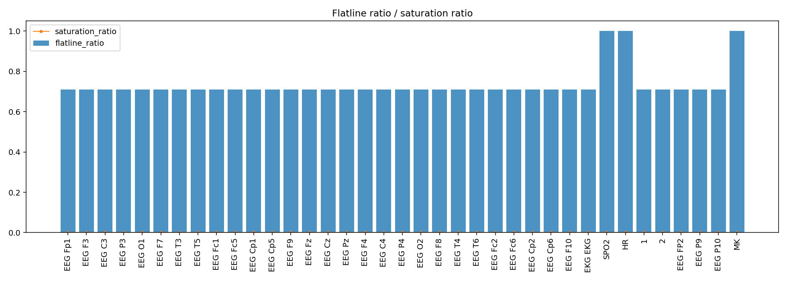
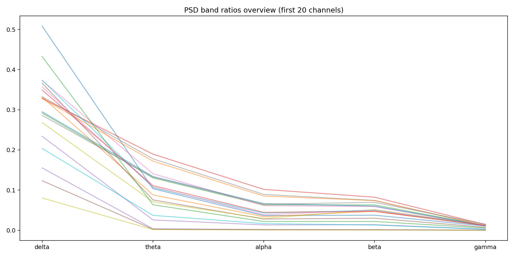
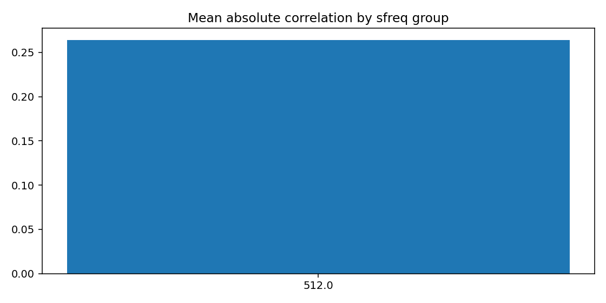
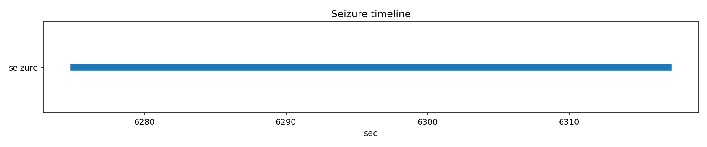

# PN06-3.edf EDA/QC 人工深度报告

## 1. 文件概览

| 项 | 值 |
|---|---|
| EDF | `E:\BaiduSyncdisk\nuro_work\data\raw\siena\PN06\PN06-3.edf` |
| 文件大小 | 309,933,568 bytes |
| 记录时长 | 8180.0 s (136.33 min) |
| 通道数 | 37 |
| 采样率结构 | 单采样率（512 Hz） |
| 文件级 flags | 无 |

## 2. 元数据检查

| 项 | 结果 |
|---|---|
| 起始时间（pyedflib） | 2016-01-01T06:25:51 |
| 起始时间（mne） | 2016-01-01 06:25:51+00:00 |
| recording_type | EDF |
| line_freq | None |
| 通道命名/范围 | 无空名、无重名、physical/digital 合法 |

人工解读：
- 文件头未见结构性错误，但后续信号质量显示存在明显“长段平线”问题。

## 3. 通道质量统计（关键表）

### 3.1 自动风险通道（核心现象）

本文件被标记风险通道非常多，几乎所有 EEG 通道均出现 `high_flatline_ratio`。

| 典型通道 | 关键风险 |
|---|---|
| EEG Fp1/F3/C3/.../P10（多数 EEG） | high_flatline_ratio |
| EKG EKG | high_variance, extreme_p2p, high_flatline_ratio |
| SPO2, HR | low_variance, high_flatline_ratio |
| 1, 2 | high_flatline_ratio（2 另有 high_variance） |
| MK | high_flatline_ratio |

### 3.2 平线指标关键值

| 通道 | flatline_ratio | flatline_total_sec | longest_flatline_sec |
|---|---:|---:|---:|
| SPO2 | 1.000 | 8179.998 | 8179.998 |
| HR | 1.000 | 8179.998 | 8179.998 |
| MK | 0.999997 | 8179.975 | 1328.998 |
| EEG Fp1 | 0.710145 | 5808.988 | 1328.998 |
| EEG Cz | 0.710390 | 5810.988 | 1327.998 |
| EEG P10 | 0.710145 | 5808.988 | 1328.998 |

人工解读：
- 本文件最大异常是“广泛长段平线”：大量通道平线比例约 71%，并出现约 1328 秒的超长平线段。
- 这是**文件质量级别风险**，不是单个导联小问题。

### 3.3 振幅与异常比

| 指标 | 观察 |
|---|---|
| 高 std | EKG EKG（0.0197）最高，1/2/FP2/P9/P10 次高 |
| 极端 p2p | EKG EKG（0.0698）显著 |
| robust z 异常比 | 大多为 0（因长平线导致统计失去辨别度） |

## 4. PSD 与噪声（关键表）

### 4.1 频带均值（按通道平均）

| delta | theta | alpha | beta | gamma |
|---:|---:|---:|---:|---:|
| 0.280 | 0.084 | 0.040 | 0.041 | 0.008 |

### 4.2 50Hz 占比最高通道（Top 5）

| 通道 | 50Hz比值 |
|---|---:|
| EEG P10 | 0.775 |
| EEG P9 | 0.770 |
| EEG Fc1 | 0.154 |
| EEG Fc2 | 0.136 |
| EEG Fz | 0.114 |

人工解读：
- `P9/P10` 仍有重度工频污染。
- 但当前文件的首要矛盾是“长平线导致有效波形窗口不足”，频谱值解释优先级应低于平线风险。

## 5. 通道间相关性

| 指标 | 值 |
|---|---:|
| mean_abs_corr | 0.264 |
| max_corr | 0.998 |
| min_corr | -0.520 |

高相关对示例：`P9-P10(0.998)`, `EKG EKG-MK(0.963)`, `Pz-1(0.922)`。

人工解读：
- 相关性中出现“非典型高相关”（如 EKG-MK），很可能是长段平线带来的相关性伪提升。
- 因此相关性结果在本文件里需谨慎使用。

## 6. Annotation 与 Seizure

| 项 | 结果 |
|---|---|
| EDF annotations | 0 |
| seizure list 命中 | 1 |
| seizure 时间窗 | 6275.0s ~ 6317.0s（42s，in_range=True） |

人工解读：
- 事件标签可用，但模型训练前必须先解决信号有效段问题。

## 7. 图像逐张解读

### raw_preview_page_01.png
- 图像：
- 观察：前 30 秒内波形存在，但结合平线统计可判断该文件存在大量其他时段的长平线，不可仅凭此页判断全程质量。

### raw_preview_page_02.png
- 图像：
- 观察：`SPO2/HR/MK` 近直线；辅助通道 `1/2` 有波动。

### channel_std_p2p.png
- 图像：
- 观察：`EKG` 振幅最高；`1/2/FP2/P9/P10` 也偏高。

### flatline_saturation.png
- 图像：
- 观察：大量通道 flatline_ratio 非常高（核心证据图）；饱和比例并不突出。

### psd_overview.png
- 图像：
- 观察：频带分布仍可见，但在强平线背景下解释可信度下降。

### corr_group.png
- 图像：
- 观察：相关性约 0.264，配合平线现象不宜直接作为“生理同步性”证据。

### annotation_distribution.png
- 图像：
- 观察：无 annotation，占位图正常。

### seizure_timeline.png
- 图像：
- 观察：42 秒发作窗显示正常。

## 8. 总结与建模建议
1. 本文件属于**高风险质量样本**：大量导联存在约 71% 的平线比例与超长平线段。  
2. 建议先做“有效片段筛选”（去除平线段）后再计算特征，否则统计与相关性会失真。  
3. `SPO2/HR/MK` 建议直接剔除或仅作缺失标识；`P9/P10` 需陷波后复评。  
4. 若有效段不足，建议该文件不纳入主训练集，或仅用于鲁棒性评估子集。  

