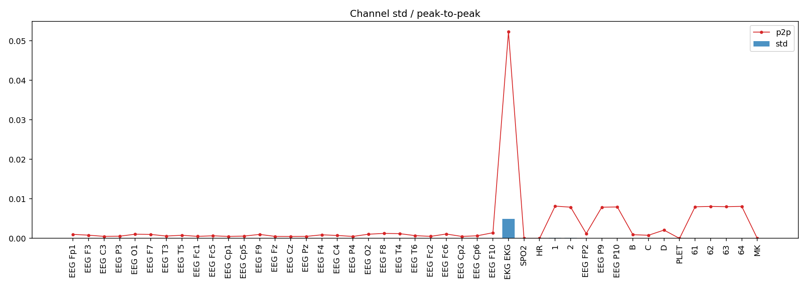
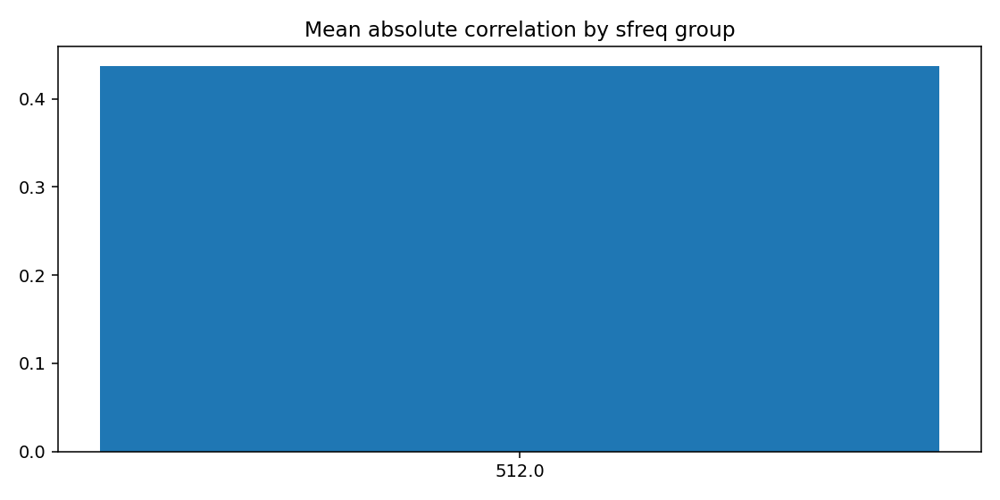
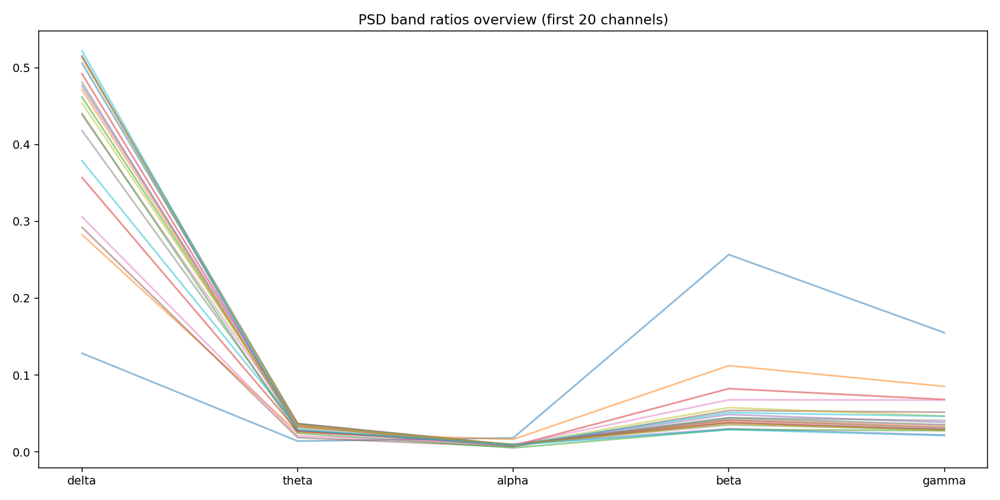
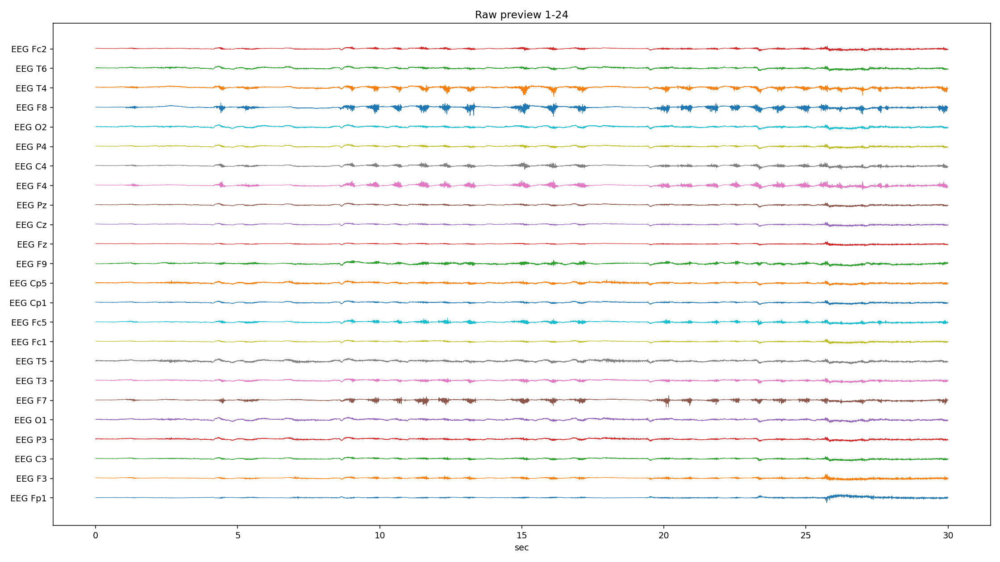
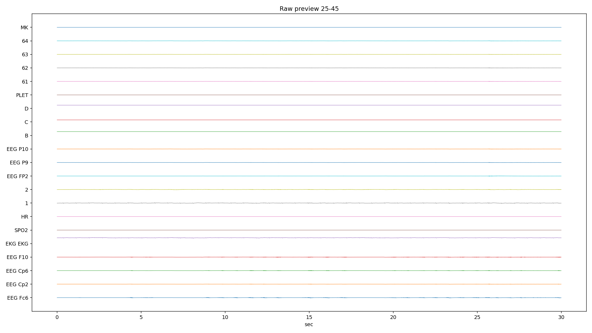
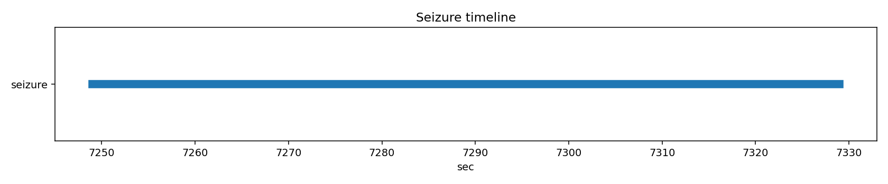

# PN09-1.edf EDA/QC ???????????????

## 1. ????????
| ?? | ?? |
|---|---|
| ??? | PN09 |
| EDF ?? | `E:\BaiduSyncdisk\nuro_work\data\raw\siena\PN09\PN09-1.edf` |
| ???? | 379388416 bytes |
| ?? | 8233.0 s (137.22 min) |
| ??? | 45 |
| ????? | ???? |
| ??? flags | ? |

## 2. ?????
- ?????pyedflib/mne??`2017-01-01T14:08:54` / `2017-01-01 14:08:54+00:00`
- ?????`EDF`?line_freq?`None`
- QC ???`{'flatline_eps': 1e-12, 'flatline_min_run_sec': 1.0, 'saturation_pct': 0.995, 'robust_z_thresh': 8.0, 'robust_z_bad_ratio': 0.05, 'low_variance_quantile': 0.05, 'high_variance_quantile': 0.95, 'extreme_p2p_quantile': 0.98, 'high_corr_threshold': 0.9, 'low_mean_abs_corr_threshold': 0.2}`

### 2.1 ??????
| channel_type | count |
| --- | --- |
| unknown | 41 |
| eeg | 2 |
| ecg | 1 |
| spo2 | 1 |

## 3. ???????
### 3.1 ????
| channel | flags |
| --- | --- |
| EKG EKG | high_variance, extreme_p2p |
| SPO2 | low_variance, high_flatline_ratio |
| HR | low_variance, high_flatline_ratio |
| 1 | high_variance |
| 2 | high_variance |
| PLET | low_variance, high_flatline_ratio |
| MK | high_flatline_ratio |

### 3.2 ???? Top10
| channel | flatline_ratio | flatline_total_sec | flatline_longest_sec |
| --- | --- | --- | --- |
| MK | 1 | 8233 | 8233 |
| PLET | 1 | 8233 | 8233 |
| SPO2 | 1 | 8233 | 8233 |
| HR | 1 | 8233 | 8233 |
| EEG FP2 | 0 | 0 | 0 |
| EEG Cp2 | 0 | 0 | 0 |
| EEG Cp6 | 0 | 0 | 0 |
| EEG F10 | 0 | 0 | 0 |
| EKG EKG | 0 | 0 | 0 |
| 1 | 0 | 0 | 0 |

### 3.3 ????? Top10
| channel | std | peak_to_peak | robust_z_outlier_ratio | saturation_ratio |
| --- | --- | --- | --- | --- |
| EKG EKG | 0.00491568 | 0.0522923 | 0 | 0 |
| 1 | 0.000195119 | 0.00817512 | 0.00688255 | 0 |
| 2 | 0.000112608 | 0.00790487 | 0.0221145 | 0 |
| D | 8.72576e-05 | 0.0021045 | 1.42339e-06 | 0 |
| C | 8.59512e-05 | 0.000793 | 0 | 0 |
| B | 8.58236e-05 | 0.0009455 | 0 | 0 |
| 63 | 7.26007e-05 | 0.00802763 | 0.0061284 | 0 |
| 61 | 7.157e-05 | 0.008006 | 0.00646811 | 0 |
| 64 | 7.0655e-05 | 0.00811187 | 0.00711267 | 0 |
| 62 | 6.97388e-05 | 0.00809837 | 0.00735749 | 0 |

## 4. ???????
- ?????delta=0.4381, theta=0.0282, alpha=0.0122, beta=0.0512, gamma=0.0372

### 4.1 ??/??/???? Top10
| channel | line_50hz_ratio | line_60hz_ratio | low_freq_drift_ratio | high_freq_noise_ratio |
| --- | --- | --- | --- | --- |
| D | 0.104646 | 0.00467301 | 0.120784 | 0.270617 |
| 63 | 0.0891615 | 0.000378068 | 0.187231 | 0.102165 |
| 61 | 0.0816304 | 0.000371975 | 0.190676 | 0.0944689 |
| 64 | 0.0786017 | 0.000389954 | 0.191107 | 0.0918812 |
| 62 | 0.0722784 | 0.00038235 | 0.194116 | 0.0853284 |
| EEG P10 | 0.0595676 | 0.000386087 | 0.198718 | 0.0726314 |
| EEG P9 | 0.043871 | 0.000399653 | 0.203164 | 0.0572586 |
| B | 0.0285443 | 0.00602276 | 0.141628 | 0.236488 |
| C | 0.0202973 | 0.00620178 | 0.144264 | 0.230325 |
| EEG Fp1 | 0.016924 | 0.01202 | 0.0969779 | 0.413302 |

## 5. ??????
| ?? | ?? |
|---|---|
| mean_abs_corr | 0.437 |
| max_corr | 0.993 |
| min_corr | -0.431 |
| low_corr_flag | False |

### 5.1 ?????? Top10
| ch_a | ch_b | corr |
| --- | --- | --- |
| EEG Cp1 | EEG Pz | 0.993266 |
| 61 | 63 | 0.992177 |
| 62 | 63 | 0.991673 |
| 62 | 64 | 0.991612 |
| 63 | 64 | 0.991426 |
| 61 | 62 | 0.991345 |
| 61 | 64 | 0.99088 |
| EEG P9 | EEG P10 | 0.990142 |
| EEG P10 | 62 | 0.989806 |
| EEG P4 | EEG Cp2 | 0.989373 |

## 6. Annotation ? Seizure ??
| ?? | ?? |
|---|---|
| Annotation ? | 0 |
| Annotation ??? | 0 |
| Annotation ??? | 0 |
| Seizure ??? | 1 |

### 6.1 Seizure ???
| file | start_sec | end_sec | duration_sec | in_range |
| --- | --- | --- | --- | --- |
| PN09-1.edf | 7249 | 7329 | 80 | True |

## 7. ??????????
### annotation_distribution.png
- ?????(exists=True, size=7036, resolution=1400x420)
- ???annotation ??????? annotation ?=0?
- ???

### channel_std_p2p.png
- ?????(exists=True, size=60680, resolution=1960x700)
- ????????????? std ??? EKG EKG (std=0.00491568, p2p=0.0522923)?
- ???

### corr_group.png
- ?????(exists=True, size=15904, resolution=1120x560)
- ??????????mean_abs=0.437, max=0.993, min=-0.431?
- ???

### flatline_saturation.png
- ?????(exists=True, size=40566, resolution=1960x700)
- ?????/?????????????????max saturation=0.000??
- ???

### psd_overview.png
- ?????(exists=True, size=190659, resolution=1680x840)
- ???????????? delta/theta/alpha/beta/gamma=0.438/0.028/0.012/0.051/0.037?
- ???

### raw_preview_page_01.png
- ?????(exists=True, size=362625, resolution=2240x1260)
- ???????????????/??/??????????????? MK (ratio=1.000)?
- ???

### raw_preview_page_02.png
- ?????(exists=True, size=133291, resolution=2240x1260)
- ???????????????/??/??????????????? MK (ratio=1.000)?
- ???

### seizure_timeline.png
- ?????(exists=True, size=13406, resolution=1680x350)
- ???seizure ??????????=1?
- ???

## 8. ?????
1. ?????????????????????
2. seizure ???????????????????
