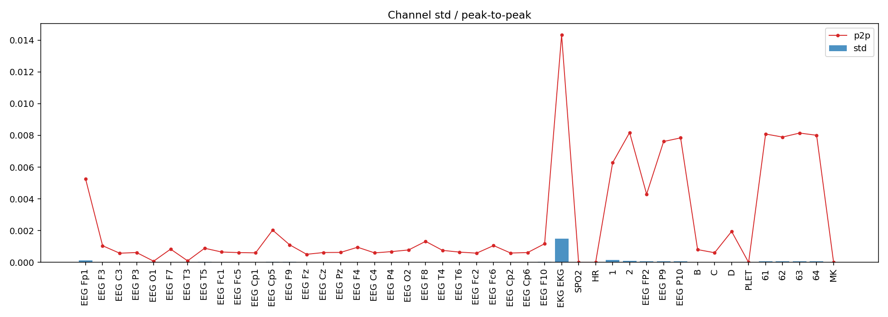
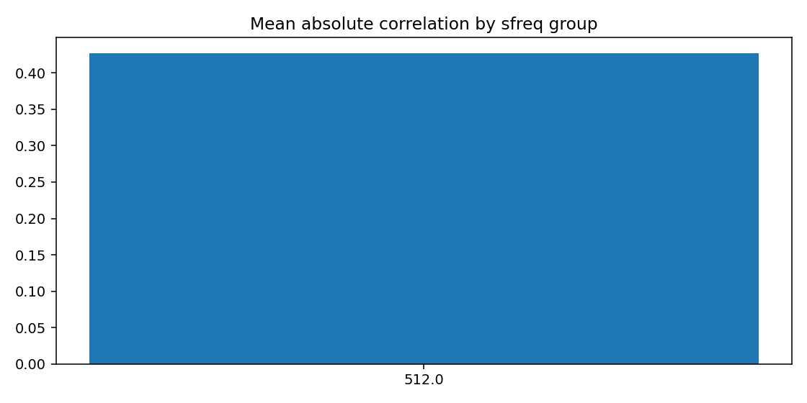
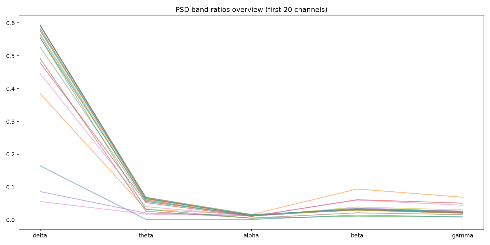
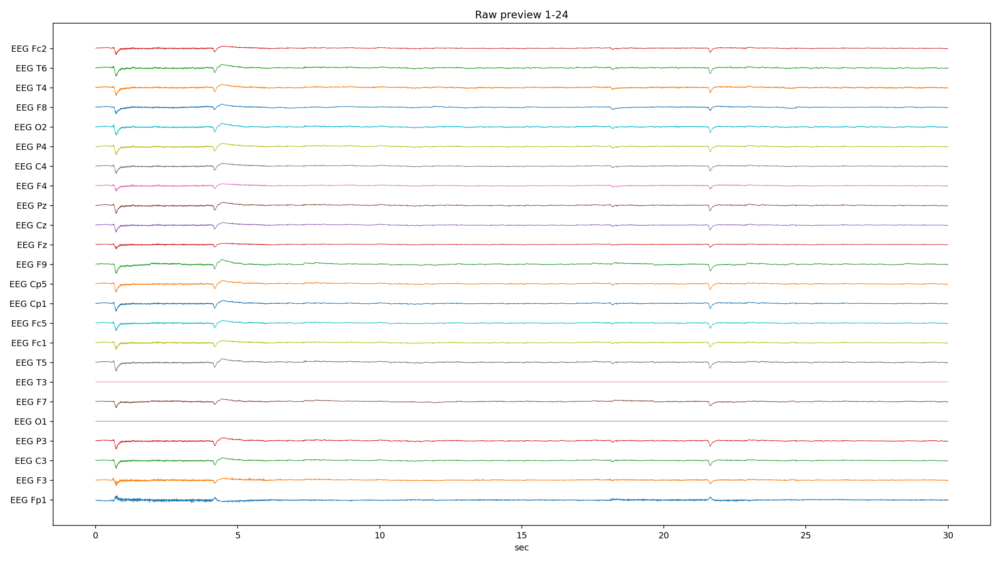
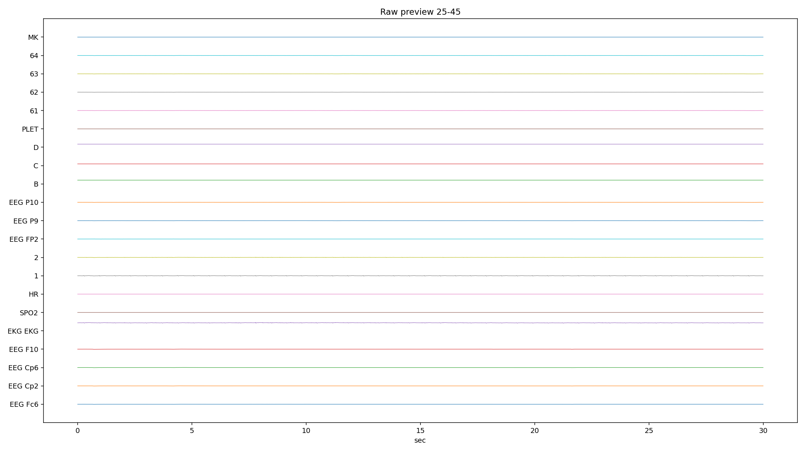
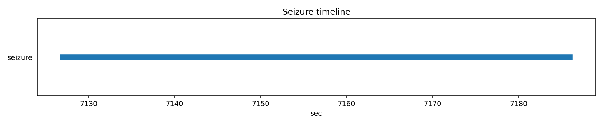

# PN09-2.edf EDA/QC ???????????????

## 1. ????????
| ?? | ?? |
|---|---|
| ??? | PN09 |
| EDF ?? | `E:\BaiduSyncdisk\nuro_work\data\raw\siena\PN09\PN09-2.edf` |
| ???? | 384918016 bytes |
| ?? | 8353.0 s (139.22 min) |
| ??? | 45 |
| ????? | ???? |
| ??? flags | ? |

## 2. ?????
- ?????pyedflib/mne??`2017-01-01T15:02:09` / `2017-01-01 15:02:09+00:00`
- ?????`EDF`?line_freq?`None`
- QC ???`{'flatline_eps': 1e-12, 'flatline_min_run_sec': 1.0, 'saturation_pct': 0.995, 'robust_z_thresh': 8.0, 'robust_z_bad_ratio': 0.05, 'low_variance_quantile': 0.05, 'high_variance_quantile': 0.95, 'extreme_p2p_quantile': 0.98, 'high_corr_threshold': 0.9, 'low_mean_abs_corr_threshold': 0.2}`

### 2.1 ??????
| channel_type | count |
| --- | --- |
| unknown | 41 |
| eeg | 2 |
| ecg | 1 |
| spo2 | 1 |

## 3. ???????
### 3.1 ????
| channel | flags |
| --- | --- |
| EEG Fp1 | high_variance |
| EKG EKG | high_variance, extreme_p2p |
| SPO2 | low_variance, high_flatline_ratio |
| HR | low_variance, high_flatline_ratio |
| 1 | high_variance |
| PLET | low_variance, high_flatline_ratio |
| MK | high_flatline_ratio |

### 3.2 ???? Top10
| channel | flatline_ratio | flatline_total_sec | flatline_longest_sec |
| --- | --- | --- | --- |
| MK | 1 | 8353 | 8353 |
| PLET | 1 | 8353 | 8353 |
| SPO2 | 1 | 8353 | 8353 |
| HR | 1 | 8353 | 8353 |
| EEG FP2 | 0 | 0 | 0 |
| EEG Cp2 | 0 | 0 | 0 |
| EEG Cp6 | 0 | 0 | 0 |
| EEG F10 | 0 | 0 | 0 |
| EKG EKG | 0 | 0 | 0 |
| 1 | 0 | 0 | 0 |

### 3.3 ????? Top10
| channel | std | peak_to_peak | robust_z_outlier_ratio | saturation_ratio |
| --- | --- | --- | --- | --- |
| EKG EKG | 0.00150089 | 0.0143198 | 0 | 0 |
| 1 | 0.000144473 | 0.00627413 | 0.00236676 | 0 |
| EEG Fp1 | 0.000138921 | 0.00524887 | 0.0342565 | 0 |
| 2 | 9.55172e-05 | 0.00817887 | 0.0136244 | 0 |
| 63 | 6.94932e-05 | 0.00814787 | 0.00489158 | 0 |
| 64 | 6.81765e-05 | 0.008007 | 0.00556523 | 0 |
| 61 | 6.79902e-05 | 0.00808625 | 0.00520397 | 0 |
| 62 | 6.61575e-05 | 0.00789512 | 0.00613412 | 0 |
| EEG P10 | 6.45948e-05 | 0.0078425 | 0.00617153 | 0 |
| EEG P9 | 6.1095e-05 | 0.00761425 | 0.00777158 | 0 |

## 4. ???????
- ?????delta=0.4418, theta=0.0477, alpha=0.0180, beta=0.0388, gamma=0.0235

### 4.1 ??/??/???? Top10
| channel | line_50hz_ratio | line_60hz_ratio | low_freq_drift_ratio | high_freq_noise_ratio |
| --- | --- | --- | --- | --- |
| EEG T3 | 0.746248 | 0.00164062 | 0.0212461 | 0.803751 |
| EEG O1 | 0.680464 | 0.00189241 | 0.0388148 | 0.74635 |
| D | 0.311281 | 0.00503891 | 0.0428938 | 0.481966 |
| 63 | 0.278573 | 0.000506664 | 0.242133 | 0.295669 |
| 61 | 0.258378 | 0.000530806 | 0.249924 | 0.275923 |
| 64 | 0.244487 | 0.000520864 | 0.258805 | 0.262198 |
| 62 | 0.221515 | 0.000551874 | 0.265925 | 0.239861 |
| EEG P10 | 0.213036 | 0.000555726 | 0.269713 | 0.231466 |
| EEG P9 | 0.155962 | 0.000555943 | 0.292815 | 0.174274 |
| B | 0.0871935 | 0.00690627 | 0.064037 | 0.336524 |

## 5. ??????
| ?? | ?? |
|---|---|
| mean_abs_corr | 0.427 |
| max_corr | 0.991 |
| min_corr | -0.466 |
| low_corr_flag | False |

### 5.1 ?????? Top10
| ch_a | ch_b | corr |
| --- | --- | --- |
| EEG P4 | EEG Cp2 | 0.990559 |
| EEG P3 | EEG Cp5 | 0.990215 |
| EEG P3 | EEG Cp1 | 0.989205 |
| 61 | 63 | 0.988478 |
| EEG Cp1 | EEG Pz | 0.987493 |
| 63 | 64 | 0.986332 |
| EEG P10 | 63 | 0.98616 |
| EEG P10 | 62 | 0.985929 |
| 62 | 63 | 0.985593 |
| EEG Pz | EEG P4 | 0.985532 |

## 6. Annotation ? Seizure ??
| ?? | ?? |
|---|---|
| Annotation ? | 0 |
| Annotation ??? | 0 |
| Annotation ??? | 0 |
| Seizure ??? | 1 |

### 6.1 Seizure ???
| file | start_sec | end_sec | duration_sec | in_range |
| --- | --- | --- | --- | --- |
| PN09-2.edf | 7127 | 7186 | 59 | True |

## 7. ??????????
### annotation_distribution.png
- ?????(exists=True, size=7036, resolution=1400x420)
- ???annotation ??????? annotation ?=0?
- ???

### channel_std_p2p.png
- ?????(exists=True, size=82577, resolution=1960x700)
- ????????????? std ??? EKG EKG (std=0.00150089, p2p=0.0143198)?
- ???

### corr_group.png
- ?????(exists=True, size=21229, resolution=1120x560)
- ??????????mean_abs=0.427, max=0.991, min=-0.466?
- ???

### flatline_saturation.png
- ?????(exists=True, size=40566, resolution=1960x700)
- ?????/?????????????????max saturation=0.000??
- ???

### psd_overview.png
- ?????(exists=True, size=160719, resolution=1680x840)
- ???????????? delta/theta/alpha/beta/gamma=0.442/0.048/0.018/0.039/0.023?
- ???

### raw_preview_page_01.png
- ?????(exists=True, size=332652, resolution=2240x1260)
- ???????????????/??/??????????????? MK (ratio=1.000)?
- ???

### raw_preview_page_02.png
- ?????(exists=True, size=105230, resolution=2240x1260)
- ???????????????/??/??????????????? MK (ratio=1.000)?
- ???

### seizure_timeline.png
- ?????(exists=True, size=11963, resolution=1680x350)
- ???seizure ??????????=1?
- ???

## 8. ?????
1. ?????????????????????
2. ??????????? 50Hz ????? PSD ?????
3. seizure ???????????????????
