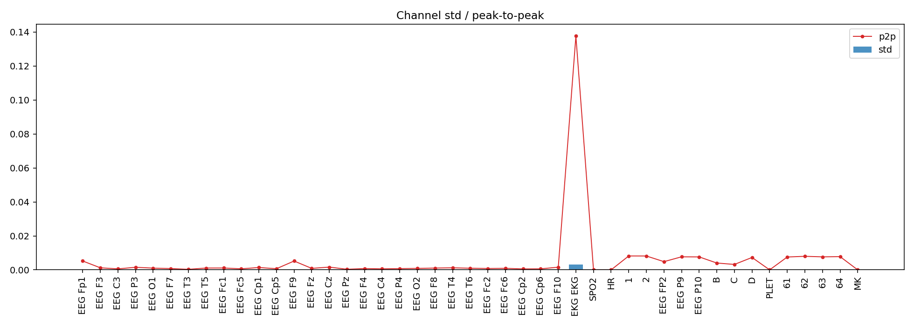
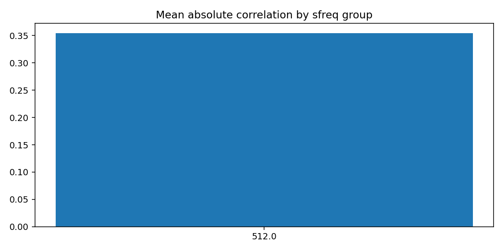
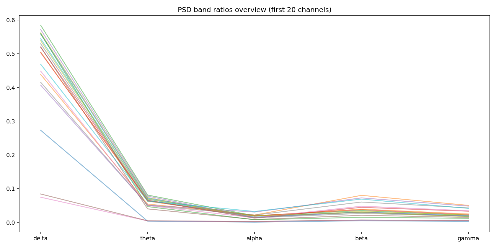
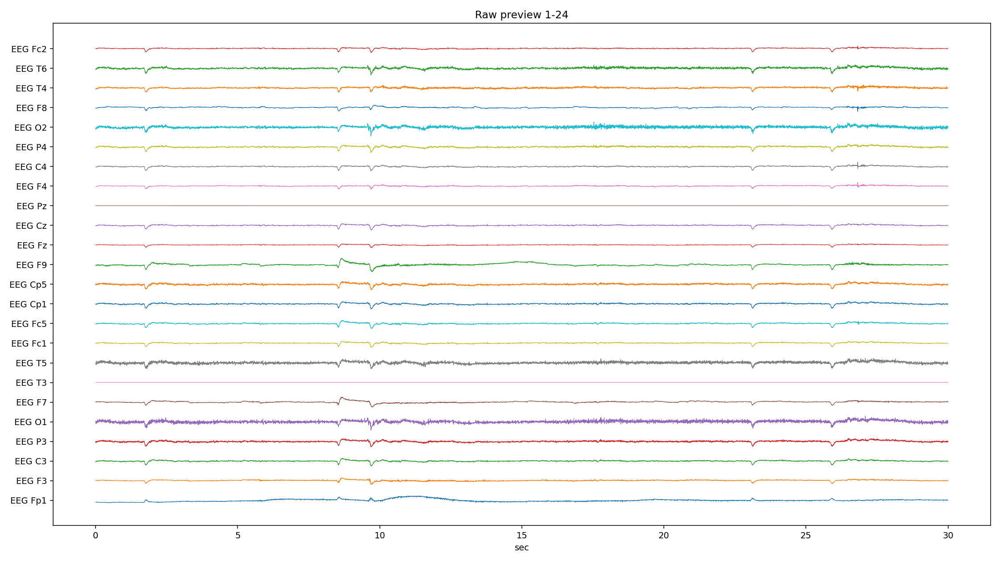
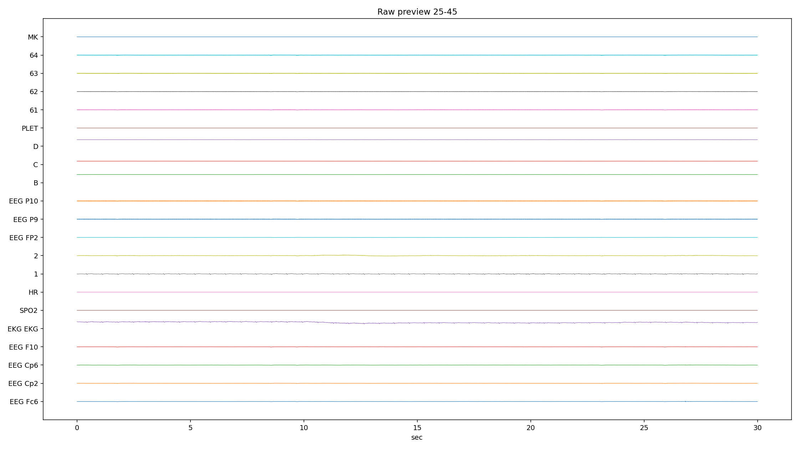
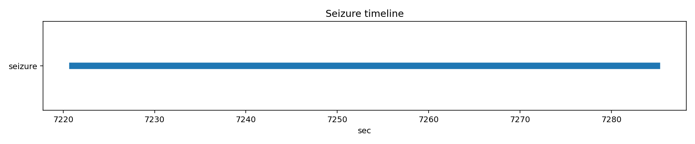

# PN09-3.edf EDA/QC ???????????????

## 1. ????????
| ?? | ?? |
|---|---|
| ??? | PN09 |
| EDF ?? | `E:\BaiduSyncdisk\nuro_work\data\raw\siena\PN09\PN09-3.edf` |
| ???? | 371646976 bytes |
| ?? | 8065.0 s (134.42 min) |
| ??? | 45 |
| ????? | ???? |
| ??? flags | ? |

## 2. ?????
- ?????pyedflib/mne??`2017-01-01T14:20:23` / `2017-01-01 14:20:23+00:00`
- ?????`EDF`?line_freq?`None`
- QC ???`{'flatline_eps': 1e-12, 'flatline_min_run_sec': 1.0, 'saturation_pct': 0.995, 'robust_z_thresh': 8.0, 'robust_z_bad_ratio': 0.05, 'low_variance_quantile': 0.05, 'high_variance_quantile': 0.95, 'extreme_p2p_quantile': 0.98, 'high_corr_threshold': 0.9, 'low_mean_abs_corr_threshold': 0.2}`

### 2.1 ??????
| channel_type | count |
| --- | --- |
| unknown | 41 |
| eeg | 2 |
| ecg | 1 |
| spo2 | 1 |

## 3. ???????
### 3.1 ????
| channel | flags |
| --- | --- |
| EEG Fp1 | high_variance |
| EKG EKG | high_variance, extreme_p2p |
| SPO2 | low_variance, high_flatline_ratio |
| HR | low_variance, high_flatline_ratio |
| 2 | high_variance |
| PLET | low_variance, high_flatline_ratio |
| MK | high_flatline_ratio |

### 3.2 ???? Top10
| channel | flatline_ratio | flatline_total_sec | flatline_longest_sec |
| --- | --- | --- | --- |
| MK | 1 | 8065 | 8065 |
| PLET | 1 | 8065 | 8065 |
| SPO2 | 1 | 8065 | 8065 |
| HR | 1 | 8065 | 8065 |
| EEG FP2 | 0 | 0 | 0 |
| EEG Cp2 | 0 | 0 | 0 |
| EEG Cp6 | 0 | 0 | 0 |
| EEG F10 | 0 | 0 | 0 |
| EKG EKG | 0 | 0 | 0 |
| 1 | 0 | 0 | 0 |

### 3.3 ????? Top10
| channel | std | peak_to_peak | robust_z_outlier_ratio | saturation_ratio |
| --- | --- | --- | --- | --- |
| EKG EKG | 0.00310571 | 0.137692 | 7.26519e-06 | 0 |
| 2 | 0.000252553 | 0.00817237 | 0.0104023 | 0 |
| EEG Fp1 | 0.000217756 | 0.0052225 | 0.0391054 | 0 |
| 1 | 0.000182745 | 0.00819175 | 0.00373382 | 0 |
| 63 | 0.000122993 | 0.00766562 | 0.00315115 | 0 |
| 64 | 0.0001216 | 0.00779712 | 0.00351466 | 0 |
| 61 | 0.000119944 | 0.00758237 | 0.00348438 | 0 |
| 62 | 0.000117031 | 0.00797938 | 0.00401934 | 0 |
| EEG P10 | 0.000111847 | 0.007633 | 0.00443225 | 0 |
| EEG P9 | 0.000105023 | 0.00768562 | 0.00554964 | 0 |

## 4. ???????
- ?????delta=0.4147, theta=0.0427, alpha=0.0155, beta=0.0326, gamma=0.0199

### 4.1 ??/??/???? Top10
| channel | line_50hz_ratio | line_60hz_ratio | low_freq_drift_ratio | high_freq_noise_ratio |
| --- | --- | --- | --- | --- |
| EEG T3 | 0.794803 | 0.000733513 | 0.0541241 | 0.81854 |
| EEG Pz | 0.783107 | 0.000647039 | 0.0622879 | 0.803882 |
| D | 0.364565 | 0.00361837 | 0.0966325 | 0.489545 |
| 63 | 0.226551 | 5.33782e-05 | 0.394956 | 0.228268 |
| 64 | 0.211451 | 5.54921e-05 | 0.403114 | 0.213242 |
| 61 | 0.210997 | 5.54724e-05 | 0.404696 | 0.212762 |
| 62 | 0.191934 | 5.6776e-05 | 0.415111 | 0.193765 |
| EEG P10 | 0.175319 | 5.7991e-05 | 0.425191 | 0.177206 |
| EEG P9 | 0.144038 | 6.22581e-05 | 0.44254 | 0.146084 |
| B | 0.113369 | 0.00614271 | 0.103351 | 0.331929 |

## 5. ??????
| ?? | ?? |
|---|---|
| mean_abs_corr | 0.354 |
| max_corr | 0.994 |
| min_corr | -0.314 |
| low_corr_flag | False |

### 5.1 ?????? Top10
| ch_a | ch_b | corr |
| --- | --- | --- |
| 61 | 63 | 0.993953 |
| 63 | 64 | 0.993541 |
| 61 | 62 | 0.993449 |
| 62 | 64 | 0.993392 |
| 62 | 63 | 0.993004 |
| 61 | 64 | 0.992465 |
| EEG P10 | 62 | 0.992398 |
| EEG P10 | 61 | 0.991844 |
| EEG P9 | EEG P10 | 0.991763 |
| EEG P10 | 63 | 0.989958 |

## 6. Annotation ? Seizure ??
| ?? | ?? |
|---|---|
| Annotation ? | 0 |
| Annotation ??? | 0 |
| Annotation ??? | 0 |
| Seizure ??? | 1 |

### 6.1 Seizure ???
| file | start_sec | end_sec | duration_sec | in_range |
| --- | --- | --- | --- | --- |
| PN09-3.edf | 7221 | 7285 | 64 | True |

## 7. ??????????
### annotation_distribution.png
- ?????(exists=True, size=7036, resolution=1400x420)
- ???annotation ??????? annotation ?=0?
- ???

### channel_std_p2p.png
- ?????(exists=True, size=58867, resolution=1960x700)
- ????????????? std ??? EKG EKG (std=0.00310571, p2p=0.137692)?
- ???

### corr_group.png
- ?????(exists=True, size=20220, resolution=1120x560)
- ??????????mean_abs=0.354, max=0.994, min=-0.314?
- ???

### flatline_saturation.png
- ?????(exists=True, size=40566, resolution=1960x700)
- ?????/?????????????????max saturation=0.000??
- ???

### psd_overview.png
- ?????(exists=True, size=181901, resolution=1680x840)
- ???????????? delta/theta/alpha/beta/gamma=0.415/0.043/0.016/0.033/0.020?
- ???

### raw_preview_page_01.png
- ?????(exists=True, size=376192, resolution=2240x1260)
- ???????????????/??/??????????????? MK (ratio=1.000)?
- ???

### raw_preview_page_02.png
- ?????(exists=True, size=142897, resolution=2240x1260)
- ???????????????/??/??????????????? MK (ratio=1.000)?
- ???

### seizure_timeline.png
- ?????(exists=True, size=12498, resolution=1680x350)
- ???seizure ??????????=1?
- ???

## 8. ?????
1. ?????????????????????
2. ??????????? 50Hz ????? PSD ?????
3. seizure ???????????????????
