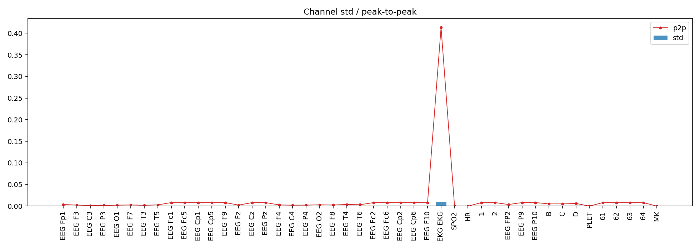
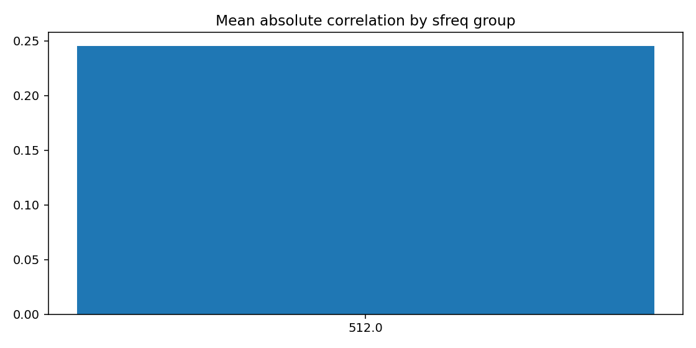
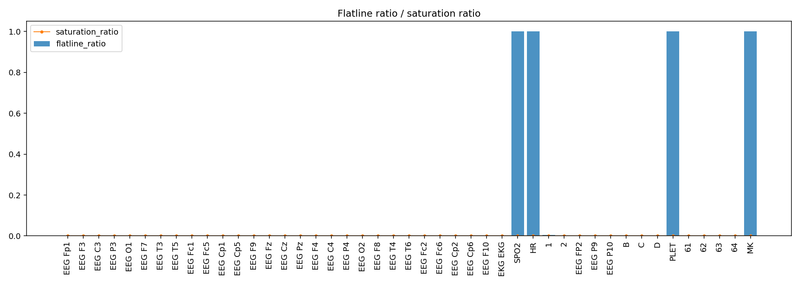
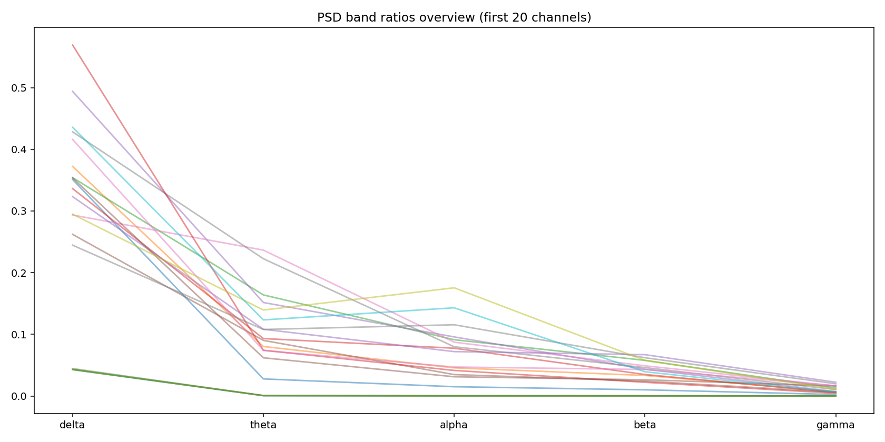
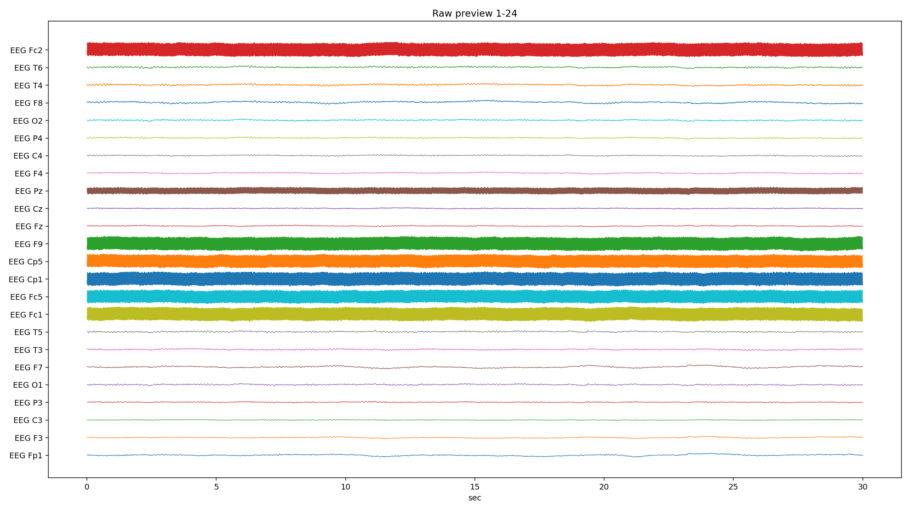
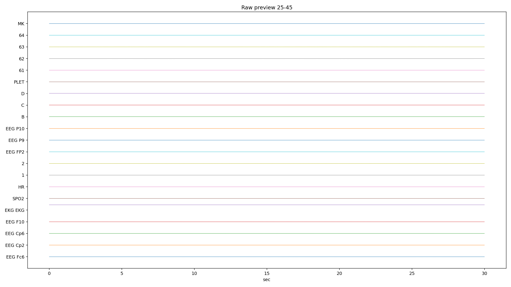
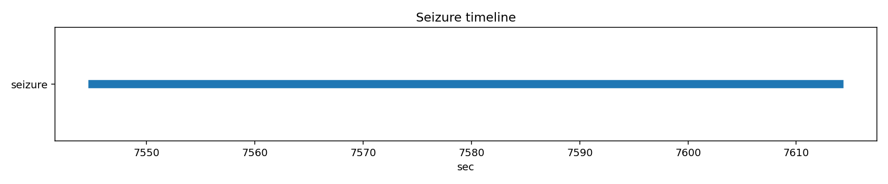

# PN10-1.edf EDA/QC ???????????????

## 1. ????????
| ?? | ?? |
|---|---|
| ??? | PN10 |
| EDF ?? | `E:\BaiduSyncdisk\nuro_work\data\raw\siena\PN10\PN10-1.edf` |
| ???? | 459982336 bytes |
| ?? | 9982.0 s (166.37 min) |
| ??? | 45 |
| ????? | ???? |
| ??? flags | ? |

## 2. ?????
- ?????pyedflib/mne??`2017-01-01T05:40:05` / `2017-01-01 05:40:05+00:00`
- ?????`EDF`?line_freq?`None`
- QC ???`{'flatline_eps': 1e-12, 'flatline_min_run_sec': 1.0, 'saturation_pct': 0.995, 'robust_z_thresh': 8.0, 'robust_z_bad_ratio': 0.05, 'low_variance_quantile': 0.05, 'high_variance_quantile': 0.95, 'extreme_p2p_quantile': 0.98, 'high_corr_threshold': 0.9, 'low_mean_abs_corr_threshold': 0.2}`

### 2.1 ??????
| channel_type | count |
| --- | --- |
| unknown | 41 |
| eeg | 2 |
| ecg | 1 |
| spo2 | 1 |

## 3. ???????
### 3.1 ????
| channel | flags |
| --- | --- |
| EKG EKG | high_variance, extreme_p2p |
| SPO2 | low_variance, high_flatline_ratio |
| HR | low_variance, high_flatline_ratio |
| 1 | high_variance |
| 2 | high_variance |
| PLET | low_variance, high_flatline_ratio |
| MK | high_flatline_ratio |

### 3.2 ???? Top10
| channel | flatline_ratio | flatline_total_sec | flatline_longest_sec |
| --- | --- | --- | --- |
| MK | 1 | 9982 | 9982 |
| PLET | 1 | 9982 | 9982 |
| SPO2 | 1 | 9982 | 9982 |
| HR | 1 | 9982 | 9982 |
| 1 | 0.00557879 | 55.6875 | 3.80469 |
| 2 | 0.00163165 | 16.2871 | 3.18555 |
| EEG FP2 | 0 | 0 | 0 |
| EEG Cp2 | 0 | 0 | 0 |
| EEG Cp6 | 0 | 0 | 0 |
| EEG F10 | 0 | 0 | 0 |

### 3.3 ????? Top10
| channel | std | peak_to_peak | robust_z_outlier_ratio | saturation_ratio |
| --- | --- | --- | --- | --- |
| EKG EKG | 0.00920121 | 0.413153 | 0.000316977 | 0 |
| 2 | 0.000593849 | 0.00819187 | 0.0472687 | 0 |
| 1 | 0.000559109 | 0.00819187 | 0.0215441 | 0 |
| 63 | 0.000202054 | 0.00818987 | 0.000982824 | 0 |
| 61 | 0.000201902 | 0.00819125 | 0.000987128 | 0 |
| EEG P10 | 0.000199639 | 0.0081905 | 0.000969714 | 0 |
| 64 | 0.000199332 | 0.00819088 | 0.00099926 | 0 |
| EEG F10 | 0.000198776 | 0.00819187 | 0.00097578 | 0 |
| EEG Fc2 | 0.00019846 | 0.00819175 | 0.000983215 | 0 |
| EEG Cp2 | 0.000198086 | 0.00819138 | 0.000990259 | 0 |

## 4. ???????
- ?????delta=0.2335, theta=0.0587, alpha=0.0394, beta=0.0256, gamma=0.0087

### 4.1 ??/??/???? Top10
| channel | line_50hz_ratio | line_60hz_ratio | low_freq_drift_ratio | high_freq_noise_ratio |
| --- | --- | --- | --- | --- |
| 63 | 0.898988 | 8.87242e-06 | 0.0434522 | 0.899301 |
| EEG P10 | 0.898031 | 9.1791e-06 | 0.0440698 | 0.898347 |
| 61 | 0.897881 | 9.26844e-06 | 0.0439491 | 0.898197 |
| EEG Fc1 | 0.897258 | 1.03723e-05 | 0.0443737 | 0.897604 |
| EEG F10 | 0.896966 | 9.45968e-06 | 0.044471 | 0.8973 |
| EEG Fc2 | 0.896439 | 9.50361e-06 | 0.0448366 | 0.896766 |
| EEG F9 | 0.896438 | 9.76416e-06 | 0.0447818 | 0.896779 |
| EEG Cp1 | 0.895762 | 9.4848e-06 | 0.0455672 | 0.896091 |
| EEG Cp2 | 0.895448 | 9.93673e-06 | 0.0453615 | 0.895783 |
| EEG P9 | 0.892861 | 1.08387e-05 | 0.0460814 | 0.893224 |

## 5. ??????
| ?? | ?? |
|---|---|
| mean_abs_corr | 0.245 |
| max_corr | 0.997 |
| min_corr | -0.410 |
| low_corr_flag | False |

### 5.1 ?????? Top10
| ch_a | ch_b | corr |
| --- | --- | --- |
| EEG P10 | 63 | 0.997441 |
| EEG Cp1 | EEG Fc2 | 0.99738 |
| EEG F10 | EEG P10 | 0.997341 |
| EEG Cp1 | EEG F9 | 0.997336 |
| EEG Cp1 | EEG P10 | 0.997309 |
| EEG F10 | 63 | 0.997253 |
| EEG F9 | EEG F10 | 0.997253 |
| EEG F9 | EEG P10 | 0.997225 |
| 61 | 63 | 0.997213 |
| EEG Cp1 | 63 | 0.997203 |

## 6. Annotation ? Seizure ??
| ?? | ?? |
|---|---|
| Annotation ? | 0 |
| Annotation ??? | 0 |
| Annotation ??? | 0 |
| Seizure ??? | 1 |

### 6.1 Seizure ???
| file | start_sec | end_sec | duration_sec | in_range |
| --- | --- | --- | --- | --- |
| PN10-1.edf | 7545 | 7614 | 69 | True |

## 7. ??????????
### annotation_distribution.png
- ?????(exists=True, size=7036, resolution=1400x420)
- ???annotation ??????? annotation ?=0?
- ???

### channel_std_p2p.png
- ?????(exists=True, size=55147, resolution=1960x700)
- ????????????? std ??? EKG EKG (std=0.00920121, p2p=0.413153)?
- ???

### corr_group.png
- ?????(exists=True, size=18133, resolution=1120x560)
- ??????????mean_abs=0.245, max=0.997, min=-0.410?
- ???

### flatline_saturation.png
- ?????(exists=True, size=40613, resolution=1960x700)
- ?????/?????????????????max saturation=0.000??
- ???

### psd_overview.png
- ?????(exists=True, size=172101, resolution=1680x840)
- ???????????? delta/theta/alpha/beta/gamma=0.234/0.059/0.039/0.026/0.009?
- ???

### raw_preview_page_01.png
- ?????(exists=True, size=399066, resolution=2240x1260)
- ???????????????/??/??????????????? MK (ratio=1.000)?
- ???

### raw_preview_page_02.png
- ?????(exists=True, size=57170, resolution=2240x1260)
- ???????????????/??/??????????????? MK (ratio=1.000)?
- ???

### seizure_timeline.png
- ?????(exists=True, size=13197, resolution=1680x350)
- ???seizure ??????????=1?
- ???

## 8. ?????
1. ?????????????????????
2. ??????????? 50Hz ????? PSD ?????
3. ??????????????????????
4. seizure ???????????????????
