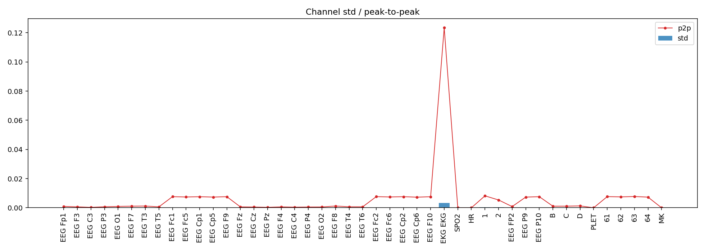
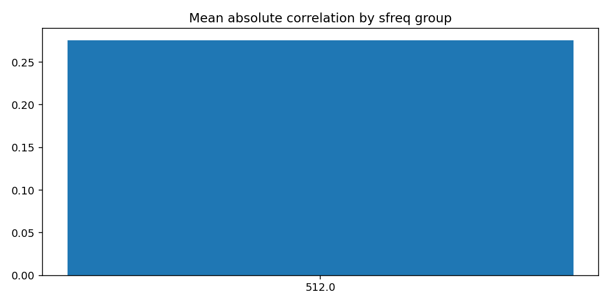
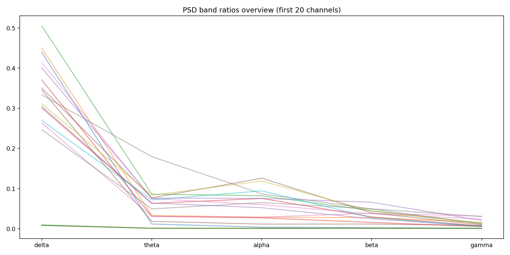
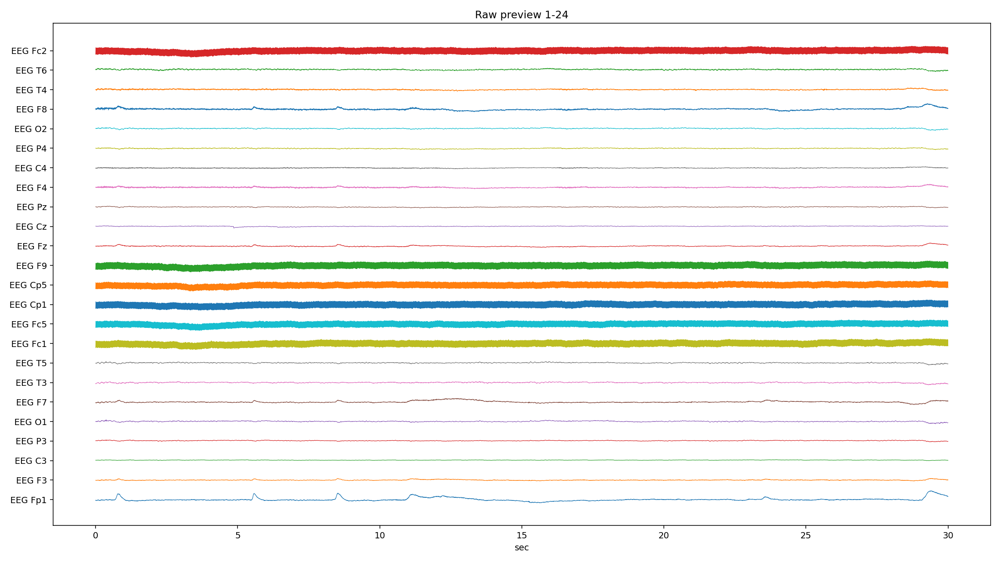
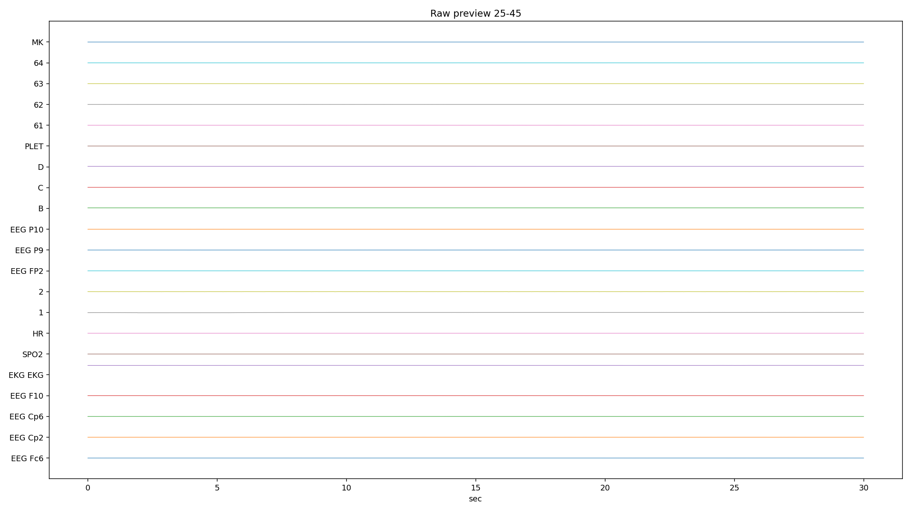
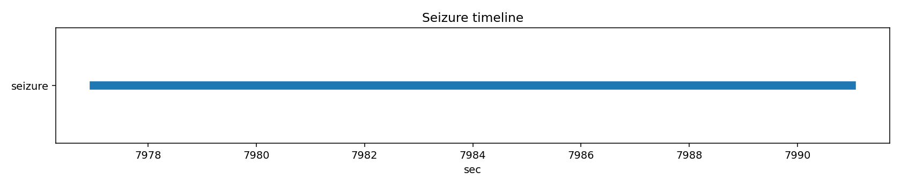

# PN10-10.edf EDA/QC ???????????????

## 1. ????????
| ?? | ?? |
|---|---|
| ??? | PN10 |
| EDF ?? | `E:\BaiduSyncdisk\nuro_work\data\raw\siena\PN10\PN10-10.edf` |
| ???? | 394686976 bytes |
| ?? | 8565.0 s (142.75 min) |
| ??? | 45 |
| ????? | ???? |
| ??? flags | ? |

## 2. ?????
- ?????pyedflib/mne??`2017-01-01T08:45:22` / `2017-01-01 08:45:22+00:00`
- ?????`EDF`?line_freq?`None`
- QC ???`{'flatline_eps': 1e-12, 'flatline_min_run_sec': 1.0, 'saturation_pct': 0.995, 'robust_z_thresh': 8.0, 'robust_z_bad_ratio': 0.05, 'low_variance_quantile': 0.05, 'high_variance_quantile': 0.95, 'extreme_p2p_quantile': 0.98, 'high_corr_threshold': 0.9, 'low_mean_abs_corr_threshold': 0.2}`

### 2.1 ??????
| channel_type | count |
| --- | --- |
| unknown | 41 |
| eeg | 2 |
| ecg | 1 |
| spo2 | 1 |

## 3. ???????
### 3.1 ????
| channel | flags |
| --- | --- |
| EKG EKG | high_variance, extreme_p2p |
| SPO2 | low_variance, high_flatline_ratio |
| HR | low_variance, high_flatline_ratio |
| 1 | high_variance |
| 2 | high_variance |
| PLET | low_variance, high_flatline_ratio |
| MK | high_flatline_ratio |

### 3.2 ???? Top10
| channel | flatline_ratio | flatline_total_sec | flatline_longest_sec |
| --- | --- | --- | --- |
| MK | 1 | 8565 | 8565 |
| PLET | 1 | 8565 | 8565 |
| SPO2 | 1 | 8565 | 8565 |
| HR | 1 | 8565 | 8565 |
| 1 | 0.000922632 | 7.90234 | 3.43945 |
| EEG FP2 | 0 | 0 | 0 |
| EEG Cp2 | 0 | 0 | 0 |
| EEG Cp6 | 0 | 0 | 0 |
| EEG F10 | 0 | 0 | 0 |
| EKG EKG | 0 | 0 | 0 |

### 3.3 ????? Top10
| channel | std | peak_to_peak | robust_z_outlier_ratio | saturation_ratio |
| --- | --- | --- | --- | --- |
| EKG EKG | 0.00340128 | 0.123464 | 7.0235e-05 | 0 |
| 1 | 0.000299732 | 0.00819037 | 0.0256846 | 0 |
| 2 | 0.000287174 | 0.00535787 | 0.0113076 | 0 |
| EEG Fp1 | 5.23571e-05 | 0.000940375 | 0.0256846 | 0 |
| 63 | 5.05435e-05 | 0.0077215 | 0.000574422 | 0 |
| 61 | 5.00369e-05 | 0.00766412 | 0.000582403 | 0 |
| 64 | 4.95989e-05 | 0.00731325 | 0.000615924 | 0 |
| EEG P10 | 4.91516e-05 | 0.00760462 | 0.000597909 | 0 |
| EEG F10 | 4.90811e-05 | 0.00758075 | 0.000625958 | 0 |
| 62 | 4.88985e-05 | 0.0074755 | 0.000647849 | 0 |

## 4. ???????
- ?????delta=0.1877, theta=0.0333, alpha=0.0333, beta=0.0270, gamma=0.0107

### 4.1 ??/??/???? Top10
| channel | line_50hz_ratio | line_60hz_ratio | low_freq_drift_ratio | high_freq_noise_ratio |
| --- | --- | --- | --- | --- |
| 63 | 0.93995 | 6.66711e-05 | 0.00983079 | 0.942609 |
| 61 | 0.937411 | 6.88233e-05 | 0.010746 | 0.94014 |
| EEG P10 | 0.936839 | 7.27461e-05 | 0.0107228 | 0.939604 |
| EEG Cp1 | 0.935835 | 7.66226e-05 | 0.0108198 | 0.938718 |
| EEG Fc2 | 0.935508 | 7.56915e-05 | 0.0113929 | 0.938344 |
| 62 | 0.934169 | 7.49124e-05 | 0.0111934 | 0.937073 |
| EEG Fc1 | 0.934164 | 7.96097e-05 | 0.0117834 | 0.937151 |
| EEG F10 | 0.934135 | 7.75273e-05 | 0.0116588 | 0.937003 |
| EEG F9 | 0.933828 | 7.5762e-05 | 0.0121328 | 0.936744 |
| EEG Cp2 | 0.933137 | 7.50356e-05 | 0.0124687 | 0.936006 |

## 5. ??????
| ?? | ?? |
|---|---|
| mean_abs_corr | 0.276 |
| max_corr | 0.993 |
| min_corr | -0.622 |
| low_corr_flag | False |

### 5.1 ?????? Top10
| ch_a | ch_b | corr |
| --- | --- | --- |
| EEG P10 | 63 | 0.993015 |
| 61 | 63 | 0.992327 |
| EEG Cp1 | 63 | 0.992326 |
| EEG Fc2 | 63 | 0.992243 |
| EEG F10 | EEG P10 | 0.99222 |
| EEG P10 | 62 | 0.992152 |
| EEG Cp1 | EEG P10 | 0.992138 |
| EEG Cp1 | EEG Fc2 | 0.99206 |
| EEG P10 | 61 | 0.992018 |
| 62 | 63 | 0.991998 |

## 6. Annotation ? Seizure ??
| ?? | ?? |
|---|---|
| Annotation ? | 0 |
| Annotation ??? | 0 |
| Annotation ??? | 0 |
| Seizure ??? | 1 |

### 6.1 Seizure ???
| file | start_sec | end_sec | duration_sec | in_range |
| --- | --- | --- | --- | --- |
| PN10-10.edf | 7977 | 7991 | 14 | True |

## 7. ??????????
### annotation_distribution.png
- ?????(exists=True, size=7036, resolution=1400x420)
- ???annotation ??????? annotation ?=0?
- ???

### channel_std_p2p.png
- ?????(exists=True, size=58991, resolution=1960x700)
- ????????????? std ??? EKG EKG (std=0.00340128, p2p=0.123464)?
- ???

### corr_group.png
- ?????(exists=True, size=18127, resolution=1120x560)
- ??????????mean_abs=0.276, max=0.993, min=-0.622?
- ???

### flatline_saturation.png
- ?????(exists=True, size=40566, resolution=1960x700)
- ?????/?????????????????max saturation=0.000??
- ???

### psd_overview.png
- ?????(exists=True, size=173311, resolution=1680x840)
- ???????????? delta/theta/alpha/beta/gamma=0.188/0.033/0.033/0.027/0.011?
- ???

### raw_preview_page_01.png
- ?????(exists=True, size=350582, resolution=2240x1260)
- ???????????????/??/??????????????? MK (ratio=1.000)?
- ???

### raw_preview_page_02.png
- ?????(exists=True, size=60306, resolution=2240x1260)
- ???????????????/??/??????????????? MK (ratio=1.000)?
- ???

### seizure_timeline.png
- ?????(exists=True, size=12345, resolution=1680x350)
- ???seizure ??????????=1?
- ???

## 8. ?????
1. ?????????????????????
2. ??????????? 50Hz ????? PSD ?????
3. seizure ???????????????????
