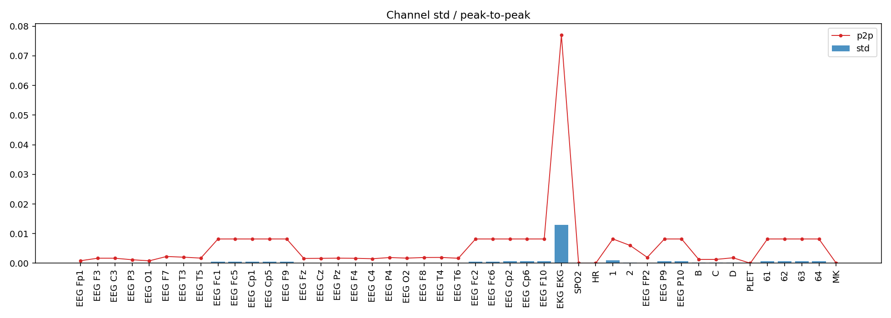
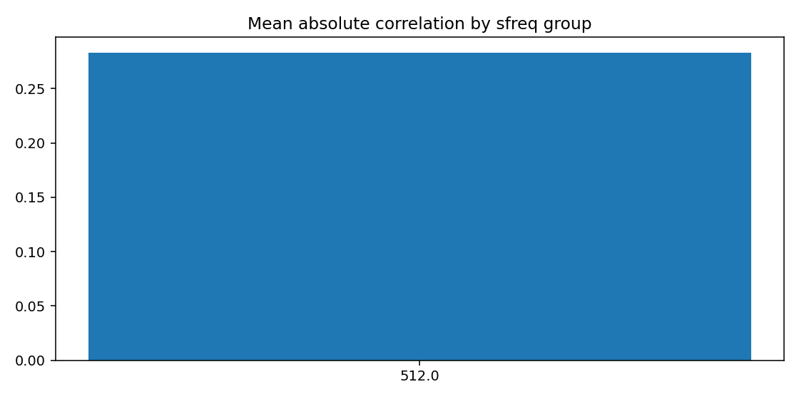
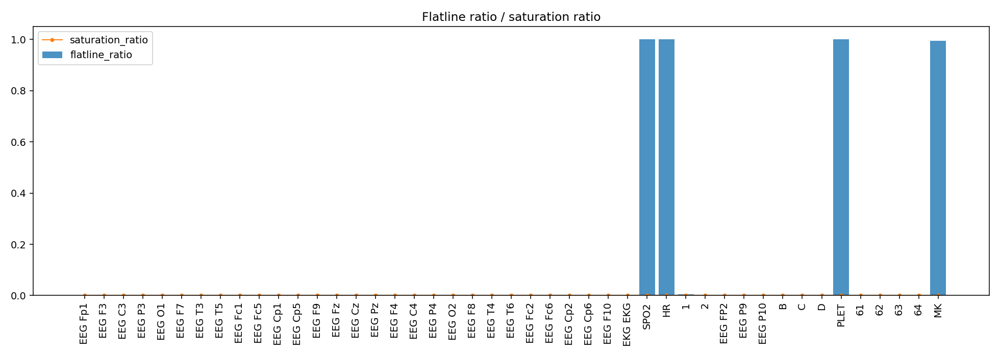
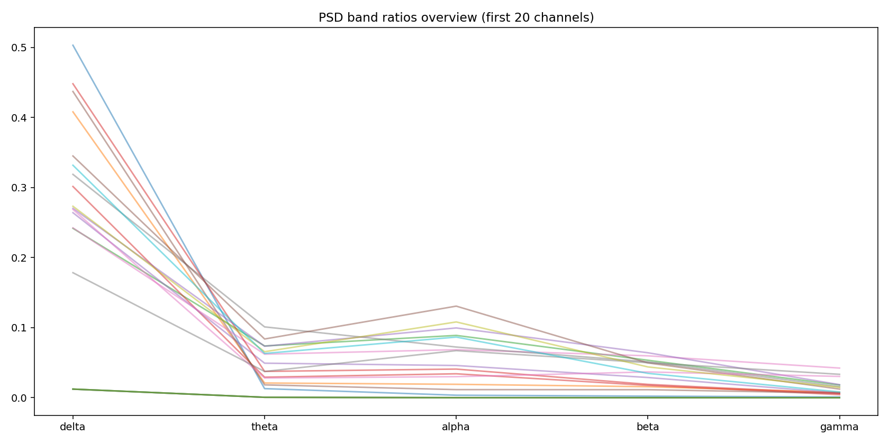
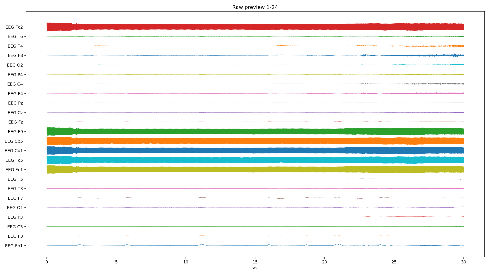
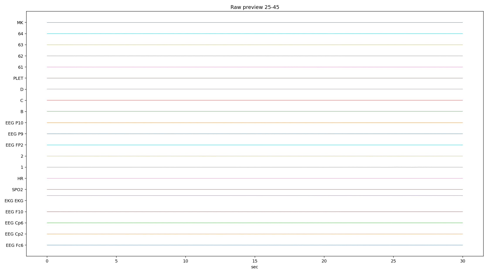
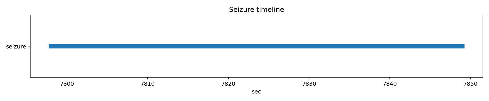

# PN10-2.edf EDA/QC ???????????????

## 1. ????????
| ?? | ?? |
|---|---|
| ??? | PN10 |
| EDF ?? | `E:\BaiduSyncdisk\nuro_work\data\raw\siena\PN10\PN10-2.edf` |
| ???? | 394180096 bytes |
| ?? | 8554.0 s (142.57 min) |
| ??? | 45 |
| ????? | ???? |
| ??? flags | ? |

## 2. ?????
- ?????pyedflib/mne??`2017-01-01T09:30:15` / `2017-01-01 09:30:15+00:00`
- ?????`EDF`?line_freq?`None`
- QC ???`{'flatline_eps': 1e-12, 'flatline_min_run_sec': 1.0, 'saturation_pct': 0.995, 'robust_z_thresh': 8.0, 'robust_z_bad_ratio': 0.05, 'low_variance_quantile': 0.05, 'high_variance_quantile': 0.95, 'extreme_p2p_quantile': 0.98, 'high_corr_threshold': 0.9, 'low_mean_abs_corr_threshold': 0.2}`

### 2.1 ??????
| channel_type | count |
| --- | --- |
| unknown | 41 |
| eeg | 2 |
| ecg | 1 |
| spo2 | 1 |

## 3. ???????
### 3.1 ????
| channel | flags |
| --- | --- |
| EKG EKG | high_variance, extreme_p2p |
| SPO2 | low_variance, high_flatline_ratio |
| HR | low_variance, high_flatline_ratio |
| 1 | high_variance |
| PLET | low_variance, high_flatline_ratio |
| 64 | high_variance |
| MK | high_flatline_ratio |

### 3.2 ???? Top10
| channel | flatline_ratio | flatline_total_sec | flatline_longest_sec |
| --- | --- | --- | --- |
| PLET | 1 | 8554 | 8554 |
| SPO2 | 1 | 8554 | 8554 |
| HR | 1 | 8554 | 8554 |
| MK | 0.994376 | 8505.89 | 6922.43 |
| 1 | 0.00486455 | 41.6113 | 2.31641 |
| EEG FP2 | 0 | 0 | 0 |
| EEG Cp2 | 0 | 0 | 0 |
| EEG Cp6 | 0 | 0 | 0 |
| EEG F10 | 0 | 0 | 0 |
| EKG EKG | 0 | 0 | 0 |

### 3.3 ????? Top10
| channel | std | peak_to_peak | robust_z_outlier_ratio | saturation_ratio |
| --- | --- | --- | --- | --- |
| EKG EKG | 0.0130002 | 0.076982 | 0 | 0 |
| 1 | 0.00103629 | 0.00819187 | 0.0317729 | 0 |
| 64 | 0.000619809 | 0.00818987 | 0 | 0 |
| 63 | 0.00061237 | 0.00819113 | 0 | 0 |
| 62 | 0.000611678 | 0.00819125 | 0 | 0 |
| 61 | 0.000611457 | 0.0081905 | 0 | 0 |
| EEG P10 | 0.0006108 | 0.00819125 | 0 | 0 |
| EEG F10 | 0.000610094 | 0.0081915 | 0 | 0 |
| EEG Cp6 | 0.000610044 | 0.00819012 | 0 | 0 |
| EEG P9 | 0.000609511 | 0.00819075 | 0 | 0 |

## 4. ???????
- ?????delta=0.1856, theta=0.0278, alpha=0.0317, beta=0.0278, gamma=0.0103

### 4.1 ??/??/???? Top10
| channel | line_50hz_ratio | line_60hz_ratio | low_freq_drift_ratio | high_freq_noise_ratio |
| --- | --- | --- | --- | --- |
| EEG F9 | 0.95392 | 1.94905e-06 | 0.00724698 | 0.954032 |
| EEG Cp1 | 0.953769 | 1.92306e-06 | 0.00713639 | 0.95388 |
| EEG Fc1 | 0.953701 | 2.00558e-06 | 0.00723595 | 0.953812 |
| 63 | 0.95345 | 2.00366e-06 | 0.00742194 | 0.95356 |
| EEG Fc2 | 0.953434 | 1.95405e-06 | 0.00736231 | 0.953545 |
| 61 | 0.95334 | 1.95683e-06 | 0.00735774 | 0.953451 |
| EEG P10 | 0.953176 | 1.87082e-06 | 0.00725013 | 0.953286 |
| EEG Cp2 | 0.95308 | 2.00207e-06 | 0.0073833 | 0.953192 |
| EEG F10 | 0.95306 | 2.00476e-06 | 0.0072815 | 0.95317 |
| EEG Fc5 | 0.952935 | 2.02583e-06 | 0.00724674 | 0.953047 |

## 5. ??????
| ?? | ?? |
|---|---|
| mean_abs_corr | 0.283 |
| max_corr | 1.000 |
| min_corr | -0.609 |
| low_corr_flag | False |

### 5.1 ?????? Top10
| ch_a | ch_b | corr |
| --- | --- | --- |
| EEG P10 | 62 | 0.999857 |
| EEG Cp1 | EEG F9 | 0.999853 |
| EEG Cp1 | EEG Cp2 | 0.999853 |
| EEG F9 | 61 | 0.99985 |
| EEG F9 | EEG Cp2 | 0.999848 |
| EEG Cp2 | 61 | 0.999848 |
| EEG Cp5 | EEG P10 | 0.999846 |
| EEG F10 | 63 | 0.999844 |
| EEG Fc5 | EEG Cp2 | 0.999844 |
| EEG Fc5 | 61 | 0.999842 |

## 6. Annotation ? Seizure ??
| ?? | ?? |
|---|---|
| Annotation ? | 0 |
| Annotation ??? | 0 |
| Annotation ??? | 0 |
| Seizure ??? | 1 |

### 6.1 Seizure ???
| file | start_sec | end_sec | duration_sec | in_range |
| --- | --- | --- | --- | --- |
| PN10-2.edf | 7798 | 7849 | 51 | True |

## 7. ??????????
### annotation_distribution.png
- ?????(exists=True, size=7036, resolution=1400x420)
- ???annotation ??????? annotation ?=0?
- ???

### channel_std_p2p.png
- ?????(exists=True, size=63517, resolution=1960x700)
- ????????????? std ??? EKG EKG (std=0.0130002, p2p=0.076982)?
- ???

### corr_group.png
- ?????(exists=True, size=18132, resolution=1120x560)
- ??????????mean_abs=0.283, max=1.000, min=-0.609?
- ???

### flatline_saturation.png
- ?????(exists=True, size=40614, resolution=1960x700)
- ?????/?????????????????max saturation=0.000??
- ???

### psd_overview.png
- ?????(exists=True, size=156627, resolution=1680x840)
- ???????????? delta/theta/alpha/beta/gamma=0.186/0.028/0.032/0.028/0.010?
- ???

### raw_preview_page_01.png
- ?????(exists=True, size=295465, resolution=2240x1260)
- ???????????????/??/??????????????? PLET (ratio=1.000)?
- ???

### raw_preview_page_02.png
- ?????(exists=True, size=104744, resolution=2240x1260)
- ???????????????/??/??????????????? PLET (ratio=1.000)?
- ???

### seizure_timeline.png
- ?????(exists=True, size=12199, resolution=1680x350)
- ???seizure ??????????=1?
- ???

## 8. ?????
1. ?????????????????????
2. ??????????? 50Hz ????? PSD ?????
3. seizure ???????????????????
