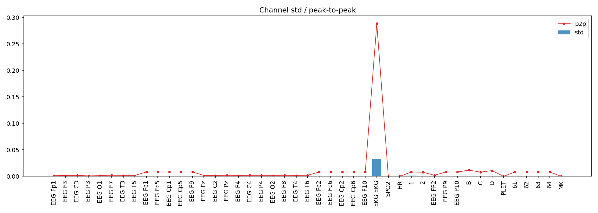
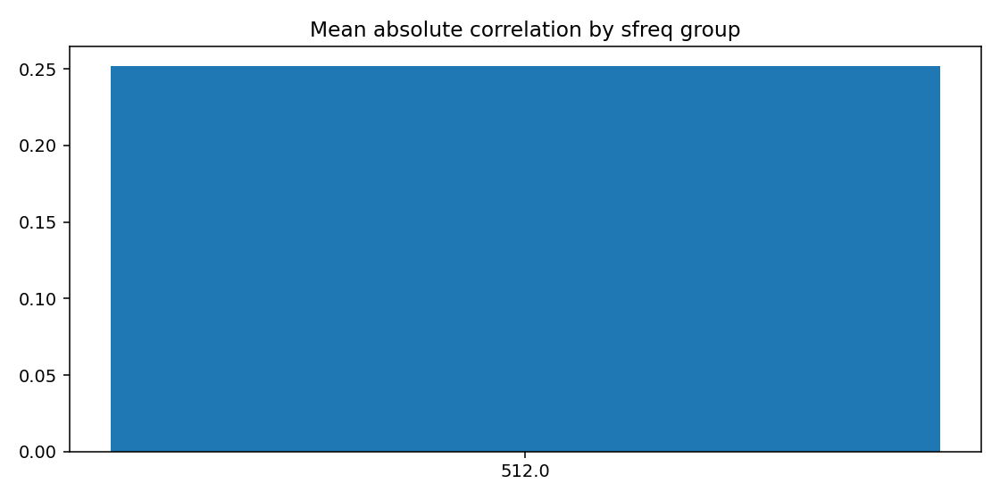
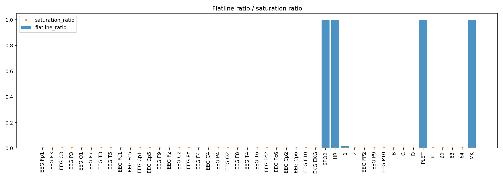
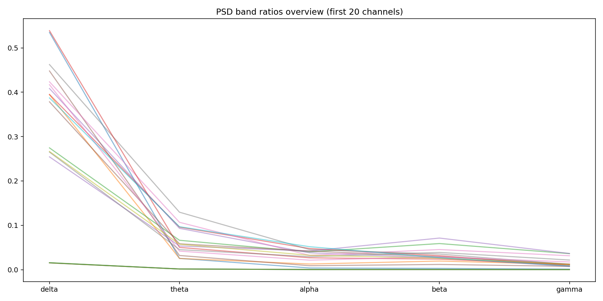
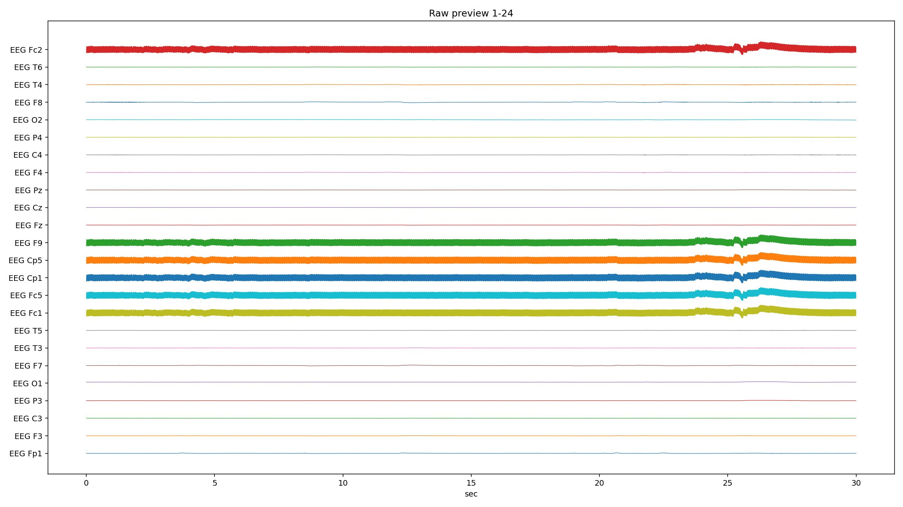
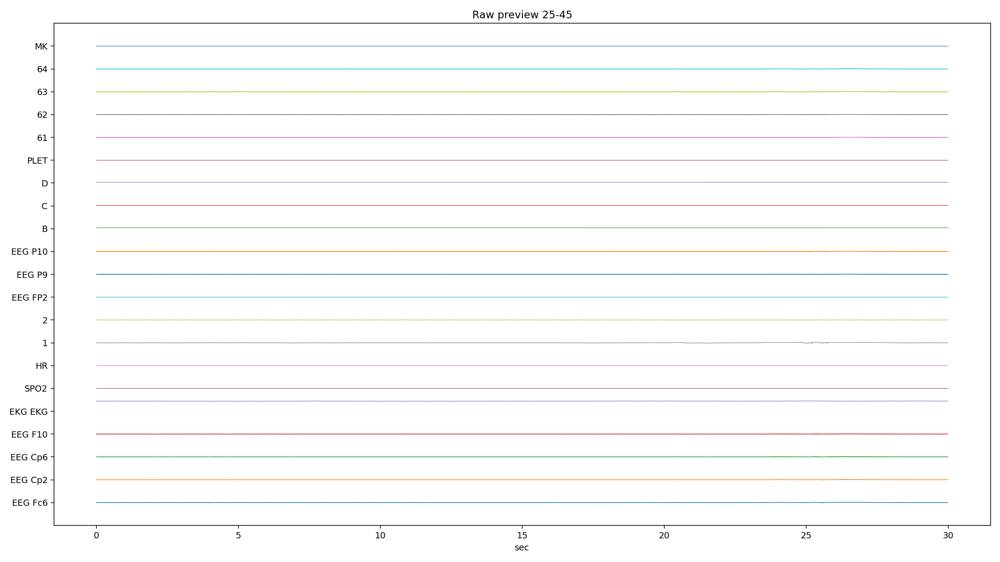
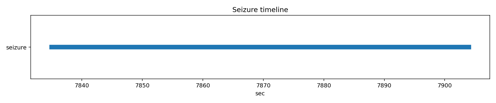

# PN10-3.edf EDA/QC ???????????????

## 1. ????????
| ?? | ?? |
|---|---|
| ??? | PN10 |
| EDF ?? | `E:\BaiduSyncdisk\nuro_work\data\raw\siena\PN10\PN10-3.edf` |
| ???? | 401506816 bytes |
| ?? | 8713.0 s (145.22 min) |
| ??? | 45 |
| ????? | ???? |
| ??? flags | ? |

## 2. ?????
- ?????pyedflib/mne??`2017-01-01T13:33:18` / `2017-01-01 13:33:18+00:00`
- ?????`EDF`?line_freq?`None`
- QC ???`{'flatline_eps': 1e-12, 'flatline_min_run_sec': 1.0, 'saturation_pct': 0.995, 'robust_z_thresh': 8.0, 'robust_z_bad_ratio': 0.05, 'low_variance_quantile': 0.05, 'high_variance_quantile': 0.95, 'extreme_p2p_quantile': 0.98, 'high_corr_threshold': 0.9, 'low_mean_abs_corr_threshold': 0.2}`

### 2.1 ??????
| channel_type | count |
| --- | --- |
| unknown | 41 |
| eeg | 2 |
| ecg | 1 |
| spo2 | 1 |

## 3. ???????
### 3.1 ????
| channel | flags |
| --- | --- |
| EKG EKG | high_variance, extreme_p2p |
| SPO2 | low_variance, high_flatline_ratio |
| HR | low_variance, high_flatline_ratio |
| 1 | high_variance |
| PLET | low_variance, high_flatline_ratio |
| 64 | high_variance |
| MK | high_flatline_ratio |

### 3.2 ???? Top10
| channel | flatline_ratio | flatline_total_sec | flatline_longest_sec |
| --- | --- | --- | --- |
| SPO2 | 1 | 8713 | 8713 |
| PLET | 1 | 8713 | 8713 |
| HR | 1 | 8713 | 8713 |
| MK | 1 | 8712.99 | 6260.78 |
| 1 | 0.0146728 | 127.844 | 14.9512 |
| EEG Fc6 | 0.00188431 | 16.418 | 14.9512 |
| EEG Cp2 | 0.00188431 | 16.418 | 14.9512 |
| EEG Cp6 | 0.00188431 | 16.418 | 14.9512 |
| EEG F10 | 0.00188431 | 16.418 | 14.9512 |
| EEG P9 | 0.00188431 | 16.418 | 14.9512 |

### 3.3 ????? Top10
| channel | std | peak_to_peak | robust_z_outlier_ratio | saturation_ratio |
| --- | --- | --- | --- | --- |
| EKG EKG | 0.0330562 | 0.288332 | 0.00171843 | 0 |
| 1 | 0.00124986 | 0.00819187 | 0 | 0 |
| 64 | 0.000937294 | 0.00819175 | 0 | 0 |
| EEG Cp6 | 0.000925998 | 0.00819187 | 0 | 0 |
| EEG P9 | 0.000925341 | 0.0081915 | 0 | 0 |
| 62 | 0.00092476 | 0.00819175 | 0 | 0 |
| EEG F10 | 0.000922225 | 0.00819138 | 0 | 0 |
| EEG P10 | 0.000922092 | 0.0081915 | 0 | 0 |
| EEG Cp5 | 0.000920493 | 0.00819175 | 0 | 0 |
| 61 | 0.000920397 | 0.00819175 | 0 | 0 |

## 4. ???????
- ?????delta=0.2225, theta=0.0343, alpha=0.0188, beta=0.0215, gamma=0.0089

### 4.1 ??/??/???? Top10
| channel | line_50hz_ratio | line_60hz_ratio | low_freq_drift_ratio | high_freq_noise_ratio |
| --- | --- | --- | --- | --- |
| EEG F9 | 0.851894 | 8.70839e-06 | 0.0104416 | 0.852219 |
| EEG Cp1 | 0.851634 | 8.49465e-06 | 0.00972489 | 0.851954 |
| EEG Fc1 | 0.851538 | 8.70237e-06 | 0.0100605 | 0.851863 |
| EEG Fc2 | 0.851342 | 8.33833e-06 | 0.00989426 | 0.851662 |
| 63 | 0.851176 | 8.43049e-06 | 0.0101933 | 0.851494 |
| 61 | 0.850487 | 8.42277e-06 | 0.0102405 | 0.850804 |
| EEG Cp2 | 0.849975 | 8.36107e-06 | 0.0101898 | 0.850294 |
| EEG Fc5 | 0.849917 | 8.4496e-06 | 0.0096916 | 0.850237 |
| EEG P10 | 0.849289 | 8.37245e-06 | 0.0101294 | 0.849605 |
| EEG Fc6 | 0.849104 | 8.3631e-06 | 0.00977858 | 0.849423 |

## 5. ??????
| ?? | ?? |
|---|---|
| mean_abs_corr | 0.252 |
| max_corr | 1.000 |
| min_corr | -0.465 |
| low_corr_flag | False |

### 5.1 ?????? Top10
| ch_a | ch_b | corr |
| --- | --- | --- |
| EEG Fc5 | EEG Cp1 | 0.999905 |
| EEG P10 | 62 | 0.999896 |
| EEG Fc5 | EEG Fc6 | 0.99989 |
| EEG Cp1 | EEG Fc6 | 0.999882 |
| EEG Fc1 | EEG Fc2 | 0.999881 |
| EEG P10 | 63 | 0.999873 |
| EEG F9 | EEG Cp2 | 0.999868 |
| EEG Cp2 | 61 | 0.999866 |
| 61 | 63 | 0.999865 |
| EEG F9 | 61 | 0.999859 |

## 6. Annotation ? Seizure ??
| ?? | ?? |
|---|---|
| Annotation ? | 0 |
| Annotation ??? | 0 |
| Annotation ??? | 0 |
| Seizure ??? | 1 |

### 6.1 Seizure ???
| file | start_sec | end_sec | duration_sec | in_range |
| --- | --- | --- | --- | --- |
| PN10-3.edf | 7835 | 7904 | 69 | True |

## 7. ??????????
### annotation_distribution.png
- ?????(exists=True, size=7036, resolution=1400x420)
- ???annotation ??????? annotation ?=0?
- ???

### channel_std_p2p.png
- ?????(exists=True, size=54259, resolution=1960x700)
- ????????????? std ??? EKG EKG (std=0.0330562, p2p=0.288332)?
- ???

### corr_group.png
- ?????(exists=True, size=18140, resolution=1120x560)
- ??????????mean_abs=0.252, max=1.000, min=-0.465?
- ???

### flatline_saturation.png
- ?????(exists=True, size=40574, resolution=1960x700)
- ?????/?????????????????max saturation=0.000??
- ???

### psd_overview.png
- ?????(exists=True, size=167617, resolution=1680x840)
- ???????????? delta/theta/alpha/beta/gamma=0.222/0.034/0.019/0.022/0.009?
- ???

### raw_preview_page_01.png
- ?????(exists=True, size=230597, resolution=2240x1260)
- ???????????????/??/??????????????? SPO2 (ratio=1.000)?
- ???

### raw_preview_page_02.png
- ?????(exists=True, size=123340, resolution=2240x1260)
- ???????????????/??/??????????????? SPO2 (ratio=1.000)?
- ???

### seizure_timeline.png
- ?????(exists=True, size=12974, resolution=1680x350)
- ???seizure ??????????=1?
- ???

## 8. ?????
1. ?????????????????????
2. ??????????? 50Hz ????? PSD ?????
3. seizure ???????????????????
