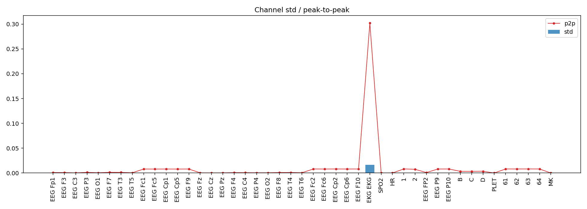
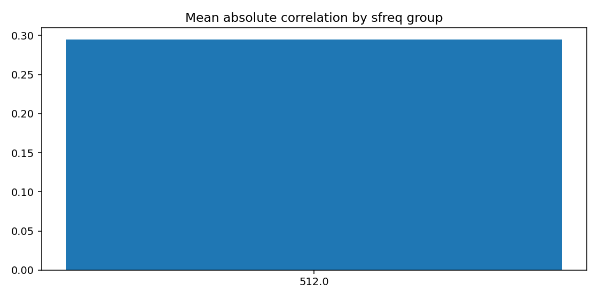
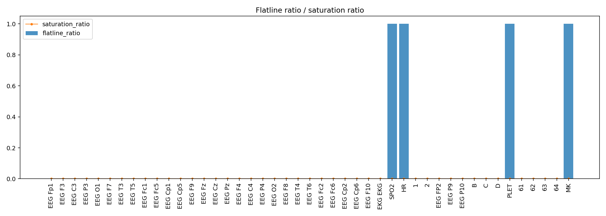
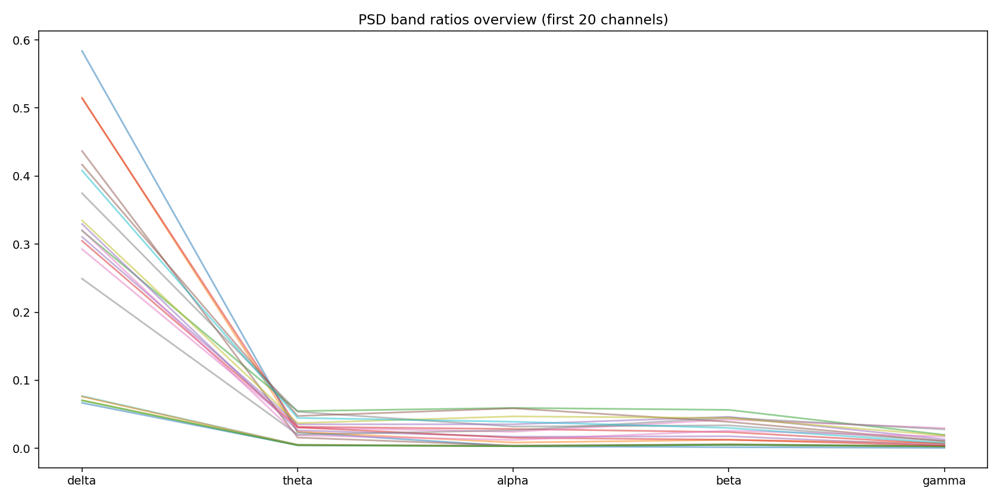
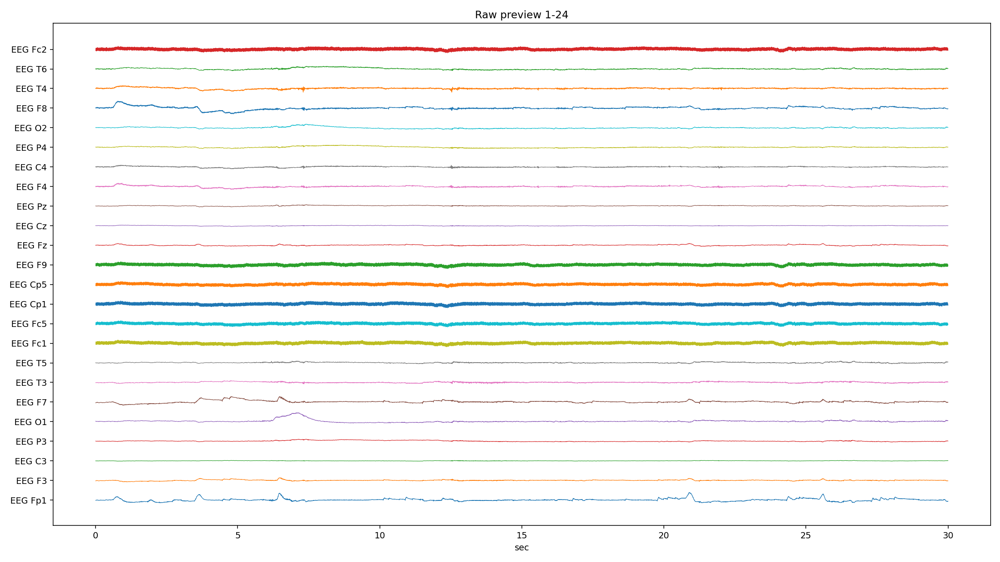
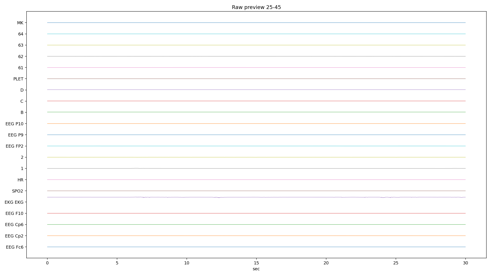
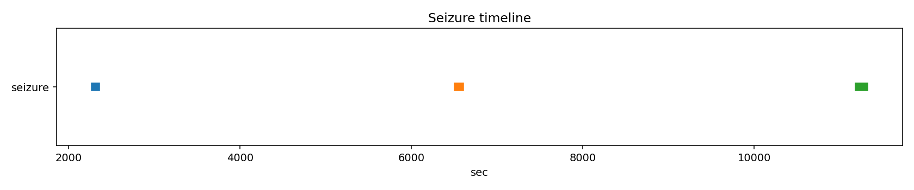

# PN10-4.5.6.edf EDA/QC ???????????????

## 1. ????????
| ?? | ?? |
|---|---|
| ??? | PN10 |
| EDF ?? | `E:\BaiduSyncdisk\nuro_work\data\raw\siena\PN10\PN10-4.5.6.edf` |
| ???? | 767151616 bytes |
| ?? | 16648.0 s (277.47 min) |
| ??? | 45 |
| ????? | ???? |
| ??? flags | ? |

## 2. ?????
- ?????pyedflib/mne??`2017-01-01T12:11:21` / `2017-01-01 12:11:21+00:00`
- ?????`EDF`?line_freq?`None`
- QC ???`{'flatline_eps': 1e-12, 'flatline_min_run_sec': 1.0, 'saturation_pct': 0.995, 'robust_z_thresh': 8.0, 'robust_z_bad_ratio': 0.05, 'low_variance_quantile': 0.05, 'high_variance_quantile': 0.95, 'extreme_p2p_quantile': 0.98, 'high_corr_threshold': 0.9, 'low_mean_abs_corr_threshold': 0.2}`

### 2.1 ??????
| channel_type | count |
| --- | --- |
| unknown | 41 |
| eeg | 2 |
| ecg | 1 |
| spo2 | 1 |

## 3. ???????
### 3.1 ????
| channel | flags |
| --- | --- |
| EKG EKG | high_variance, extreme_p2p |
| SPO2 | low_variance, high_flatline_ratio |
| HR | low_variance, high_flatline_ratio |
| 1 | high_variance, high_robust_outlier_ratio |
| 2 | high_variance |
| PLET | low_variance, high_flatline_ratio |
| MK | high_flatline_ratio |

### 3.2 ???? Top10
| channel | flatline_ratio | flatline_total_sec | flatline_longest_sec |
| --- | --- | --- | --- |
| MK | 1 | 16648 | 16648 |
| PLET | 1 | 16648 | 16648 |
| SPO2 | 1 | 16648 | 16648 |
| HR | 1 | 16648 | 16648 |
| 1 | 0.000141135 | 2.34961 | 1.30664 |
| EEG FP2 | 0 | 0 | 0 |
| EEG Cp2 | 0 | 0 | 0 |
| EEG Cp6 | 0 | 0 | 0 |
| EEG F10 | 0 | 0 | 0 |
| EKG EKG | 0 | 0 | 0 |

### 3.3 ????? Top10
| channel | std | peak_to_peak | robust_z_outlier_ratio | saturation_ratio |
| --- | --- | --- | --- | --- |
| EKG EKG | 0.0163053 | 0.30192 | 0.0422765 | 0 |
| 1 | 0.000331258 | 0.00819187 | 0.0598797 | 0 |
| 2 | 0.000251083 | 0.007492 | 0.0129351 | 0 |
| C | 0.000231691 | 0.0033245 | 0.0392496 | 0 |
| B | 0.000231365 | 0.00333975 | 0.040867 | 0 |
| D | 0.000228155 | 0.003538 | 0.0409046 | 0 |
| 63 | 7.07951e-05 | 0.00815975 | 0.00465873 | 0 |
| 61 | 7.01845e-05 | 0.008156 | 0.00469581 | 0 |
| 64 | 6.98632e-05 | 0.00814487 | 0.00492505 | 0 |
| 62 | 6.91907e-05 | 0.00811237 | 0.00506325 | 0 |

## 4. ???????
- ?????delta=0.2501, theta=0.0232, alpha=0.0183, beta=0.0247, gamma=0.0097

### 4.1 ??/??/???? Top10
| channel | line_50hz_ratio | line_60hz_ratio | low_freq_drift_ratio | high_freq_noise_ratio |
| --- | --- | --- | --- | --- |
| 63 | 0.721938 | 0.00026059 | 0.0563344 | 0.731165 |
| 61 | 0.713131 | 0.000280786 | 0.0589402 | 0.722862 |
| EEG P10 | 0.704577 | 0.000286644 | 0.0615425 | 0.714593 |
| EEG Cp2 | 0.698059 | 0.000297023 | 0.0647445 | 0.708603 |
| EEG Fc2 | 0.696952 | 0.000286309 | 0.0664967 | 0.70726 |
| 62 | 0.691593 | 0.000308004 | 0.065211 | 0.702136 |
| EEG F10 | 0.690945 | 0.000296324 | 0.0696483 | 0.701308 |
| 64 | 0.690189 | 0.000292724 | 0.0632322 | 0.700504 |
| EEG Cp1 | 0.690114 | 0.000309418 | 0.067676 | 0.700952 |
| EEG Fc1 | 0.685674 | 0.000299065 | 0.0713592 | 0.69674 |

## 5. ??????
| ?? | ?? |
|---|---|
| mean_abs_corr | 0.295 |
| max_corr | 0.957 |
| min_corr | -0.688 |
| low_corr_flag | False |

### 5.1 ?????? Top10
| ch_a | ch_b | corr |
| --- | --- | --- |
| B | C | 0.957422 |
| EEG P10 | 63 | 0.957184 |
| B | D | 0.956464 |
| EEG P10 | 61 | 0.954826 |
| EEG Cp2 | EEG P10 | 0.954694 |
| 61 | 63 | 0.954205 |
| EEG Cp1 | 63 | 0.95384 |
| C | D | 0.953683 |
| EEG F10 | EEG P10 | 0.952946 |
| EEG Cp2 | 63 | 0.952273 |

## 6. Annotation ? Seizure ??
| ?? | ?? |
|---|---|
| Annotation ? | 0 |
| Annotation ??? | 0 |
| Annotation ??? | 0 |
| Seizure ??? | 3 |

### 6.1 Seizure ???
| file | start_sec | end_sec | duration_sec | in_range |
| --- | --- | --- | --- | --- |
| PN10-4.5.6.edf | 2309 | 2314 | 5 | True |
| PN10-4.5.6.edf | 6544 | 6563 | 19 | True |
| PN10-4.5.6.edf | 11225 | 11282 | 57 | True |

## 7. ??????????
### annotation_distribution.png
- ?????(exists=True, size=7036, resolution=1400x420)
- ???annotation ??????? annotation ?=0?
- ???

### channel_std_p2p.png
- ?????(exists=True, size=54083, resolution=1960x700)
- ????????????? std ??? EKG EKG (std=0.0163053, p2p=0.30192)?
- ???

### corr_group.png
- ?????(exists=True, size=19160, resolution=1120x560)
- ??????????mean_abs=0.295, max=0.957, min=-0.688?
- ???

### flatline_saturation.png
- ?????(exists=True, size=40566, resolution=1960x700)
- ?????/?????????????????max saturation=0.000??
- ???

### psd_overview.png
- ?????(exists=True, size=154977, resolution=1680x840)
- ???????????? delta/theta/alpha/beta/gamma=0.250/0.023/0.018/0.025/0.010?
- ???

### raw_preview_page_01.png
- ?????(exists=True, size=341367, resolution=2240x1260)
- ???????????????/??/??????????????? MK (ratio=1.000)?
- ???

### raw_preview_page_02.png
- ?????(exists=True, size=60410, resolution=2240x1260)
- ???????????????/??/??????????????? MK (ratio=1.000)?
- ???

### seizure_timeline.png
- ?????(exists=True, size=11668, resolution=1680x350)
- ???seizure ??????????=3?
- ???

## 8. ?????
1. ?????????????????????
2. ??????????? 50Hz ????? PSD ?????
3. seizure ???????????????????
