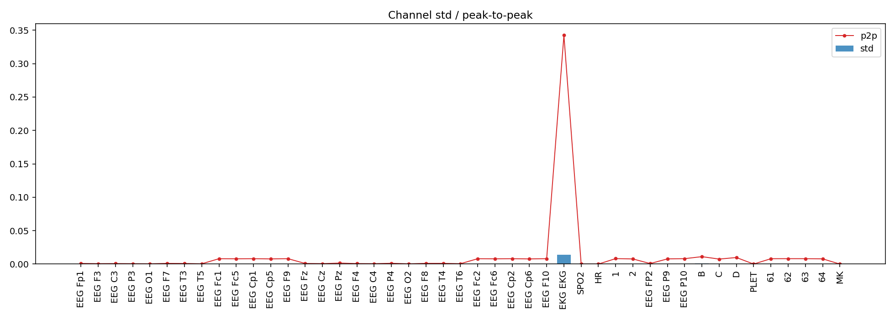
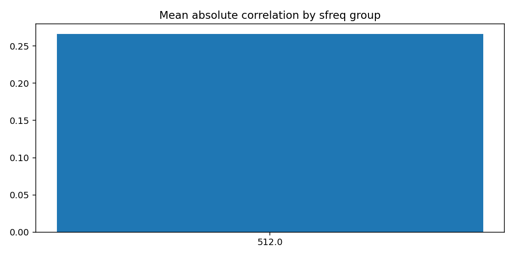
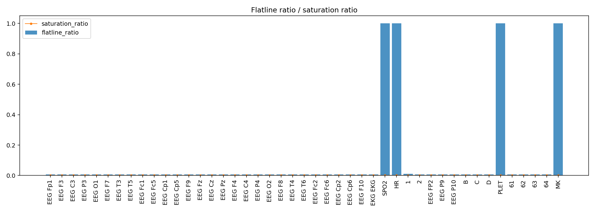
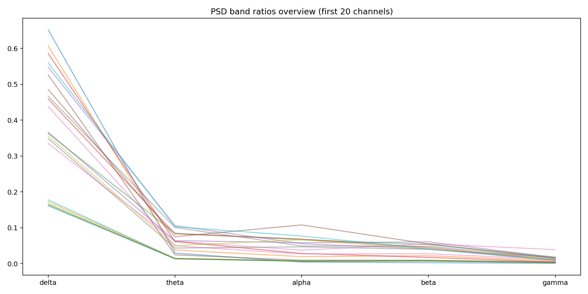
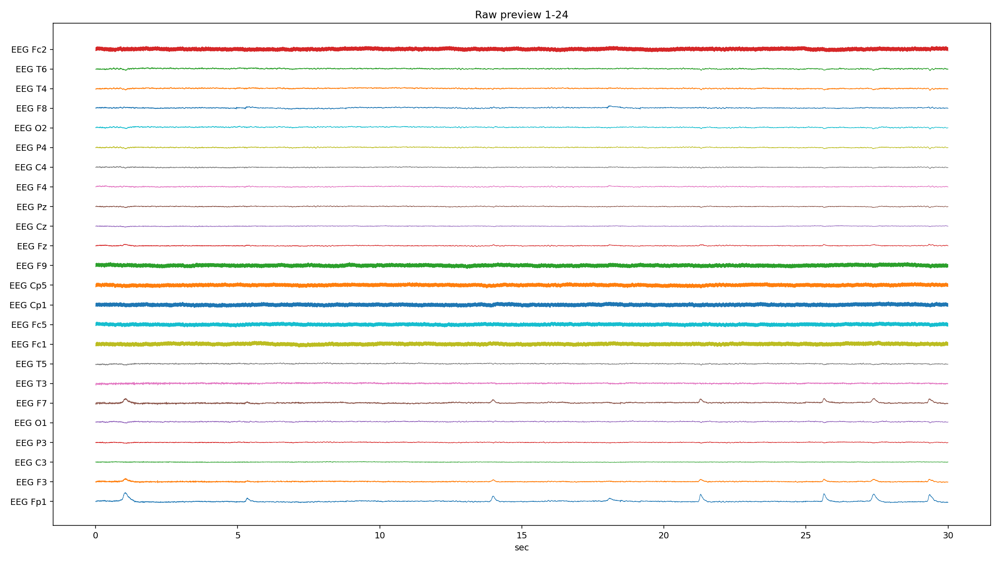
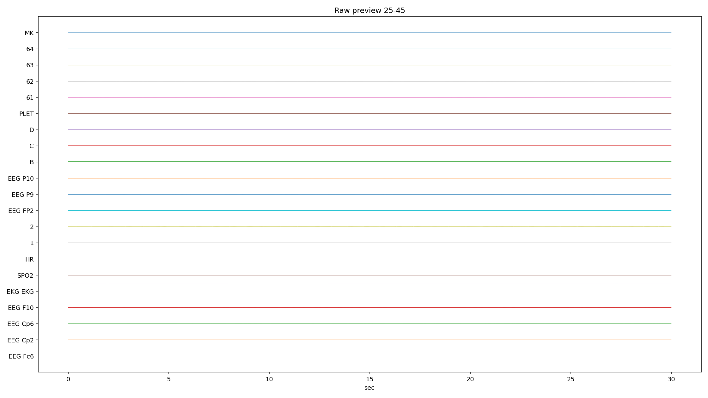
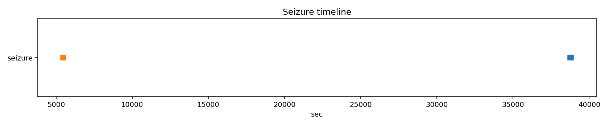

# PN10-7.8.9.edf EDA/QC ???????????????

## 1. ????????
| ?? | ?? |
|---|---|
| ??? | PN10 |
| EDF ?? | `E:\BaiduSyncdisk\nuro_work\data\raw\siena\PN10\PN10-7.8.9.edf` |
| ???? | 689138176 bytes |
| ?? | 14955.0 s (249.25 min) |
| ??? | 45 |
| ????? | ???? |
| ??? flags | ? |

## 2. ?????
- ?????pyedflib/mne??`2017-01-01T16:49:25` / `2017-01-01 16:49:25+00:00`
- ?????`EDF`?line_freq?`None`
- QC ???`{'flatline_eps': 1e-12, 'flatline_min_run_sec': 1.0, 'saturation_pct': 0.995, 'robust_z_thresh': 8.0, 'robust_z_bad_ratio': 0.05, 'low_variance_quantile': 0.05, 'high_variance_quantile': 0.95, 'extreme_p2p_quantile': 0.98, 'high_corr_threshold': 0.9, 'low_mean_abs_corr_threshold': 0.2}`

### 2.1 ??????
| channel_type | count |
| --- | --- |
| unknown | 41 |
| eeg | 2 |
| ecg | 1 |
| spo2 | 1 |

## 3. ???????
### 3.1 ????
| channel | flags |
| --- | --- |
| EKG EKG | high_variance, extreme_p2p |
| SPO2 | low_variance, high_flatline_ratio |
| HR | low_variance, high_flatline_ratio |
| B | high_variance, high_robust_outlier_ratio |
| C | high_robust_outlier_ratio |
| D | high_variance, high_robust_outlier_ratio |
| PLET | low_variance, high_flatline_ratio |
| MK | high_flatline_ratio |

### 3.2 ???? Top10
| channel | flatline_ratio | flatline_total_sec | flatline_longest_sec |
| --- | --- | --- | --- |
| PLET | 1 | 14955 | 14955 |
| SPO2 | 1 | 14955 | 14955 |
| HR | 1 | 14955 | 14955 |
| MK | 1 | 14955 | 14409 |
| 1 | 0.0104959 | 156.967 | 111.404 |
| EEG FP2 | 0.0074493 | 111.404 | 111.404 |
| EEG Cp2 | 0.0074493 | 111.404 | 111.404 |
| EEG Cp6 | 0.0074493 | 111.404 | 111.404 |
| EEG F10 | 0.0074493 | 111.404 | 111.404 |
| EKG EKG | 0.0074493 | 111.404 | 111.404 |

### 3.3 ????? Top10
| channel | std | peak_to_peak | robust_z_outlier_ratio | saturation_ratio |
| --- | --- | --- | --- | --- |
| EKG EKG | 0.0138804 | 0.342408 | 0.0145758 | 0 |
| B | 0.000692693 | 0.011102 | 0.245888 | 0 |
| D | 0.000590324 | 0.00980575 | 0.122606 | 0 |
| 1 | 0.000574338 | 0.00819187 | 0.0238062 | 0 |
| C | 0.000406234 | 0.0074725 | 0.130571 | 0 |
| 2 | 0.000340398 | 0.00766137 | 0.00425978 | 0 |
| 63 | 0.000167465 | 0.00807275 | 0.00194464 | 0 |
| 61 | 0.000164627 | 0.008053 | 0.00195339 | 0 |
| 64 | 0.000161562 | 0.00781987 | 0.00203449 | 0 |
| EEG P10 | 0.000158265 | 0.00810487 | 0.001994 | 0 |

## 4. ???????
- ?????delta=0.3215, theta=0.0366, alpha=0.0260, beta=0.0238, gamma=0.0075

### 4.1 ??/??/???? Top10
| channel | line_50hz_ratio | line_60hz_ratio | low_freq_drift_ratio | high_freq_noise_ratio |
| --- | --- | --- | --- | --- |
| 63 | 0.588895 | 0.000238532 | 0.142938 | 0.597962 |
| 61 | 0.570251 | 0.000251907 | 0.154195 | 0.579507 |
| EEG Fc2 | 0.556216 | 0.000275621 | 0.158114 | 0.5661 |
| EEG P10 | 0.553837 | 0.000264561 | 0.164004 | 0.563376 |
| 62 | 0.546573 | 0.000276975 | 0.164832 | 0.556674 |
| EEG F10 | 0.545735 | 0.000293224 | 0.164031 | 0.555568 |
| EEG Cp1 | 0.545221 | 0.000276162 | 0.16228 | 0.555317 |
| 64 | 0.544317 | 0.000265626 | 0.161696 | 0.554091 |
| EEG Cp2 | 0.544118 | 0.000272337 | 0.167416 | 0.554032 |
| EEG Fc1 | 0.541697 | 0.000288403 | 0.163645 | 0.5522 |

## 5. ??????
| ?? | ?? |
|---|---|
| mean_abs_corr | 0.266 |
| max_corr | 0.942 |
| min_corr | -0.659 |
| low_corr_flag | False |

### 5.1 ?????? Top10
| ch_a | ch_b | corr |
| --- | --- | --- |
| EEG P10 | 63 | 0.942179 |
| EEG Cp2 | 63 | 0.940566 |
| 62 | 63 | 0.940184 |
| EEG Cp1 | 63 | 0.939572 |
| 61 | 63 | 0.939411 |
| EEG Fc2 | 63 | 0.937551 |
| EEG Fc2 | EEG P10 | 0.936236 |
| EEG Cp2 | EEG P10 | 0.935992 |
| 63 | 64 | 0.934994 |
| EEG Cp2 | 62 | 0.934932 |

## 6. Annotation ? Seizure ??
| ?? | ?? |
|---|---|
| Annotation ? | 0 |
| Annotation ??? | 0 |
| Annotation ??? | 0 |
| Seizure ??? | 3 |

### 6.1 Seizure ???
| file | start_sec | end_sec | duration_sec | in_range |
| --- | --- | --- | --- | --- |
| PN10-7.8.9.edf | 38748 | 38796 | 48 | False |
| PN10-7.8.9.edf | 5459 | 5477 | 18 | True |
| PN10-7.8.9.edf | 12923 | 12938 | 15 | True |

## 7. ??????????
### annotation_distribution.png
- ?????(exists=True, size=7036, resolution=1400x420)
- ???annotation ??????? annotation ?=0?
- ???

### channel_std_p2p.png
- ?????(exists=True, size=55379, resolution=1960x700)
- ????????????? std ??? EKG EKG (std=0.0138804, p2p=0.342408)?
- ???

### corr_group.png
- ?????(exists=True, size=18115, resolution=1120x560)
- ??????????mean_abs=0.266, max=0.942, min=-0.659?
- ???

### flatline_saturation.png
- ?????(exists=True, size=40559, resolution=1960x700)
- ?????/?????????????????max saturation=0.000??
- ???

### psd_overview.png
- ?????(exists=True, size=175668, resolution=1680x840)
- ???????????? delta/theta/alpha/beta/gamma=0.321/0.037/0.026/0.024/0.007?
- ???

### raw_preview_page_01.png
- ?????(exists=True, size=354617, resolution=2240x1260)
- ???????????????/??/??????????????? PLET (ratio=1.000)?
- ???

### raw_preview_page_02.png
- ?????(exists=True, size=54745, resolution=2240x1260)
- ???????????????/??/??????????????? PLET (ratio=1.000)?
- ???

### seizure_timeline.png
- ?????(exists=True, size=12471, resolution=1680x350)
- ???seizure ??????????=3?
- ???

## 8. ?????
1. ?????????????????????
2. ??????????? 50Hz ????? PSD ?????
3. ???? seizure ??????????
