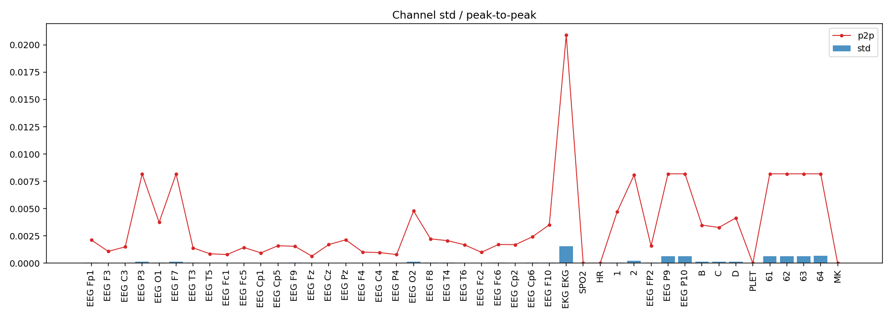
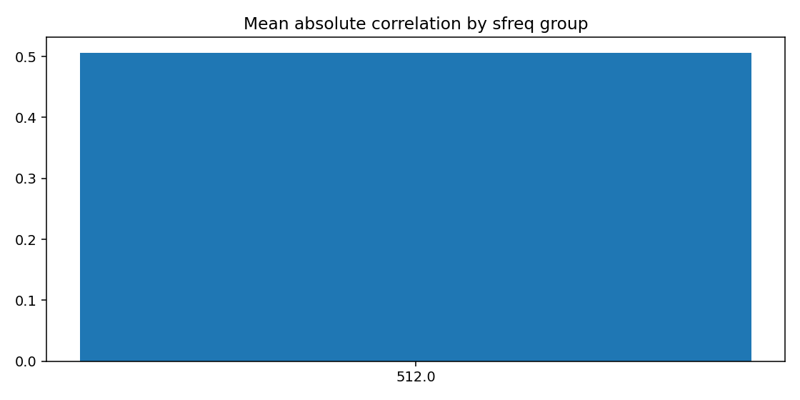
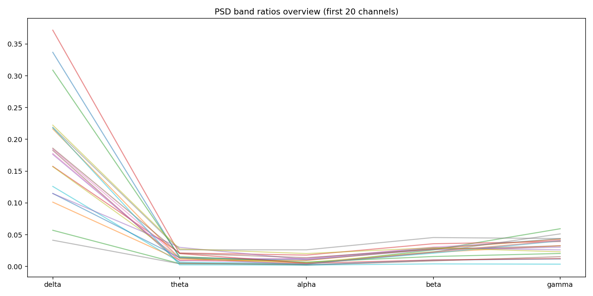
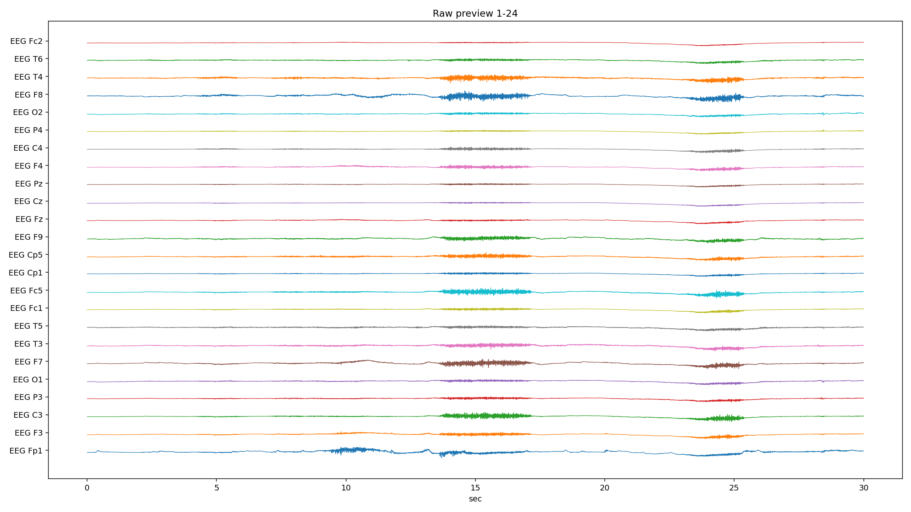
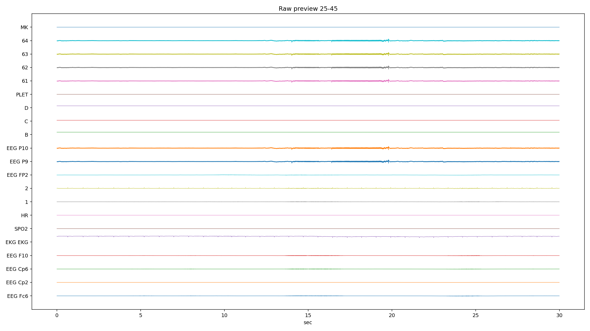
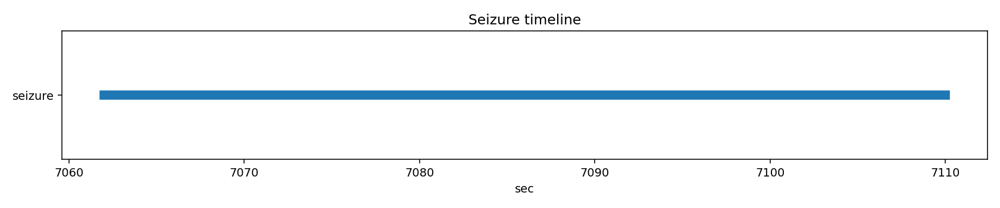

# PN13-1.edf EDA/QC ???????????????

## 1. ????????
| ?? | ?? |
|---|---|
| ??? | PN13 |
| EDF ?? | `E:\BaiduSyncdisk\nuro_work\data\raw\siena\PN13\PN13-1.edf` |
| ???? | 431090176 bytes |
| ?? | 9355.0 s (155.92 min) |
| ??? | 45 |
| ????? | ???? |
| ??? flags | ? |

## 2. ?????
- ?????pyedflib/mne??`2017-01-01T08:24:28` / `2017-01-01 08:24:28+00:00`
- ?????`EDF`?line_freq?`None`
- QC ???`{'flatline_eps': 1e-12, 'flatline_min_run_sec': 1.0, 'saturation_pct': 0.995, 'robust_z_thresh': 8.0, 'robust_z_bad_ratio': 0.05, 'low_variance_quantile': 0.05, 'high_variance_quantile': 0.95, 'extreme_p2p_quantile': 0.98, 'high_corr_threshold': 0.9, 'low_mean_abs_corr_threshold': 0.2}`

### 2.1 ??????
| channel_type | count |
| --- | --- |
| unknown | 41 |
| eeg | 2 |
| ecg | 1 |
| spo2 | 1 |

## 3. ???????
### 3.1 ????
| channel | flags |
| --- | --- |
| EKG EKG | high_variance, extreme_p2p |
| SPO2 | low_variance, high_flatline_ratio |
| HR | low_variance, high_flatline_ratio |
| PLET | low_variance, high_flatline_ratio |
| 62 | high_variance |
| 64 | high_variance |
| MK | high_flatline_ratio |

### 3.2 ???? Top10
| channel | flatline_ratio | flatline_total_sec | flatline_longest_sec |
| --- | --- | --- | --- |
| MK | 1 | 9355 | 9355 |
| PLET | 1 | 9355 | 9355 |
| SPO2 | 1 | 9355 | 9355 |
| HR | 1 | 9355 | 9355 |
| EEG F7 | 0.000568713 | 5.32031 | 2.71875 |
| EEG P3 | 0.000443446 | 4.14844 | 2.30273 |
| 64 | 0.000340101 | 3.18164 | 2.10547 |
| 62 | 0.000219426 | 2.05273 | 2.05273 |
| EEG P10 | 0.0002188 | 2.04688 | 2.04688 |
| 63 | 0.000218591 | 2.04492 | 2.04492 |

### 3.3 ????? Top10
| channel | std | peak_to_peak | robust_z_outlier_ratio | saturation_ratio |
| --- | --- | --- | --- | --- |
| EKG EKG | 0.00155324 | 0.0208925 | 1.67023e-06 | 0 |
| 64 | 0.000666795 | 0.00819175 | 0 | 0 |
| 62 | 0.000661614 | 0.00819175 | 0 | 0 |
| EEG P10 | 0.000661094 | 0.00819138 | 0 | 0 |
| 63 | 0.000660583 | 0.00819162 | 0 | 0 |
| 61 | 0.000659753 | 0.00819187 | 0 | 0 |
| EEG P9 | 0.000658802 | 0.00819187 | 0 | 0 |
| 2 | 0.000230583 | 0.00808325 | 0.0306406 | 0 |
| EEG F7 | 0.000148979 | 0.00818012 | 0.00802086 | 0 |
| C | 0.00014289 | 0.00327875 | 2.08779e-07 | 0 |

## 4. ???????
- ?????delta=0.1579, theta=0.0289, alpha=0.0184, beta=0.0361, gamma=0.0266

### 4.1 ??/??/???? Top10
| channel | line_50hz_ratio | line_60hz_ratio | low_freq_drift_ratio | high_freq_noise_ratio |
| --- | --- | --- | --- | --- |
| 63 | 0.85908 | 0.00010619 | 0.0110614 | 0.863756 |
| 61 | 0.858987 | 0.000107882 | 0.0110745 | 0.863731 |
| EEG P10 | 0.858589 | 0.00010427 | 0.0110396 | 0.863261 |
| EEG P9 | 0.858315 | 0.000104494 | 0.0109205 | 0.862997 |
| 62 | 0.857593 | 0.000104401 | 0.0110126 | 0.86227 |
| 64 | 0.855823 | 0.000101868 | 0.0108646 | 0.860401 |
| D | 0.536317 | 0.00239401 | 0.0289668 | 0.619931 |
| B | 0.469351 | 0.00303201 | 0.0324284 | 0.573851 |
| C | 0.438786 | 0.00311491 | 0.0400731 | 0.545304 |
| EEG Cp2 | 0.0856483 | 0.0017577 | 0.296033 | 0.144517 |

## 5. ??????
| ?? | ?? |
|---|---|
| mean_abs_corr | 0.506 |
| max_corr | 1.000 |
| min_corr | -0.653 |
| low_corr_flag | False |

### 5.1 ?????? Top10
| ch_a | ch_b | corr |
| --- | --- | --- |
| EEG P9 | EEG P10 | 0.999911 |
| EEG P10 | 62 | 0.999905 |
| EEG P9 | 62 | 0.999895 |
| EEG P9 | 63 | 0.999887 |
| EEG P10 | 63 | 0.999886 |
| 62 | 63 | 0.999868 |
| 61 | 63 | 0.999868 |
| EEG P9 | 61 | 0.999794 |
| EEG P10 | 61 | 0.999766 |
| 61 | 62 | 0.999747 |

## 6. Annotation ? Seizure ??
| ?? | ?? |
|---|---|
| Annotation ? | 0 |
| Annotation ??? | 0 |
| Annotation ??? | 0 |
| Seizure ??? | 1 |

### 6.1 Seizure ???
| file | start_sec | end_sec | duration_sec | in_range |
| --- | --- | --- | --- | --- |
| PN13-1.edf | 7062 | 7110 | 48 | True |

## 7. ??????????
### annotation_distribution.png
- ?????(exists=True, size=7036, resolution=1400x420)
- ???annotation ??????? annotation ?=0?
- ???

### channel_std_p2p.png
- ?????(exists=True, size=86008, resolution=1960x700)
- ????????????? std ??? EKG EKG (std=0.00155324, p2p=0.0208925)?
- ???

### corr_group.png
- ?????(exists=True, size=16654, resolution=1120x560)
- ??????????mean_abs=0.506, max=1.000, min=-0.653?
- ???

### flatline_saturation.png
- ?????(exists=True, size=40566, resolution=1960x700)
- ?????/?????????????????max saturation=0.000??
- ???

### psd_overview.png
- ?????(exists=True, size=171904, resolution=1680x840)
- ???????????? delta/theta/alpha/beta/gamma=0.158/0.029/0.018/0.036/0.027?
- ???

### raw_preview_page_01.png
- ?????(exists=True, size=339442, resolution=2240x1260)
- ???????????????/??/??????????????? MK (ratio=1.000)?
- ???

### raw_preview_page_02.png
- ?????(exists=True, size=149772, resolution=2240x1260)
- ???????????????/??/??????????????? MK (ratio=1.000)?
- ???

### seizure_timeline.png
- ?????(exists=True, size=12132, resolution=1680x350)
- ???seizure ??????????=1?
- ???

## 8. ?????
1. ?????????????????????
2. ??????????? 50Hz ????? PSD ?????
3. ????????????????????
4. seizure ???????????????????
