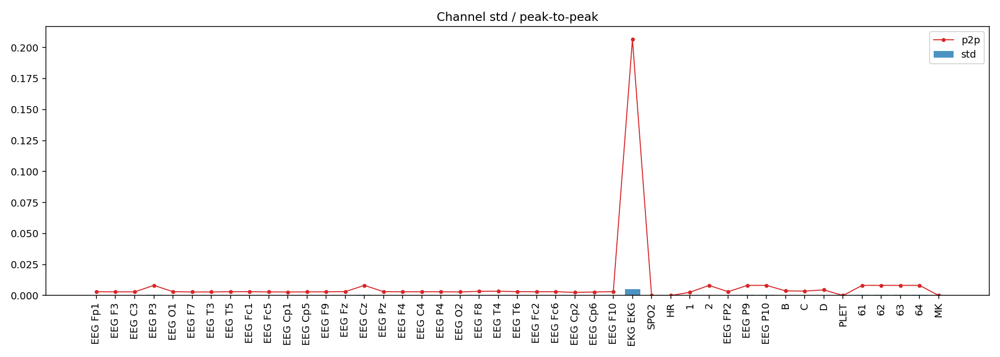
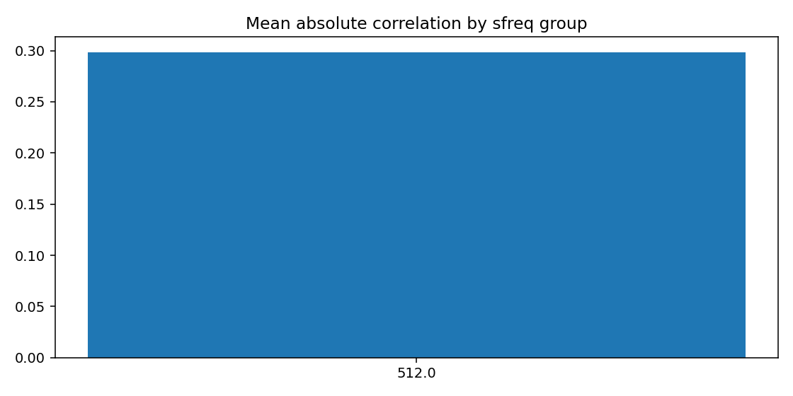
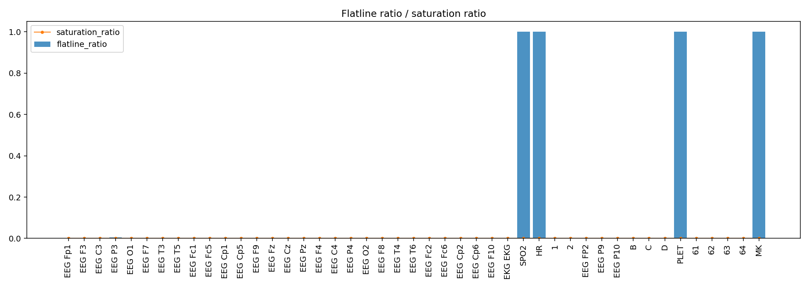
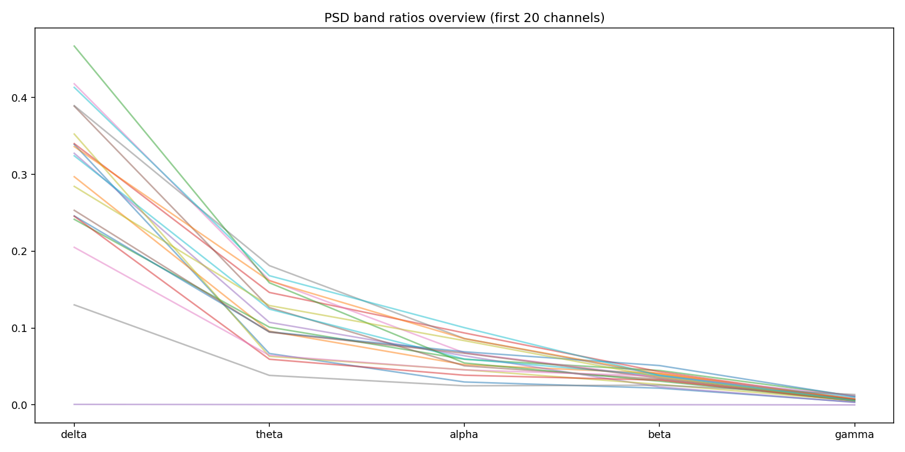
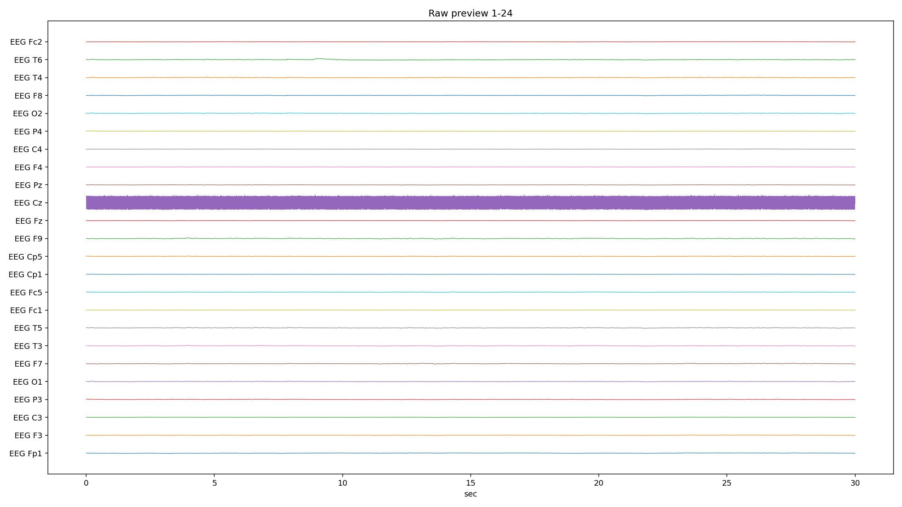
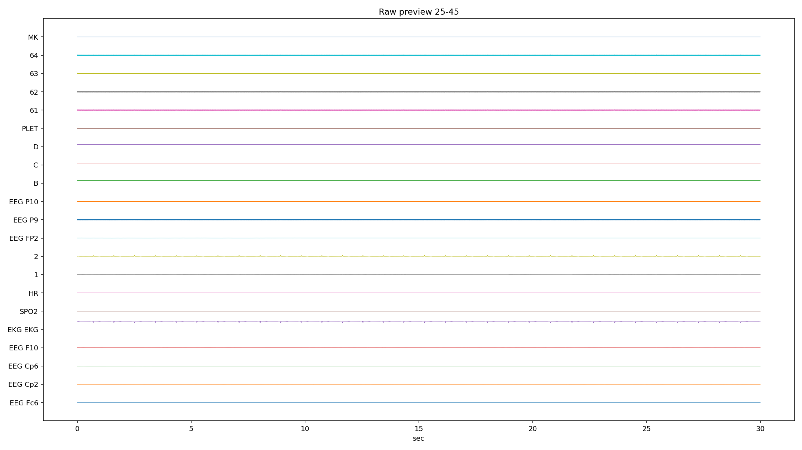
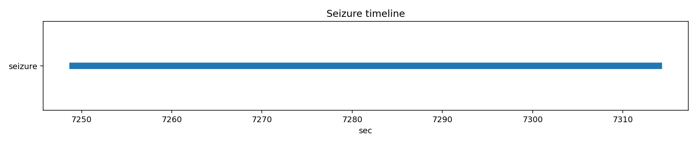

# PN13-2.edf EDA/QC ???????????????

## 1. ????????
| ?? | ?? |
|---|---|
| ??? | PN13 |
| EDF ?? | `E:\BaiduSyncdisk\nuro_work\data\raw\siena\PN13\PN13-2.edf` |
| ???? | 429108736 bytes |
| ?? | 9312.0 s (155.20 min) |
| ??? | 45 |
| ????? | ???? |
| ??? flags | ? |

## 2. ?????
- ?????pyedflib/mne??`2017-01-01T06:55:02` / `2017-01-01 06:55:02+00:00`
- ?????`EDF`?line_freq?`None`
- QC ???`{'flatline_eps': 1e-12, 'flatline_min_run_sec': 1.0, 'saturation_pct': 0.995, 'robust_z_thresh': 8.0, 'robust_z_bad_ratio': 0.05, 'low_variance_quantile': 0.05, 'high_variance_quantile': 0.95, 'extreme_p2p_quantile': 0.98, 'high_corr_threshold': 0.9, 'low_mean_abs_corr_threshold': 0.2}`

### 2.1 ??????
| channel_type | count |
| --- | --- |
| unknown | 41 |
| eeg | 2 |
| ecg | 1 |
| spo2 | 1 |

## 3. ???????
### 3.1 ????
| channel | flags |
| --- | --- |
| EEG P3 | high_robust_outlier_ratio |
| EKG EKG | high_variance, extreme_p2p |
| SPO2 | low_variance, high_flatline_ratio |
| HR | low_variance, high_flatline_ratio |
| EEG P10 | high_variance |
| PLET | low_variance, high_flatline_ratio |
| 64 | high_variance |
| MK | high_flatline_ratio |

### 3.2 ???? Top10
| channel | flatline_ratio | flatline_total_sec | flatline_longest_sec |
| --- | --- | --- | --- |
| MK | 1 | 9312 | 9312 |
| PLET | 1 | 9312 | 9312 |
| SPO2 | 1 | 9312 | 9312 |
| HR | 1 | 9312 | 9312 |
| EEG P3 | 0.00480521 | 44.7461 | 3.0918 |
| 64 | 0.000635731 | 5.91992 | 2.5332 |
| EEG P10 | 0.000631326 | 5.87891 | 2.5332 |
| 63 | 0.000630697 | 5.87305 | 2.5332 |
| 62 | 0.000622307 | 5.79492 | 2.51367 |
| EEG P9 | 0.000617902 | 5.75391 | 2.47461 |

### 3.3 ????? Top10
| channel | std | peak_to_peak | robust_z_outlier_ratio | saturation_ratio |
| --- | --- | --- | --- | --- |
| EKG EKG | 0.0051166 | 0.206516 | 0.0140813 | 0 |
| 64 | 0.000783606 | 0.00819187 | 0 | 0 |
| EEG P10 | 0.000778876 | 0.00819187 | 0 | 0 |
| 62 | 0.00077869 | 0.00819187 | 0 | 0 |
| EEG Cz | 0.000777725 | 0.00819187 | 0 | 0 |
| 63 | 0.000777635 | 0.00819187 | 0 | 0 |
| 61 | 0.000775831 | 0.00819187 | 0 | 0 |
| EEG P9 | 0.000775807 | 0.00819187 | 0 | 0 |
| EEG P3 | 0.000570748 | 0.00819187 | 0.175251 | 0 |
| 2 | 0.000262614 | 0.00818287 | 0.0343391 | 0 |

## 4. ???????
- ?????delta=0.2325, theta=0.0948, alpha=0.0538, beta=0.0493, gamma=0.0097

### 4.1 ??/??/???? Top10
| channel | line_50hz_ratio | line_60hz_ratio | low_freq_drift_ratio | high_freq_noise_ratio |
| --- | --- | --- | --- | --- |
| EEG Cz | 0.99158 | 5.61889e-06 | 0.000305924 | 0.992133 |
| 63 | 0.991534 | 5.57176e-06 | 0.000285816 | 0.992085 |
| 61 | 0.991533 | 5.5217e-06 | 0.000291121 | 0.992084 |
| EEG P10 | 0.991474 | 5.6524e-06 | 0.000282764 | 0.992025 |
| EEG P9 | 0.991399 | 5.66118e-06 | 0.000284497 | 0.991953 |
| 62 | 0.991267 | 5.57669e-06 | 0.000296864 | 0.991824 |
| 64 | 0.991032 | 5.48998e-06 | 0.000296924 | 0.991594 |
| EEG Fc2 | 0.541143 | 0.00039365 | 0.137647 | 0.557586 |
| EEG C4 | 0.423291 | 0.000806751 | 0.135327 | 0.503222 |
| EEG Fz | 0.392417 | 0.000298445 | 0.170666 | 0.409949 |

## 5. ??????
| ?? | ?? |
|---|---|
| mean_abs_corr | 0.298 |
| max_corr | 1.000 |
| min_corr | -0.900 |
| low_corr_flag | False |

### 5.1 ?????? Top10
| ch_a | ch_b | corr |
| --- | --- | --- |
| EEG P9 | EEG P10 | 0.999856 |
| EEG P10 | 62 | 0.999846 |
| EEG P10 | 63 | 0.999841 |
| EEG P9 | 63 | 0.99983 |
| EEG Cz | 63 | 0.999819 |
| EEG P9 | 62 | 0.999814 |
| EEG Cz | 61 | 0.999811 |
| 61 | 63 | 0.999806 |
| 62 | 63 | 0.999772 |
| EEG Cz | EEG P10 | 0.999754 |

## 6. Annotation ? Seizure ??
| ?? | ?? |
|---|---|
| Annotation ? | 0 |
| Annotation ??? | 0 |
| Annotation ??? | 0 |
| Seizure ??? | 1 |

### 6.1 Seizure ???
| file | start_sec | end_sec | duration_sec | in_range |
| --- | --- | --- | --- | --- |
| PN13-2.edf | 7249 | 7314 | 65 | True |

## 7. ??????????
### annotation_distribution.png
- ?????(exists=True, size=7036, resolution=1400x420)
- ???annotation ??????? annotation ?=0?
- ???

### channel_std_p2p.png
- ?????(exists=True, size=59087, resolution=1960x700)
- ????????????? std ??? EKG EKG (std=0.0051166, p2p=0.206516)?
- ???

### corr_group.png
- ?????(exists=True, size=19185, resolution=1120x560)
- ??????????mean_abs=0.298, max=1.000, min=-0.900?
- ???

### flatline_saturation.png
- ?????(exists=True, size=40628, resolution=1960x700)
- ?????/?????????????????max saturation=0.000??
- ???

### psd_overview.png
- ?????(exists=True, size=200377, resolution=1680x840)
- ???????????? delta/theta/alpha/beta/gamma=0.233/0.095/0.054/0.049/0.010?
- ???

### raw_preview_page_01.png
- ?????(exists=True, size=268086, resolution=2240x1260)
- ???????????????/??/??????????????? MK (ratio=1.000)?
- ???

### raw_preview_page_02.png
- ?????(exists=True, size=111244, resolution=2240x1260)
- ???????????????/??/??????????????? MK (ratio=1.000)?
- ???

### seizure_timeline.png
- ?????(exists=True, size=12881, resolution=1680x350)
- ???seizure ??????????=1?
- ???

## 8. ?????
1. ?????????????????????
2. ??????????? 50Hz ????? PSD ?????
3. seizure ???????????????????
