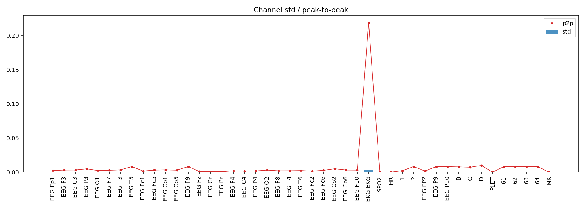
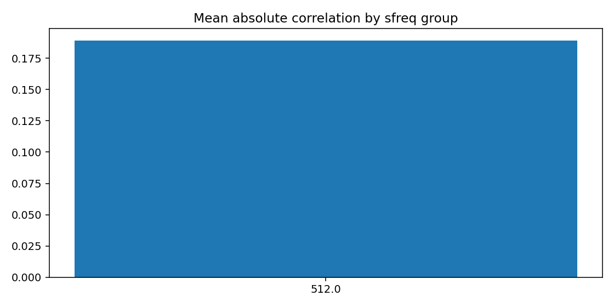
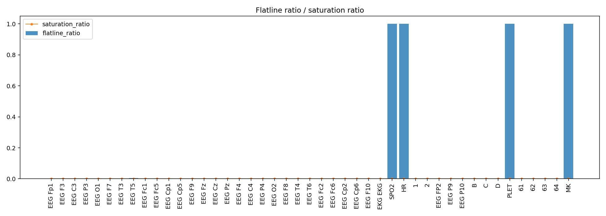
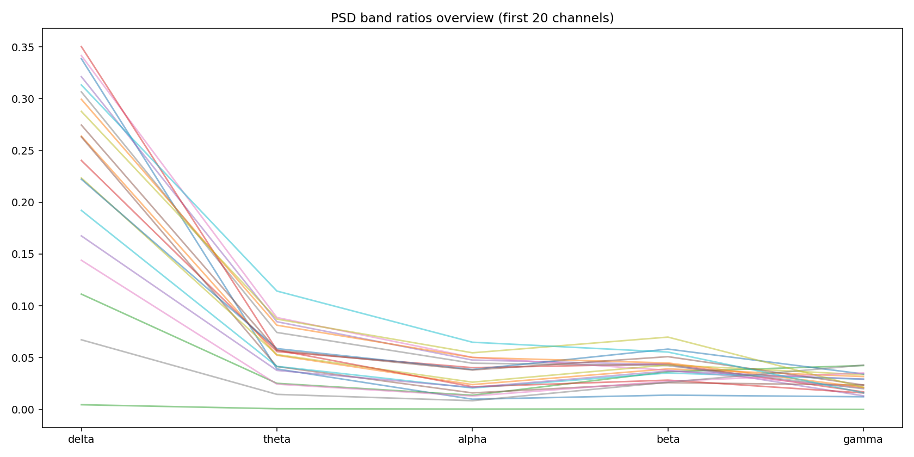
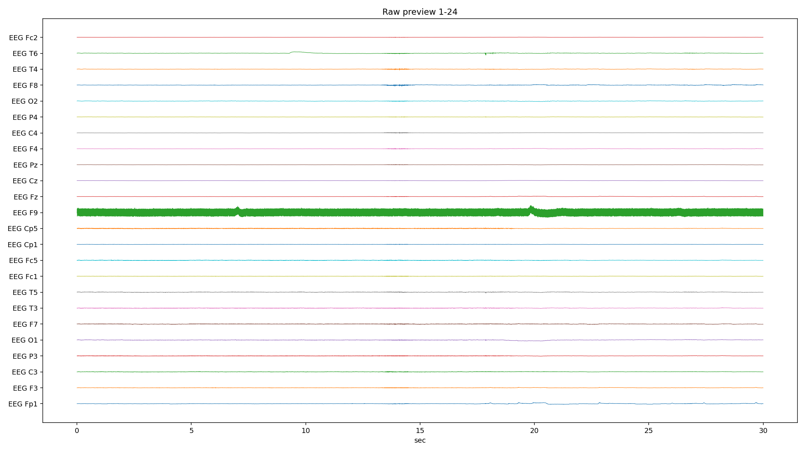
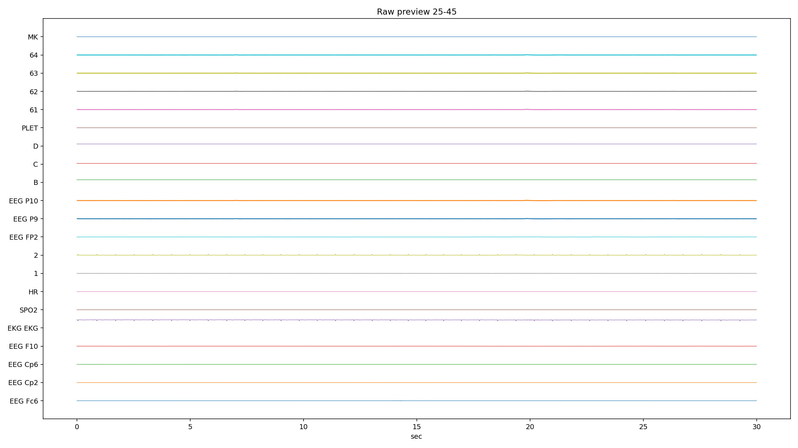
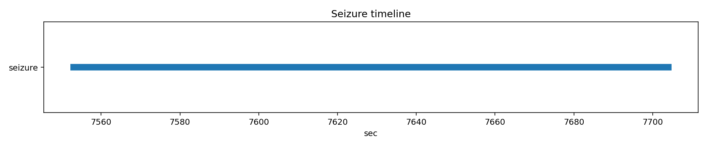

# PN13-3.edf EDA/QC ???????????????

## 1. ????????
| ?? | ?? |
|---|---|
| ??? | PN13 |
| EDF ?? | `E:\BaiduSyncdisk\nuro_work\data\raw\siena\PN13\PN13-3.edf` |
| ???? | 577255936 bytes |
| ?? | 12527.0 s (208.78 min) |
| ??? | 45 |
| ????? | ???? |
| ??? flags | ? |

## 2. ?????
- ?????pyedflib/mne??`2017-01-01T12:00:01` / `2017-01-01 12:00:01+00:00`
- ?????`EDF`?line_freq?`None`
- QC ???`{'flatline_eps': 1e-12, 'flatline_min_run_sec': 1.0, 'saturation_pct': 0.995, 'robust_z_thresh': 8.0, 'robust_z_bad_ratio': 0.05, 'low_variance_quantile': 0.05, 'high_variance_quantile': 0.95, 'extreme_p2p_quantile': 0.98, 'high_corr_threshold': 0.9, 'low_mean_abs_corr_threshold': 0.2}`

### 2.1 ??????
| channel_type | count |
| --- | --- |
| unknown | 41 |
| eeg | 2 |
| ecg | 1 |
| spo2 | 1 |

## 3. ???????
### 3.1 ????
| channel | flags |
| --- | --- |
| EEG T5 | high_robust_outlier_ratio |
| EEG F9 | high_robust_outlier_ratio |
| EKG EKG | high_variance, extreme_p2p |
| SPO2 | low_variance, high_flatline_ratio |
| HR | low_variance, high_flatline_ratio |
| EEG P10 | high_variance |
| PLET | low_variance, high_flatline_ratio |
| 64 | high_variance |
| MK | high_flatline_ratio |

### 3.2 ???? Top10
| channel | flatline_ratio | flatline_total_sec | flatline_longest_sec |
| --- | --- | --- | --- |
| MK | 1 | 12527 | 12527 |
| SPO2 | 1 | 12527 | 12527 |
| HR | 1 | 12527 | 12527 |
| PLET | 1 | 12527 | 12527 |
| EEG T5 | 0.00411128 | 51.502 | 2.69531 |
| EEG F9 | 0.00117948 | 14.7754 | 3.14844 |
| 64 | 0.000809969 | 10.1465 | 2.10742 |
| EEG P10 | 0.000724997 | 9.08203 | 2.14648 |
| 63 | 0.000723282 | 9.06055 | 2.14648 |
| 62 | 0.000717201 | 8.98438 | 2.10547 |

### 3.3 ????? Top10
| channel | std | peak_to_peak | robust_z_outlier_ratio | saturation_ratio |
| --- | --- | --- | --- | --- |
| EKG EKG | 0.00284199 | 0.218441 | 0.00414074 | 0 |
| 64 | 0.000684555 | 0.00819187 | 0 | 0 |
| EEG P10 | 0.00068005 | 0.00819187 | 0 | 0 |
| 62 | 0.000679402 | 0.00819187 | 0 | 0 |
| 63 | 0.000678642 | 0.00819187 | 0 | 0 |
| EEG P9 | 0.000677576 | 0.00819187 | 0 | 0 |
| 61 | 0.000677545 | 0.00819187 | 0 | 0 |
| EEG F9 | 0.000588458 | 0.00819187 | 0.120828 | 0 |
| EEG T5 | 0.000437969 | 0.00819187 | 0.0740524 | 0 |
| 2 | 0.000264083 | 0.00818837 | 0.0340256 | 0 |

## 4. ???????
- ?????delta=0.1857, theta=0.0523, alpha=0.0340, beta=0.0487, gamma=0.0219

### 4.1 ??/??/???? Top10
| channel | line_50hz_ratio | line_60hz_ratio | low_freq_drift_ratio | high_freq_noise_ratio |
| --- | --- | --- | --- | --- |
| EEG F9 | 0.979235 | 1.53645e-05 | 0.00156447 | 0.980685 |
| 63 | 0.97909 | 1.52503e-05 | 0.00156947 | 0.980544 |
| 61 | 0.978978 | 1.52179e-05 | 0.00158104 | 0.980432 |
| EEG P10 | 0.97884 | 1.55435e-05 | 0.00158583 | 0.980298 |
| EEG P9 | 0.97869 | 1.55699e-05 | 0.00159232 | 0.980154 |
| 62 | 0.978549 | 1.53849e-05 | 0.00161992 | 0.980013 |
| 64 | 0.978032 | 1.54927e-05 | 0.001605 | 0.979512 |
| EEG Cp2 | 0.446463 | 0.00149439 | 0.136079 | 0.500333 |
| D | 0.207397 | 0.00514598 | 0.034047 | 0.389579 |
| B | 0.153538 | 0.00608443 | 0.0411435 | 0.354342 |

## 5. ??????
| ?? | ?? |
|---|---|
| mean_abs_corr | 0.189 |
| max_corr | 1.000 |
| min_corr | -0.888 |
| low_corr_flag | True |

### 5.1 ?????? Top10
| ch_a | ch_b | corr |
| --- | --- | --- |
| EEG P10 | 63 | 0.999628 |
| EEG P10 | 62 | 0.999617 |
| EEG P9 | EEG P10 | 0.999608 |
| EEG F9 | 61 | 0.999597 |
| 61 | 63 | 0.999592 |
| EEG P9 | 62 | 0.999586 |
| EEG P9 | 63 | 0.999586 |
| 62 | 63 | 0.999582 |
| EEG F9 | 63 | 0.999553 |
| EEG P10 | 61 | 0.999505 |

## 6. Annotation ? Seizure ??
| ?? | ?? |
|---|---|
| Annotation ? | 0 |
| Annotation ??? | 0 |
| Annotation ??? | 0 |
| Seizure ??? | 1 |

### 6.1 Seizure ???
| file | start_sec | end_sec | duration_sec | in_range |
| --- | --- | --- | --- | --- |
| PN13-3.edf | 7553 | 7704 | 151 | True |

## 7. ??????????
### annotation_distribution.png
- ?????(exists=True, size=7036, resolution=1400x420)
- ???annotation ??????? annotation ?=0?
- ???

### channel_std_p2p.png
- ?????(exists=True, size=53900, resolution=1960x700)
- ????????????? std ??? EKG EKG (std=0.00284199, p2p=0.218441)?
- ???

### corr_group.png
- ?????(exists=True, size=21677, resolution=1120x560)
- ??????????mean_abs=0.189, max=1.000, min=-0.888?
- ???

### flatline_saturation.png
- ?????(exists=True, size=40623, resolution=1960x700)
- ?????/?????????????????max saturation=0.000??
- ???

### psd_overview.png
- ?????(exists=True, size=212320, resolution=1680x840)
- ???????????? delta/theta/alpha/beta/gamma=0.186/0.052/0.034/0.049/0.022?
- ???

### raw_preview_page_01.png
- ?????(exists=True, size=250124, resolution=2240x1260)
- ???????????????/??/??????????????? MK (ratio=1.000)?
- ???

### raw_preview_page_02.png
- ?????(exists=True, size=109625, resolution=2240x1260)
- ???????????????/??/??????????????? MK (ratio=1.000)?
- ???

### seizure_timeline.png
- ?????(exists=True, size=13262, resolution=1680x350)
- ???seizure ??????????=1?
- ???

## 8. ?????
1. ?????????????????????
2. ??????????? 50Hz ????? PSD ?????
3. ??????????????????????
4. seizure ???????????????????
