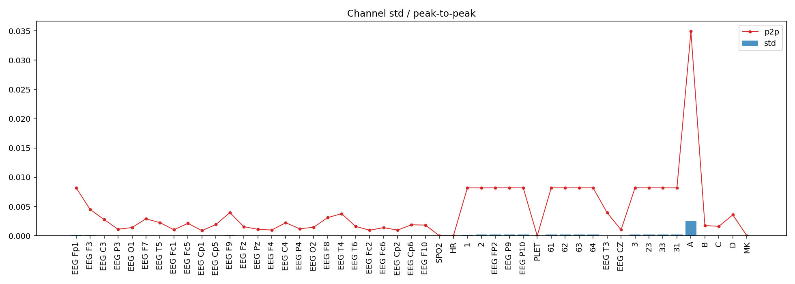
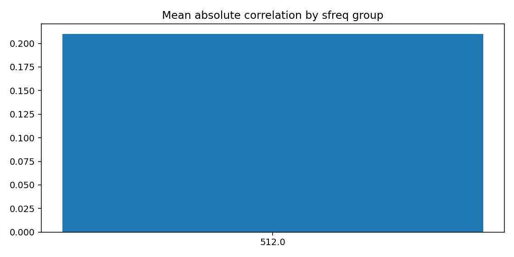
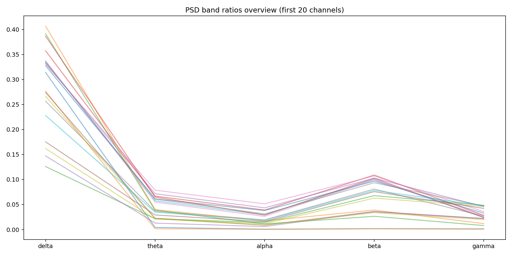
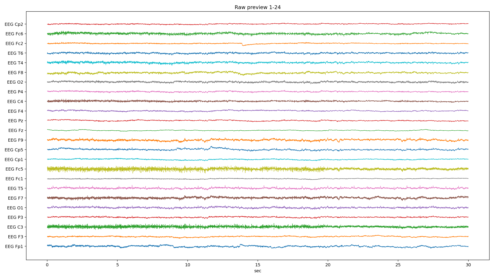
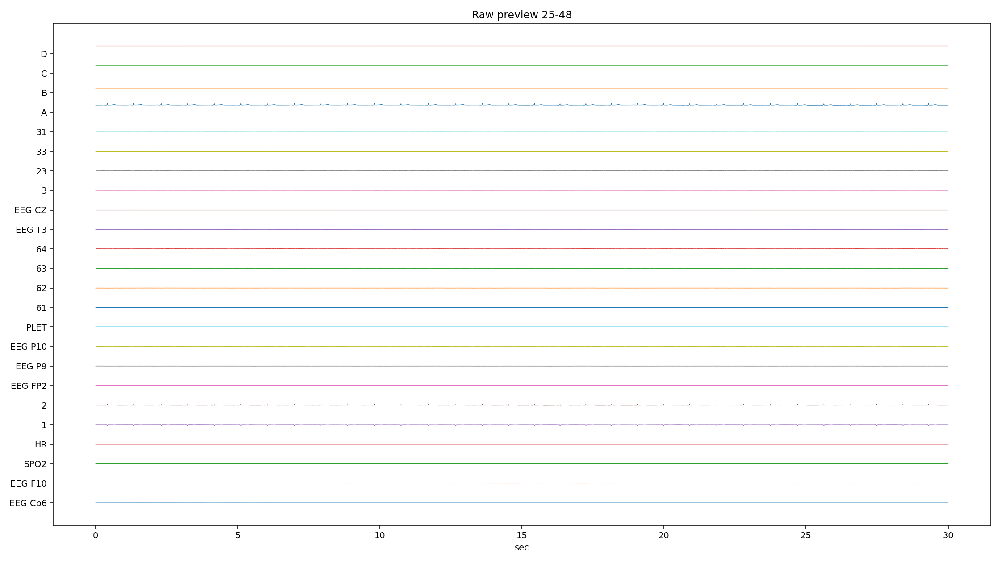
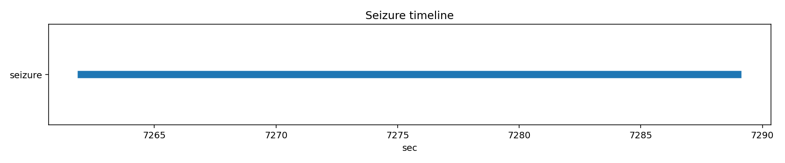

# PN14-1.edf EDA/QC ???????????????

## 1. ????????
| ?? | ?? |
|---|---|
| ??? | PN14 |
| EDF ?? | `E:\BaiduSyncdisk\nuro_work\data\raw\siena\PN14\PN14-1.edf` |
| ???? | 394797568 bytes |
| ?? | 7868.0 s (131.13 min) |
| ??? | 49 |
| ????? | ???? |
| ??? flags | ? |

## 2. ?????
- ?????pyedflib/mne??`2017-01-01T11:44:58` / `2017-01-01 11:44:58+00:00`
- ?????`EDF`?line_freq?`None`
- QC ???`{'flatline_eps': 1e-12, 'flatline_min_run_sec': 1.0, 'saturation_pct': 0.995, 'robust_z_thresh': 8.0, 'robust_z_bad_ratio': 0.05, 'low_variance_quantile': 0.05, 'high_variance_quantile': 0.95, 'extreme_p2p_quantile': 0.98, 'high_corr_threshold': 0.9, 'low_mean_abs_corr_threshold': 0.2}`

### 2.1 ??????
| channel_type | count |
| --- | --- |
| unknown | 46 |
| eeg | 2 |
| spo2 | 1 |

## 3. ???????
### 3.1 ????
| channel | flags |
| --- | --- |
| SPO2 | low_variance, high_flatline_ratio |
| HR | low_variance, high_flatline_ratio |
| 2 | high_variance |
| PLET | low_variance, high_flatline_ratio |
| 33 | high_variance |
| A | high_variance, extreme_p2p |
| MK | high_flatline_ratio |

### 3.2 ???? Top10
| channel | flatline_ratio | flatline_total_sec | flatline_longest_sec |
| --- | --- | --- | --- |
| SPO2 | 1 | 7868 | 7868 |
| PLET | 1 | 7868 | 7868 |
| HR | 1 | 7868 | 7868 |
| MK | 0.999978 | 7867.82 | 7344.03 |
| EEG FP2 | 0.00018866 | 1.48438 | 1.48438 |
| B | 0 | 0 | 0 |
| A | 0 | 0 | 0 |
| D | 0 | 0 | 0 |
| 1 | 0 | 0 | 0 |
| 2 | 0 | 0 | 0 |

### 3.3 ????? Top10
| channel | std | peak_to_peak | robust_z_outlier_ratio | saturation_ratio |
| --- | --- | --- | --- | --- |
| A | 0.00255614 | 0.0349073 | 0 | 0 |
| 2 | 0.000238435 | 0.00817637 | 0.0150513 | 0 |
| 33 | 0.000204566 | 0.008187 | 0.0048277 | 0 |
| 61 | 0.000196069 | 0.00818812 | 0.00500172 | 0 |
| 64 | 0.000195992 | 0.00818738 | 0.00516084 | 0 |
| 63 | 0.000195835 | 0.00818587 | 0.00488852 | 0 |
| 62 | 0.000194415 | 0.008188 | 0.00516084 | 0 |
| 3 | 0.0001932 | 0.00819062 | 0.00506601 | 0 |
| EEG P10 | 0.000193175 | 0.00818662 | 0.00497764 | 0 |
| EEG FP2 | 0.0001908 | 0.00818837 | 0.0261751 | 0 |

## 4. ???????
- ?????delta=0.2570, theta=0.0503, alpha=0.0274, beta=0.0606, gamma=0.0241

### 4.1 ??/??/???? Top10
| channel | line_50hz_ratio | line_60hz_ratio | low_freq_drift_ratio | high_freq_noise_ratio |
| --- | --- | --- | --- | --- |
| 33 | 0.537298 | 0.000136078 | 0.120218 | 0.54402 |
| 63 | 0.536218 | 8.29744e-05 | 0.124395 | 0.541861 |
| EEG P10 | 0.535223 | 8.33196e-05 | 0.128909 | 0.54071 |
| 23 | 0.530968 | 8.58889e-05 | 0.13134 | 0.536447 |
| 31 | 0.529638 | 8.19785e-05 | 0.132777 | 0.535075 |
| 61 | 0.529372 | 8.23464e-05 | 0.128807 | 0.535008 |
| 64 | 0.524655 | 8.77072e-05 | 0.129307 | 0.530344 |
| 3 | 0.523799 | 8.46652e-05 | 0.132584 | 0.529498 |
| 62 | 0.52318 | 8.42126e-05 | 0.130695 | 0.52882 |
| EEG P9 | 0.520406 | 8.46648e-05 | 0.136531 | 0.525923 |

## 5. ??????
| ?? | ?? |
|---|---|
| mean_abs_corr | 0.210 |
| max_corr | 0.998 |
| min_corr | -0.510 |
| low_corr_flag | False |

### 5.1 ?????? Top10
| ch_a | ch_b | corr |
| --- | --- | --- |
| EEG P10 | 62 | 0.99778 |
| 62 | 63 | 0.997593 |
| EEG P10 | 31 | 0.997423 |
| EEG P10 | 63 | 0.997409 |
| 62 | 31 | 0.997353 |
| EEG P9 | 62 | 0.99735 |
| EEG P10 | 23 | 0.997315 |
| 62 | 3 | 0.997296 |
| 62 | 23 | 0.997285 |
| EEG P9 | EEG P10 | 0.997223 |

## 6. Annotation ? Seizure ??
| ?? | ?? |
|---|---|
| Annotation ? | 0 |
| Annotation ??? | 0 |
| Annotation ??? | 0 |
| Seizure ??? | 1 |

### 6.1 Seizure ???
| file | start_sec | end_sec | duration_sec | in_range |
| --- | --- | --- | --- | --- |
| PN14-1.edf | 7262 | 7289 | 27 | True |

## 7. ??????????
### annotation_distribution.png
- ?????(exists=True, size=7036, resolution=1400x420)
- ???annotation ??????? annotation ?=0?
- ???

### channel_std_p2p.png
- ?????(exists=True, size=72669, resolution=1960x700)
- ????????????? std ??? A (std=0.00255614, p2p=0.0349073)?
- ???

### corr_group.png
- ?????(exists=True, size=23006, resolution=1120x560)
- ??????????mean_abs=0.210, max=0.998, min=-0.510?
- ???

### flatline_saturation.png
- ?????(exists=True, size=40700, resolution=1960x700)
- ?????/?????????????????max saturation=0.000??
- ???

### psd_overview.png
- ?????(exists=True, size=222045, resolution=1680x840)
- ???????????? delta/theta/alpha/beta/gamma=0.257/0.050/0.027/0.061/0.024?
- ???

### raw_preview_page_01.png
- ?????(exists=True, size=592330, resolution=2240x1260)
- ???????????????/??/??????????????? SPO2 (ratio=1.000)?
- ???

### raw_preview_page_02.png
- ?????(exists=True, size=145707, resolution=2240x1260)
- ???????????????/??/??????????????? SPO2 (ratio=1.000)?
- ???

### raw_preview_page_03.png
- ?????(exists=True, size=22817, resolution=2240x1260)
- ???????????????/??/??????????????? SPO2 (ratio=1.000)?
- ???

### seizure_timeline.png
- ?????(exists=True, size=11719, resolution=1680x350)
- ???seizure ??????????=1?
- ???

## 8. ?????
1. ?????????????????????
2. ??????????? 50Hz ????? PSD ?????
3. ??????????????????????
4. seizure ???????????????????
