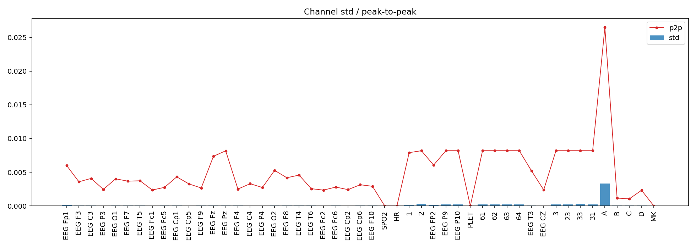
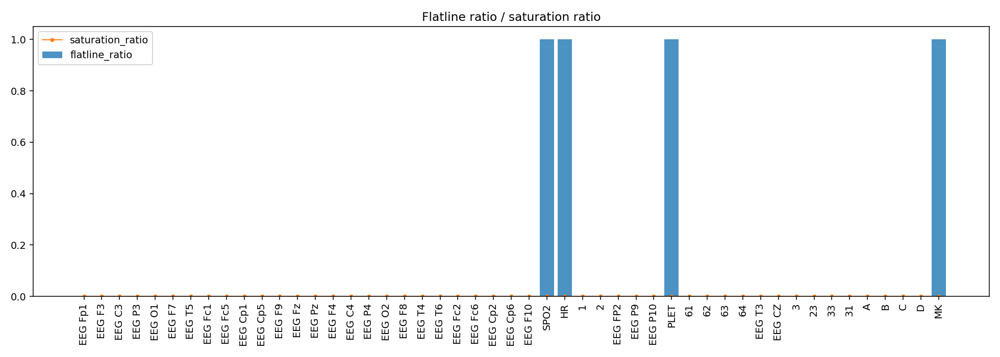
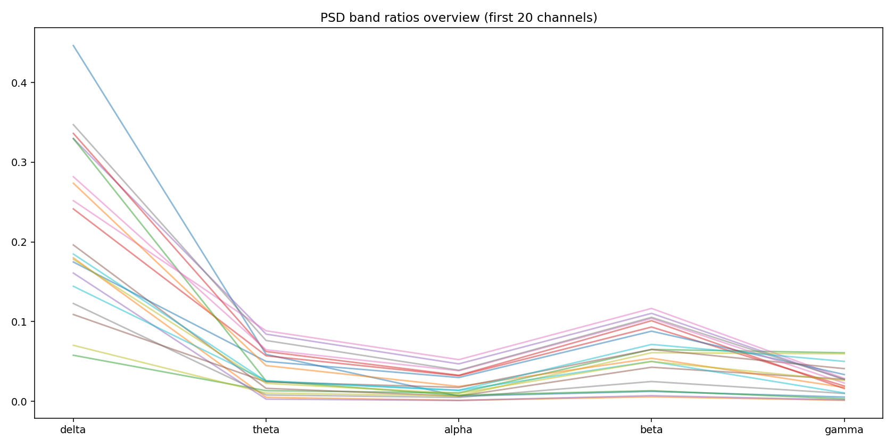
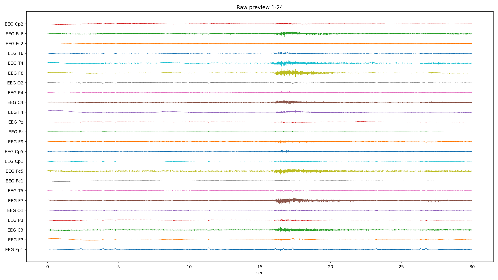
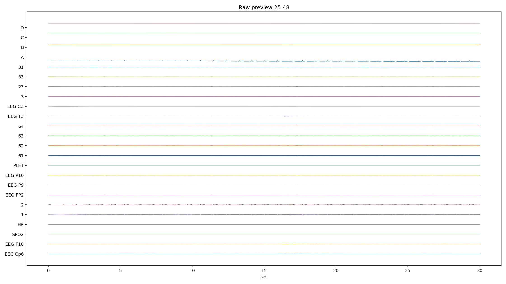
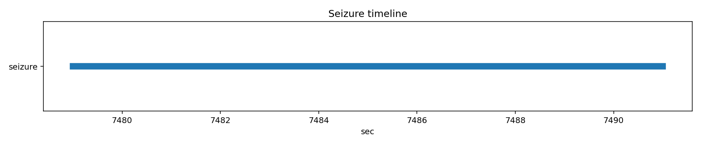

# PN14-2.edf EDA/QC ???????????????

## 1. ????????
| ?? | ?? |
|---|---|
| ??? | PN14 |
| EDF ?? | `E:\BaiduSyncdisk\nuro_work\data\raw\siena\PN14\PN14-2.edf` |
| ???? | 459875840 bytes |
| ?? | 9165.0 s (152.75 min) |
| ??? | 49 |
| ????? | ???? |
| ??? flags | ? |

## 2. ?????
- ?????pyedflib/mne??`2017-01-01T15:50:13` / `2017-01-01 15:50:13+00:00`
- ?????`EDF`?line_freq?`None`
- QC ???`{'flatline_eps': 1e-12, 'flatline_min_run_sec': 1.0, 'saturation_pct': 0.995, 'robust_z_thresh': 8.0, 'robust_z_bad_ratio': 0.05, 'low_variance_quantile': 0.05, 'high_variance_quantile': 0.95, 'extreme_p2p_quantile': 0.98, 'high_corr_threshold': 0.9, 'low_mean_abs_corr_threshold': 0.2}`

### 2.1 ??????
| channel_type | count |
| --- | --- |
| unknown | 46 |
| eeg | 2 |
| spo2 | 1 |

## 3. ???????
### 3.1 ????
| channel | flags |
| --- | --- |
| SPO2 | low_variance, high_flatline_ratio |
| HR | low_variance, high_flatline_ratio |
| 2 | high_variance |
| PLET | low_variance, high_flatline_ratio |
| 33 | high_variance |
| A | high_variance, extreme_p2p |
| MK | high_flatline_ratio |

### 3.2 ???? Top10
| channel | flatline_ratio | flatline_total_sec | flatline_longest_sec |
| --- | --- | --- | --- |
| MK | 1 | 9165 | 9165 |
| PLET | 1 | 9165 | 9165 |
| HR | 1 | 9165 | 9165 |
| SPO2 | 1 | 9165 | 9165 |
| B | 0 | 0 | 0 |
| A | 0 | 0 | 0 |
| D | 0 | 0 | 0 |
| 1 | 0 | 0 | 0 |
| 2 | 0 | 0 | 0 |
| EEG FP2 | 0 | 0 | 0 |

### 3.3 ????? Top10
| channel | std | peak_to_peak | robust_z_outlier_ratio | saturation_ratio |
| --- | --- | --- | --- | --- |
| A | 0.00334569 | 0.026474 | 0 | 0 |
| 33 | 0.000257917 | 0.00819162 | 0.00444946 | 0 |
| 2 | 0.000254008 | 0.00818612 | 0.0120192 | 0 |
| 63 | 0.000245961 | 0.00819175 | 0.00487589 | 0 |
| 61 | 0.000244912 | 0.00819175 | 0.0049119 | 0 |
| 64 | 0.00024363 | 0.008191 | 0.00501803 | 0 |
| 62 | 0.000241666 | 0.00819125 | 0.00500205 | 0 |
| EEG P10 | 0.000239396 | 0.00819175 | 0.00486076 | 0 |
| 3 | 0.000238813 | 0.008191 | 0.00483263 | 0 |
| 31 | 0.000235314 | 0.00819088 | 0.00491489 | 0 |

## 4. ???????
- ?????delta=0.1649, theta=0.0400, alpha=0.0232, beta=0.0562, gamma=0.0220

### 4.1 ??/??/???? Top10
| channel | line_50hz_ratio | line_60hz_ratio | low_freq_drift_ratio | high_freq_noise_ratio |
| --- | --- | --- | --- | --- |
| 33 | 0.890582 | 2.66856e-05 | 0.0113974 | 0.891547 |
| 63 | 0.882194 | 3.36343e-05 | 0.013721 | 0.883374 |
| 3 | 0.880571 | 3.41312e-05 | 0.0147375 | 0.881762 |
| 61 | 0.878554 | 3.36663e-05 | 0.0152892 | 0.87978 |
| EEG P10 | 0.877084 | 3.51306e-05 | 0.0149666 | 0.87832 |
| 31 | 0.876685 | 3.45637e-05 | 0.0155364 | 0.877947 |
| 23 | 0.876624 | 3.67459e-05 | 0.0153733 | 0.877933 |
| 62 | 0.875081 | 3.6482e-05 | 0.0149606 | 0.87634 |
| EEG P9 | 0.872236 | 3.71557e-05 | 0.015732 | 0.873618 |
| 64 | 0.871257 | 3.67805e-05 | 0.0152467 | 0.872572 |

## 5. ??????
| ?? | ?? |
|---|---|
| mean_abs_corr | 0.240 |
| max_corr | 0.997 |
| min_corr | -0.659 |
| low_corr_flag | False |

### 5.1 ?????? Top10
| ch_a | ch_b | corr |
| --- | --- | --- |
| EEG P10 | 62 | 0.997199 |
| 62 | 31 | 0.996927 |
| EEG P10 | 63 | 0.996886 |
| EEG P9 | 62 | 0.996872 |
| 62 | 63 | 0.996786 |
| EEG P10 | 31 | 0.996754 |
| 62 | 23 | 0.996738 |
| EEG P9 | EEG P10 | 0.996708 |
| 63 | 3 | 0.996493 |
| EEG P10 | 23 | 0.996462 |

## 6. Annotation ? Seizure ??
| ?? | ?? |
|---|---|
| Annotation ? | 0 |
| Annotation ??? | 0 |
| Annotation ??? | 0 |
| Seizure ??? | 1 |

### 6.1 Seizure ???
| file | start_sec | end_sec | duration_sec | in_range |
| --- | --- | --- | --- | --- |
| PN14-2.edf | 7479 | 7491 | 12 | True |

## 7. ??????????
### annotation_distribution.png
- ?????(exists=True, size=7036, resolution=1400x420)
- ???annotation ??????? annotation ?=0?
- ???

### channel_std_p2p.png
- ?????(exists=True, size=75698, resolution=1960x700)
- ????????????? std ??? A (std=0.00334569, p2p=0.026474)?
- ???

### corr_group.png
- ?????(exists=True, size=18095, resolution=1120x560)
- ??????????mean_abs=0.240, max=0.997, min=-0.659?
- ???

### flatline_saturation.png
- ?????(exists=True, size=40700, resolution=1960x700)
- ?????/?????????????????max saturation=0.000??
- ???

### psd_overview.png
- ?????(exists=True, size=211038, resolution=1680x840)
- ???????????? delta/theta/alpha/beta/gamma=0.165/0.040/0.023/0.056/0.022?
- ???

### raw_preview_page_01.png
- ?????(exists=True, size=346602, resolution=2240x1260)
- ???????????????/??/??????????????? MK (ratio=1.000)?
- ???

### raw_preview_page_02.png
- ?????(exists=True, size=159258, resolution=2240x1260)
- ???????????????/??/??????????????? MK (ratio=1.000)?
- ???

### raw_preview_page_03.png
- ?????(exists=True, size=22817, resolution=2240x1260)
- ???????????????/??/??????????????? MK (ratio=1.000)?
- ???

### seizure_timeline.png
- ?????(exists=True, size=11985, resolution=1680x350)
- ???seizure ??????????=1?
- ???

## 8. ?????
1. ?????????????????????
2. ??????????? 50Hz ????? PSD ?????
3. ??????????????????????
4. seizure ???????????????????
