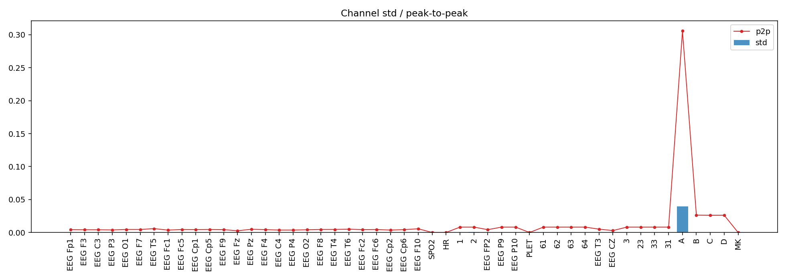
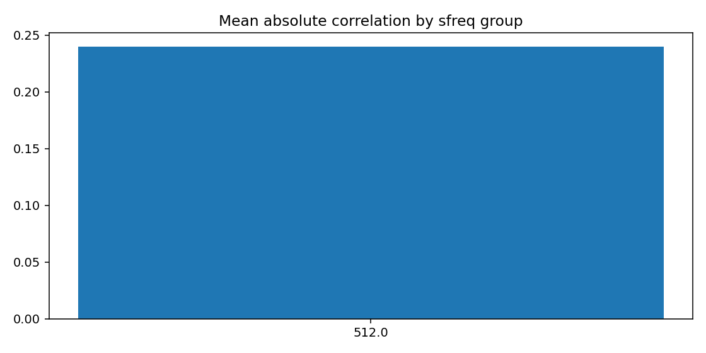
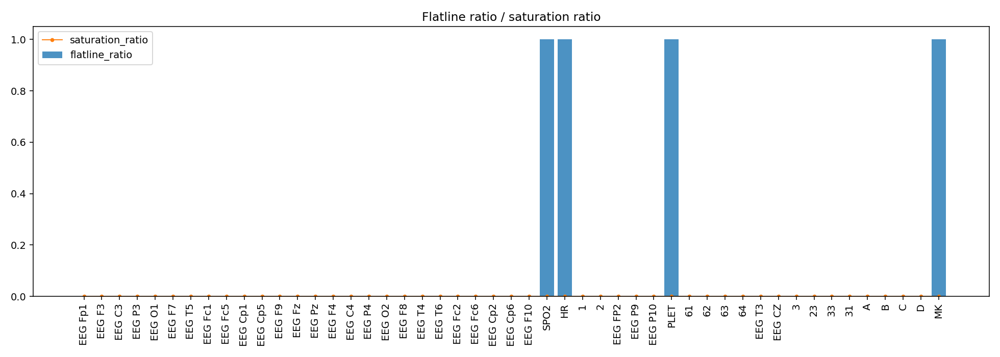
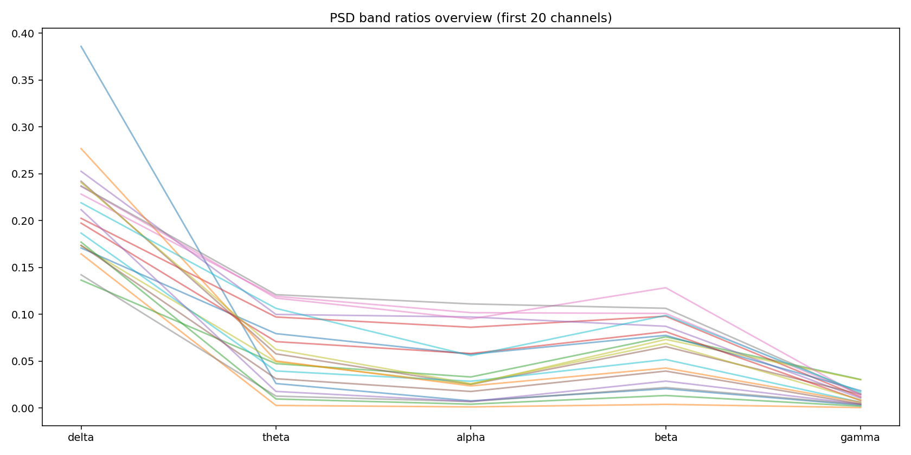
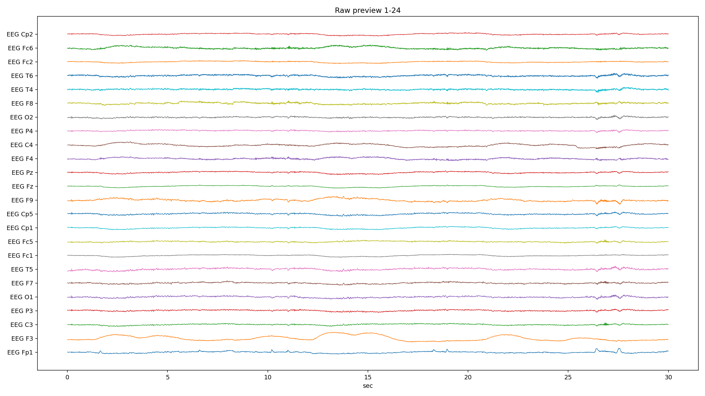
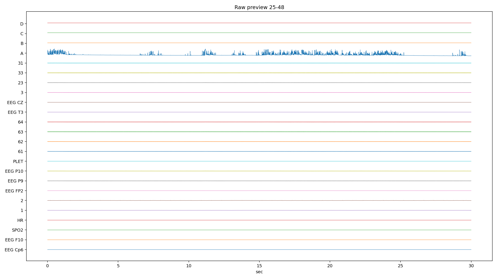
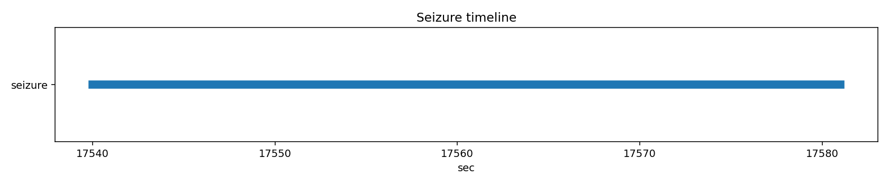

# PN14-3.edf EDA/QC ???????????????

## 1. ????????
| ?? | ?? |
|---|---|
| ??? | PN14 |
| EDF ?? | `E:\BaiduSyncdisk\nuro_work\data\raw\siena\PN14\PN14-3.edf` |
| ???? | 2107153920 bytes |
| ?? | 41995.0 s (699.92 min) |
| ??? | 49 |
| ????? | ???? |
| ??? flags | ? |

## 2. ?????
- ?????pyedflib/mne??`2017-01-01T19:17:45` / `2017-01-01 19:17:45+00:00`
- ?????`EDF`?line_freq?`None`
- QC ???`{'flatline_eps': 1e-12, 'flatline_min_run_sec': 1.0, 'saturation_pct': 0.995, 'robust_z_thresh': 8.0, 'robust_z_bad_ratio': 0.05, 'low_variance_quantile': 0.05, 'high_variance_quantile': 0.95, 'extreme_p2p_quantile': 0.98, 'high_corr_threshold': 0.9, 'low_mean_abs_corr_threshold': 0.2}`

### 2.1 ??????
| channel_type | count |
| --- | --- |
| unknown | 46 |
| eeg | 2 |
| spo2 | 1 |

## 3. ???????
### 3.1 ????
| channel | flags |
| --- | --- |
| SPO2 | low_variance, high_flatline_ratio |
| HR | low_variance, high_flatline_ratio |
| 2 | high_variance |
| PLET | low_variance, high_flatline_ratio |
| 33 | high_variance |
| A | high_variance, extreme_p2p |
| MK | high_flatline_ratio |

### 3.2 ???? Top10
| channel | flatline_ratio | flatline_total_sec | flatline_longest_sec |
| --- | --- | --- | --- |
| SPO2 | 1 | 41995 | 41995 |
| PLET | 1 | 41995 | 41995 |
| HR | 1 | 41995 | 41995 |
| MK | 0.999989 | 41994.6 | 31690.7 |
| 2 | 0.00189425 | 79.5488 | 5.22656 |
| 1 | 7.10185e-05 | 2.98242 | 1.91797 |
| EEG T5 | 2.89748e-05 | 1.2168 | 1.2168 |
| B | 0 | 0 | 0 |
| 62 | 0 | 0 | 0 |
| D | 0 | 0 | 0 |

### 3.3 ????? Top10
| channel | std | peak_to_peak | robust_z_outlier_ratio | saturation_ratio |
| --- | --- | --- | --- | --- |
| A | 0.0397931 | 0.305686 | 0 | 0 |
| 2 | 0.000705162 | 0.00819187 | 0.0207451 | 0 |
| 33 | 0.000233174 | 0.00819138 | 0.00054201 | 0 |
| 1 | 0.000231968 | 0.00819187 | 0.0479363 | 0 |
| 3 | 0.000224563 | 0.00819125 | 0.000535499 | 0 |
| 63 | 0.000222894 | 0.00819162 | 0.000528895 | 0 |
| EEG P10 | 0.000221789 | 0.00819138 | 0.000523314 | 0 |
| 61 | 0.000221156 | 0.00819187 | 0.000533732 | 0 |
| 64 | 0.000219397 | 0.0081915 | 0.000545033 | 0 |
| 31 | 0.000218909 | 0.00819 | 0.000529081 | 0 |

## 4. ???????
- ?????delta=0.1625, theta=0.0440, alpha=0.0297, beta=0.0475, gamma=0.0101

### 4.1 ??/??/???? Top10
| channel | line_50hz_ratio | line_60hz_ratio | low_freq_drift_ratio | high_freq_noise_ratio |
| --- | --- | --- | --- | --- |
| 33 | 0.891194 | 8.82051e-06 | 0.00653997 | 0.892317 |
| 3 | 0.886937 | 9.9778e-06 | 0.00771917 | 0.888102 |
| 63 | 0.886806 | 9.75386e-06 | 0.00711505 | 0.887973 |
| 61 | 0.885567 | 1.00878e-05 | 0.00757762 | 0.886742 |
| 31 | 0.885157 | 9.99505e-06 | 0.00785779 | 0.886338 |
| 23 | 0.885139 | 1.02522e-05 | 0.00783458 | 0.886327 |
| EEG P10 | 0.8842 | 1.0163e-05 | 0.00761284 | 0.885382 |
| EEG P9 | 0.880663 | 1.07429e-05 | 0.00817292 | 0.881878 |
| 62 | 0.880401 | 1.0274e-05 | 0.00770531 | 0.8816 |
| 64 | 0.877152 | 1.00695e-05 | 0.00767745 | 0.878363 |

## 5. ??????
| ?? | ?? |
|---|---|
| mean_abs_corr | 0.240 |
| max_corr | 1.000 |
| min_corr | -0.614 |
| low_corr_flag | False |

### 5.1 ?????? Top10
| ch_a | ch_b | corr |
| --- | --- | --- |
| EEG P10 | 31 | 0.999591 |
| EEG P9 | 62 | 0.999575 |
| EEG P9 | EEG P10 | 0.999574 |
| EEG P10 | 62 | 0.999572 |
| EEG P10 | 63 | 0.999569 |
| 23 | 31 | 0.99955 |
| EEG P10 | 23 | 0.999542 |
| 63 | 31 | 0.999537 |
| 63 | 23 | 0.999529 |
| EEG P9 | 31 | 0.999479 |

## 6. Annotation ? Seizure ??
| ?? | ?? |
|---|---|
| Annotation ? | 0 |
| Annotation ??? | 0 |
| Annotation ??? | 0 |
| Seizure ??? | 1 |

### 6.1 Seizure ???
| file | start_sec | end_sec | duration_sec | in_range |
| --- | --- | --- | --- | --- |
| PN14-3.edf | 17540 | 17581 | 41 | True |

## 7. ??????????
### annotation_distribution.png
- ?????(exists=True, size=7036, resolution=1400x420)
- ???annotation ??????? annotation ?=0?
- ???

### channel_std_p2p.png
- ?????(exists=True, size=54486, resolution=1960x700)
- ????????????? std ??? A (std=0.0397931, p2p=0.305686)?
- ???

### corr_group.png
- ?????(exists=True, size=18095, resolution=1120x560)
- ??????????mean_abs=0.240, max=1.000, min=-0.614?
- ???

### flatline_saturation.png
- ?????(exists=True, size=40706, resolution=1960x700)
- ?????/?????????????????max saturation=0.000??
- ???

### psd_overview.png
- ?????(exists=True, size=214178, resolution=1680x840)
- ???????????? delta/theta/alpha/beta/gamma=0.163/0.044/0.030/0.048/0.010?
- ???

### raw_preview_page_01.png
- ?????(exists=True, size=430988, resolution=2240x1260)
- ???????????????/??/??????????????? SPO2 (ratio=1.000)?
- ???

### raw_preview_page_02.png
- ?????(exists=True, size=139537, resolution=2240x1260)
- ???????????????/??/??????????????? SPO2 (ratio=1.000)?
- ???

### raw_preview_page_03.png
- ?????(exists=True, size=22817, resolution=2240x1260)
- ???????????????/??/??????????????? SPO2 (ratio=1.000)?
- ???

### seizure_timeline.png
- ?????(exists=True, size=11825, resolution=1680x350)
- ???seizure ??????????=1?
- ???

## 8. ?????
1. ?????????????????????
2. ??????????? 50Hz ????? PSD ?????
3. ??????????????????????
4. seizure ???????????????????
