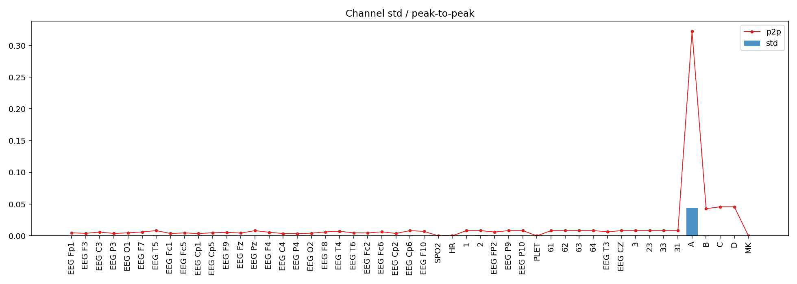
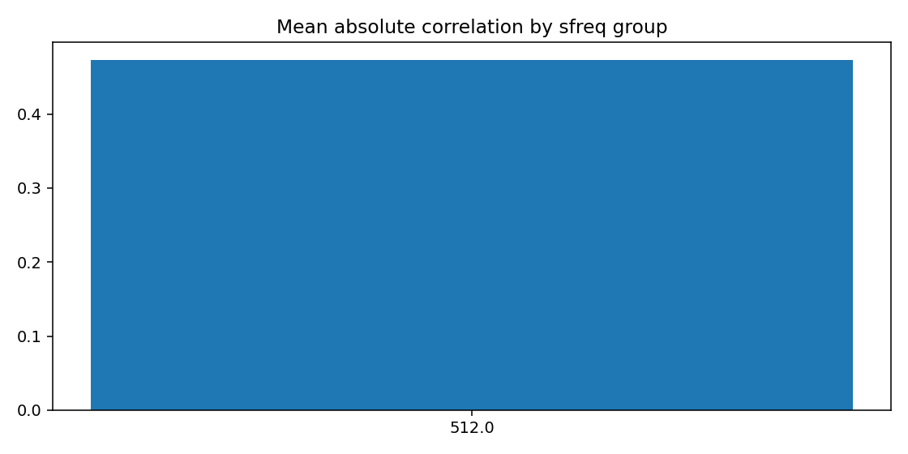
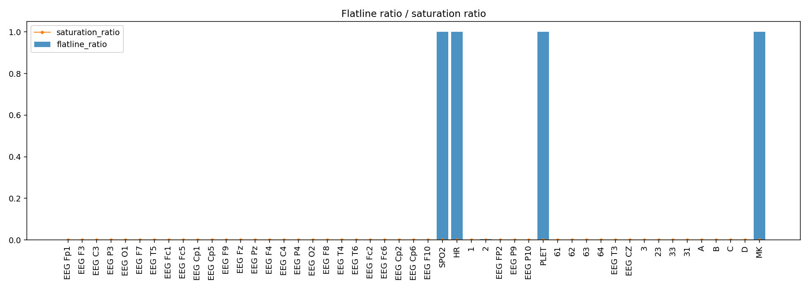
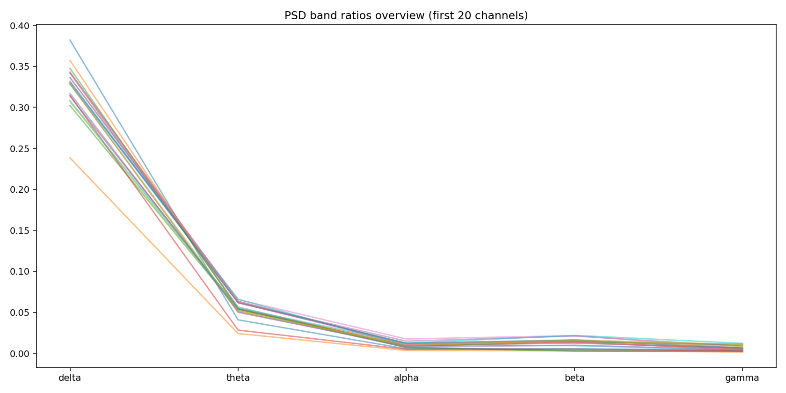
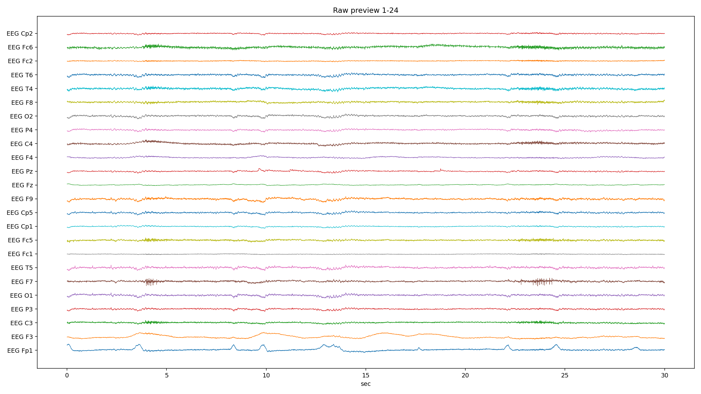
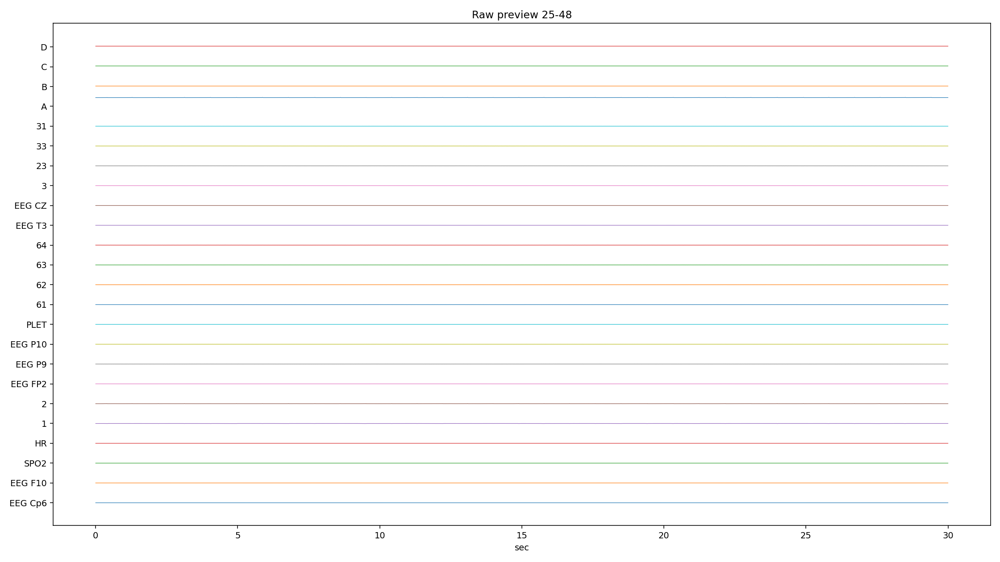
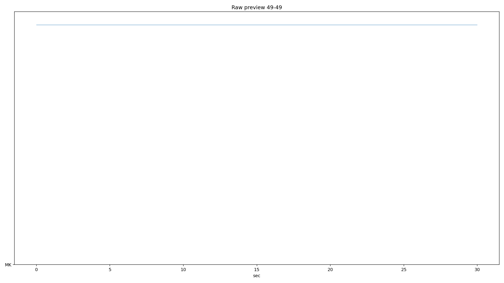
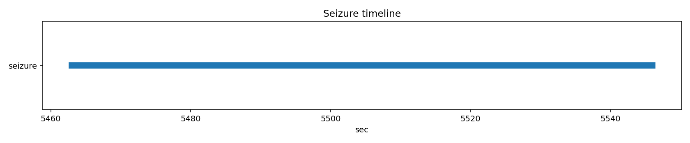

# PN14-4.edf EDA/QC ???????????????

## 1. ????????
| ?? | ?? |
|---|---|
| ??? | PN14 |
| EDF ?? | `E:\BaiduSyncdisk\nuro_work\data\raw\siena\PN14\PN14-4.edf` |
| ???? | 734689792 bytes |
| ?? | 14642.0 s (244.03 min) |
| ??? | 49 |
| ????? | ???? |
| ??? flags | ? |

## 2. ?????
- ?????pyedflib/mne??`2017-01-01T14:18:30` / `2017-01-01 14:18:30+00:00`
- ?????`EDF`?line_freq?`None`
- QC ???`{'flatline_eps': 1e-12, 'flatline_min_run_sec': 1.0, 'saturation_pct': 0.995, 'robust_z_thresh': 8.0, 'robust_z_bad_ratio': 0.05, 'low_variance_quantile': 0.05, 'high_variance_quantile': 0.95, 'extreme_p2p_quantile': 0.98, 'high_corr_threshold': 0.9, 'low_mean_abs_corr_threshold': 0.2}`

### 2.1 ??????
| channel_type | count |
| --- | --- |
| unknown | 46 |
| eeg | 2 |
| spo2 | 1 |

## 3. ???????
### 3.1 ????
| channel | flags |
| --- | --- |
| SPO2 | low_variance, high_flatline_ratio |
| HR | low_variance, high_flatline_ratio |
| 2 | high_variance |
| PLET | low_variance, high_flatline_ratio |
| A | high_variance, extreme_p2p |
| C | high_variance |
| MK | high_flatline_ratio |

### 3.2 ???? Top10
| channel | flatline_ratio | flatline_total_sec | flatline_longest_sec |
| --- | --- | --- | --- |
| SPO2 | 1 | 14642 | 14642 |
| HR | 1 | 14642 | 14642 |
| PLET | 1 | 14642 | 14642 |
| MK | 1 | 14642 | 10612 |
| 2 | 0.00473275 | 69.2969 | 16.373 |
| EEG Pz | 0.00145664 | 21.3281 | 16.373 |
| 1 | 0.00127243 | 18.6309 | 16.373 |
| EEG T5 | 0.00123654 | 18.1055 | 16.373 |
| EEG F10 | 0.00122014 | 17.8652 | 16.373 |
| EEG P4 | 0.00111836 | 16.375 | 16.375 |

### 3.3 ????? Top10
| channel | std | peak_to_peak | robust_z_outlier_ratio | saturation_ratio |
| --- | --- | --- | --- | --- |
| A | 0.0440866 | 0.322156 | 6.48285e-05 | 0 |
| 2 | 0.000596942 | 0.00819187 | 0.0388153 | 0 |
| C | 0.000292272 | 0.0457348 | 0.00112063 | 0 |
| D | 0.000286787 | 0.045811 | 0.0011361 | 0 |
| 1 | 0.000272792 | 0.00819187 | 0.0356177 | 0 |
| 33 | 0.000263144 | 0.00819187 | 0.00228447 | 0 |
| 63 | 0.000250199 | 0.00819113 | 0.00242226 | 0 |
| 61 | 0.000249058 | 0.008191 | 0.00247162 | 0 |
| 3 | 0.000248435 | 0.00818987 | 0.00248736 | 0 |
| 64 | 0.000247931 | 0.00819125 | 0.0025706 | 0 |

## 4. ???????
- ?????delta=0.2561, theta=0.0437, alpha=0.0130, beta=0.0196, gamma=0.0090

### 4.1 ??/??/???? Top10
| channel | line_50hz_ratio | line_60hz_ratio | low_freq_drift_ratio | high_freq_noise_ratio |
| --- | --- | --- | --- | --- |
| 33 | 0.819537 | 7.20283e-05 | 0.071462 | 0.822945 |
| 63 | 0.801857 | 8.15565e-05 | 0.0804885 | 0.805566 |
| 61 | 0.796702 | 8.22744e-05 | 0.0825899 | 0.800468 |
| 3 | 0.796601 | 8.2288e-05 | 0.0830953 | 0.800327 |
| EEG P10 | 0.795983 | 8.36672e-05 | 0.0835207 | 0.799728 |
| 23 | 0.793377 | 8.50702e-05 | 0.0841148 | 0.797173 |
| 31 | 0.792783 | 8.29907e-05 | 0.0846487 | 0.796562 |
| 64 | 0.792545 | 8.44982e-05 | 0.0845299 | 0.796394 |
| 62 | 0.791465 | 8.67146e-05 | 0.0851224 | 0.795317 |
| EEG P9 | 0.784826 | 8.68413e-05 | 0.0881994 | 0.788709 |

## 5. ??????
| ?? | ?? |
|---|---|
| mean_abs_corr | 0.473 |
| max_corr | 0.999 |
| min_corr | -0.140 |
| low_corr_flag | False |

### 5.1 ?????? Top10
| ch_a | ch_b | corr |
| --- | --- | --- |
| EEG P10 | 62 | 0.998794 |
| EEG P9 | 62 | 0.998773 |
| EEG P10 | 63 | 0.998758 |
| EEG P10 | 31 | 0.998744 |
| EEG P10 | 23 | 0.998715 |
| EEG P9 | EEG P10 | 0.998688 |
| 62 | 31 | 0.998655 |
| 23 | 31 | 0.998632 |
| EEG P9 | 31 | 0.998632 |
| 63 | 23 | 0.998618 |

## 6. Annotation ? Seizure ??
| ?? | ?? |
|---|---|
| Annotation ? | 0 |
| Annotation ??? | 0 |
| Annotation ??? | 0 |
| Seizure ??? | 1 |

### 6.1 Seizure ???
| file | start_sec | end_sec | duration_sec | in_range |
| --- | --- | --- | --- | --- |
| PN14-4.edf | 5463 | 5546 | 83 | True |

## 7. ??????????
### annotation_distribution.png
- ?????(exists=True, size=7036, resolution=1400x420)
- ???annotation ??????? annotation ?=0?
- ???

### channel_std_p2p.png
- ?????(exists=True, size=55870, resolution=1960x700)
- ????????????? std ??? A (std=0.0440866, p2p=0.322156)?
- ???

### corr_group.png
- ?????(exists=True, size=15913, resolution=1120x560)
- ??????????mean_abs=0.473, max=0.999, min=-0.140?
- ???

### flatline_saturation.png
- ?????(exists=True, size=40760, resolution=1960x700)
- ?????/?????????????????max saturation=0.000??
- ???

### psd_overview.png
- ?????(exists=True, size=155867, resolution=1680x840)
- ???????????? delta/theta/alpha/beta/gamma=0.256/0.044/0.013/0.020/0.009?
- ???

### raw_preview_page_01.png
- ?????(exists=True, size=454090, resolution=2240x1260)
- ???????????????/??/??????????????? SPO2 (ratio=1.000)?
- ???

### raw_preview_page_02.png
- ?????(exists=True, size=86743, resolution=2240x1260)
- ???????????????/??/??????????????? SPO2 (ratio=1.000)?
- ???

### raw_preview_page_03.png
- ?????(exists=True, size=22817, resolution=2240x1260)
- ???????????????/??/??????????????? SPO2 (ratio=1.000)?
- ???

### seizure_timeline.png
- ?????(exists=True, size=12106, resolution=1680x350)
- ???seizure ??????????=1?
- ???

## 8. ?????
1. ?????????????????????
2. ??????????? 50Hz ????? PSD ?????
3. ????????????????????
4. seizure ???????????????????
